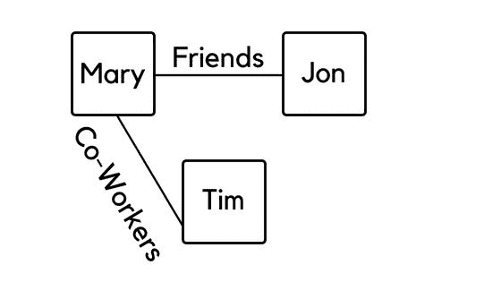
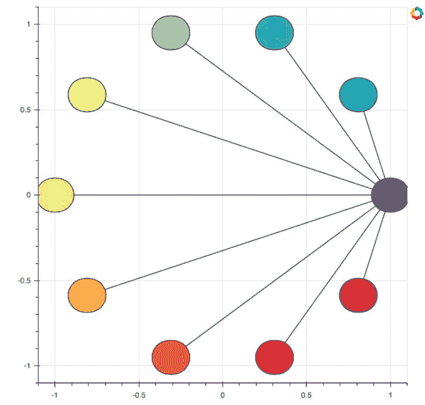
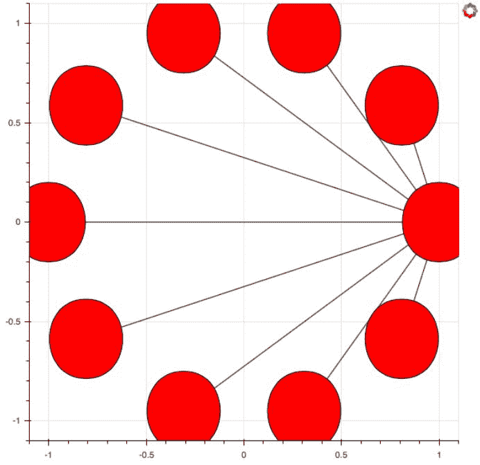
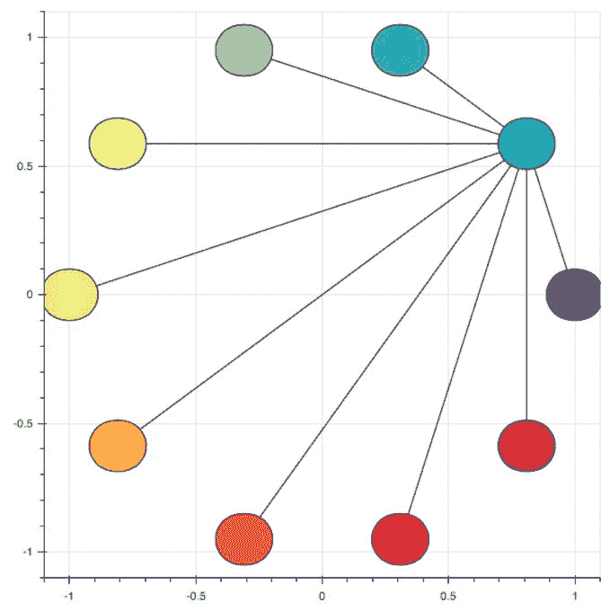
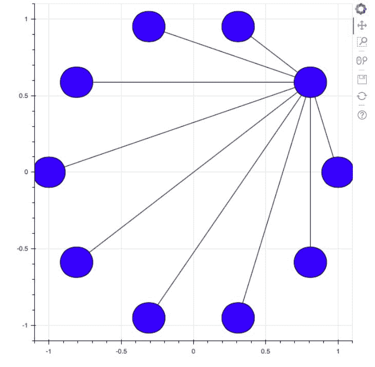
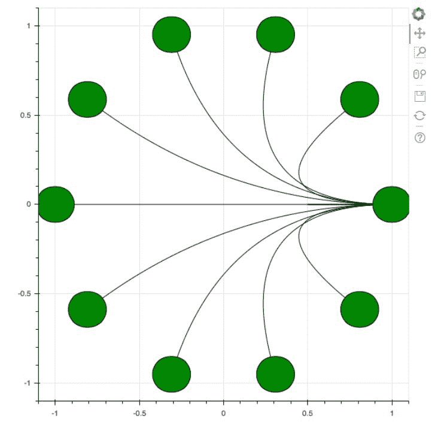
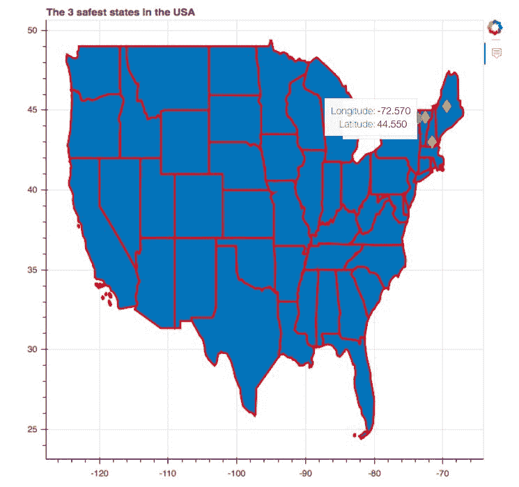
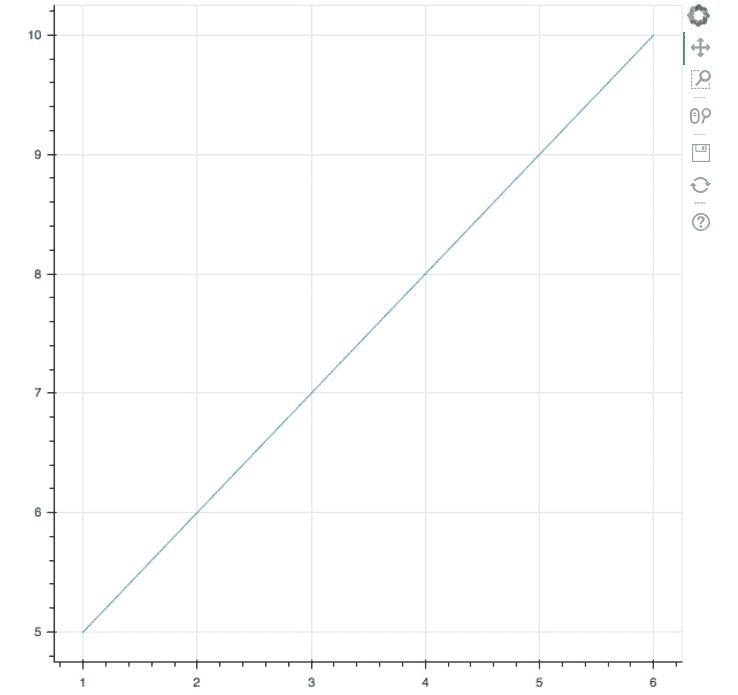
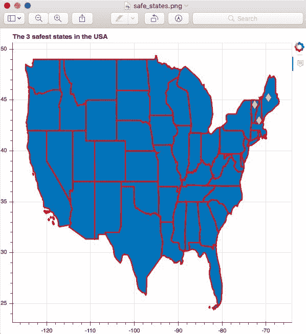

# 使用网络、地理数据、网络地理数据库和导出地块进行高级绘图

向用于可视化网络(如社交网络和运输网络)的图中添加交互性允许用户突出显示他们感兴趣的特定部分并与之交互，而忽略网络的其余部分。当您有一个庞大而复杂的网络时，这尤其有用。

当涉及提取感兴趣的特定位置的信息时，地理数据中的交互性尤其有用，而不是查看整个绘图。这种基于地理的可视化帮助我们放大位置并将这些地图嵌入到我们的应用程序中。

在处理大型复杂数据集时，充分利用 Bokeh 在速度方面的性能符合我们的最佳利益。我们可以用 WebGL 做到这一点。

最后，在某些情况下，我们可能希望以高水平的图像质量在书籍和期刊中发布我们用 Bokeh 创建的绘图。我们可以使用Bokeh的导出功能以巴布亚新几内亚格式导出我们的地块。

在本章中，您将了解:

*   使用Bokeh可视化网络
*   使用Bokeh可视化地理数据
*   使用 WebGL 提高性能
*   使用 Bokeh 将地块导出为 PNG 图像

# 技术要求

您需要在系统上安装 Python。最后，为了使用本书的 Git 存储库，用户需要安装 Git。

本章的代码文件可以在 GitHub:
[https://GitHub . com/PacktPublishing/动手-数据-可视化-with-Bokeh](https://github.com/PacktPublishing/Hands-on-Data-Visualization-with-Bokeh) 上找到。

查看以下视频，了解代码的运行情况:

[http://bit.ly/2HCCUJJ](http://bit.ly/2HCCUJJ)。

# 使用Bokeh可视化网络

网络帮助您可视化人与物品之间的关系。例如，一个简单的网络可以向你展示人们是如何相互关联的。下图说明了这一点:



在这个网络中，很容易看到玛丽和乔恩是朋友，而玛丽和蒂姆是同事。我们也可以看到蒂姆和乔恩根本没有关系。这样的网络有强大的应用，尤其是在社交网络领域！

在本节中，我们将学习如何使用 Bokeh 构建交互式网络。从根本上说，有两种方法可以做到这一点。第一种是使用默认直线将两个节点连接在一起来构建和可视化这些网络，下一种是通过为我们选择的路径定义形状来构建和可视化这些网络。

# 用直线路径可视化网络

第一步是导入所需的包:

```py
import math
from bokeh.io import show, output_file
from bokeh.plotting import figure
from bokeh.models import GraphRenderer, StaticLayoutProvider, Oval
from bokeh.palettes import Spectral10
```

这里新增的套餐有`math`、`GraphRenderer`、`StaticLayoutProvider`、`Oval`和`Spectral10`。随着我们逐步建立自己的网络，您将看到为什么以及何时使用以下软件包。

在本例中，我们将构建一个包含 10 个节点的网络。让我们构建一个从`0`到`9`的列表，我们可以将其用作网络中节点的点。这里显示的代码说明了这一点:

```py
total_nodes = 10
node_points = list(range(total_nodes))
print(node_points)
```

作为前面代码的结果，我们有 10 个节点，将从`0`到`9`合并到我们的网络中:

```py
#Output of print(node_points)

[0, 1, 2, 3, 4, 5, 6, 7, 8, 9]
```

下一步是构建将进入我们网络的图，并将其渲染为网络图。我们可以通过使用这里显示的代码来做到这一点:

```py
plot = figure(x_range=(-1.1,1.1), y_range=(-1.1,1.1))

network = GraphRenderer()
```

在前面的代码中，我们通过指定 *x* 和 *y* 范围创建了一个图形。在前面的例子中，我们的范围是`-1.1`到`+1.1`。这给了我们一个相当明显的网络。例如，将 *x* 和 *y* 范围的大小增加到-10 到+ 10 会使网络变小。

最后，`GraphRenderer`功能用于创建和渲染感兴趣的网络。

下一步是定制您的网络。我们可以通过使用这里显示的代码来做到这一点:

```py
network.node_renderer.data_source.add(Spectral10, 'color')
```

在前面的代码中，我们从`Spectral10`包中为网络的每个节点提供了 10 种独特颜色中的一种。这里说明了这一点:



如果我们希望所有的节点都有相同的颜色，我们可以完全跳过编写前面的代码。

为了将节点添加到网络中，我们使用如下所示的代码:

```py
network.node_renderer.data_source.add(node_points, 'index')
```

为了自定义网络的形状、大小和颜色，我们使用这里显示的代码:

```py
network.node_renderer.glyph = Oval(height=0.2, width=0.3, fill_color='color')
```

如果我们想创建一个具有更大节点的网络，其中每个节点都是红色的，那么我们可以将前面显示的代码修改为:

```py
network.node_renderer.glyph = Oval(height=0.4, width=0.5, fill_color='red')
```

这将呈现此处显示的网络:



下一步是配置网络中的边缘连接。边只是将两个节点连接在一起的链接。为此，我们使用这里显示的代码:

```py
network.edge_renderer.data_source.data = dict(start=[1]*total_nodes, end=node_points)
```

为了创建一条边，我们只需创建一个将点集相互映射的字典。在前面的代码中，`start`参数等于包含数字`1`的列表乘以节点总数，即`10`。这将导致此处显示的列表:

```py
#Output of [1] * total_nodes:

[10,10,10,10,10,10,10,10,10,10]
```

参数结束包含`node_points`，这是我们之前定义的从`0`到`9`的列表:

```py
#Output of total_nodes:

[0,1,2,3,4,5,6,7,8,9]
```

换句话说，我们将这两个列表映射在一起:

```py
{10:0, 10:1, 10:2, 10:3, 10:4, 10:5, 10:6, 10:7, 10:8, 10:9}
```

这导致节点 10 被映射到网络中的每一个其他节点。这里显示的输出说明了这一点:



从根本上说，我们到目前为止创建的代码足以设计您的网络，但不足以在您的浏览器/ Jupyter Notebook 中呈现网络的输出。

我们需要使用布局提供者模型，以便在二维空间中呈现这个网络。为了在二维空间中渲染一个对象，我们需要指定二维空间中每个节点的 *x* 和 *y* 坐标。我们通过提取每个节点的周长，然后使用余弦函数和周长来为每个节点建立 *x* 和 *y* 坐标。

第一步是为每个节点创建一个周长列表。我们可以通过使用这里显示的代码来做到这一点:

```py
#Extracting the circumference of each node

node_circumference = [node*2*math.pi/10 for node in node_points]
```

如果你记得，`node_points`是从`0`到`9`的每个节点的点列表。这将产生如下所示的输出:

```py
#Output of the circumference of each node

[0.0, 0.6283185307179586, 1.2566370614359172, 1.8849555921538759, 2.5132741228718345, 3.141592653589793, 3.7699111843077517, 4.39822971502571, 5.026548245743669, 5.654866776461628]
```

下一步是提取 *x* 和 *y* 坐标。我们可以通过使用这里显示的代码来做到这一点:

```py
#Extracting the x and y co-ordinates

x = [math.cos(circum) for circum in node_circumference]

y = [math.sin(circum) for circum in node_circumference]
```

这将产生一个由 *x* 和 *y* 坐标组成的列表，如代码块所示:

```py
#Output of the x co-ordinates

[1.0, 0.8090169943749475, 0.30901699437494745, -0.30901699437494734, -0.8090169943749473, -1.0, -0.8090169943749475, -0.30901699437494756, 0.30901699437494723, 0.8090169943749473]

#Output of the y co-ordinates

[0.0, 0.5877852522924731, 0.9510565162951535, 0.9510565162951536, 0.5877852522924732, 1.2246467991473532e-16, -0.587785252292473, -0.9510565162951535, -0.9510565162951536, -0.5877852522924732]
```

最后，我们需要用字典把这些坐标联系在一起。我们可以通过使用这里显示的代码来做到这一点:

```py
network_layout = dict(zip(node_points, zip(x, y)))
```

这将生成一个字典，其中包含一个关键字(即节点(`0`)到`9`)和一个值(即元组( *x* 、 *y* ):

```py
#Output of the dictionary

{0: (1.0, 0.0), 1: (0.8090169943749475, 0.5877852522924731), 2: (0.30901699437494745, 0.9510565162951535), 3: (-0.30901699437494734, 0.9510565162951536), 4: (-0.8090169943749473, 0.5877852522924732), 5: (-1.0, 1.2246467991473532e-16), 6: (-0.8090169943749475, -0.587785252292473), 7: (-0.30901699437494756, -0.9510565162951535), 8: (0.30901699437494723, -0.9510565162951536), 9: (0.8090169943749473, -0.5877852522924732)}
```

最后，我们使用 Bokeh 包的布局提供程序来实时和在二维空间中渲染网络:

```py
#Output the network in two dimensional space

network.layout_provider = StaticLayoutProvider(graph_layout=network_layout)

plot.renderers.append(network)

output_file('network.html')
show(plot)
```

在前面的代码中，`StaticLayoutProvider`函数用于渲染我们在二维空间中构建的网络，也就是最终渲染剧情的网页的笔记本或者 HTML 文件。

现在我们已经完全理解了构建网络的所有组件，让我们将所有代码联系在一起，并查看生成的网络:

```py
#Import the required packages

import math
from bokeh.io import show, output_file
from bokeh.plotting import figure
from bokeh.models import GraphRenderer, StaticLayoutProvider, Oval

#Configure the number of nodes

total_nodes = 10
node_points = list(range(total_nodes))

#Create the network

plot = figure(x_range=(-1.1,1.1), y_range=(-1.1,1.1))

network = GraphRenderer()

#Customize your network

network.node_renderer.data_source.add(node_points, 'index')

network.node_renderer.glyph = Oval(height=0.2, width=0.3, fill_color='blue')

network.edge_renderer.data_source.data = dict(start=[1]*total_nodes, end=node_points)

#Render your network in 2-D space

node_circumference = [node*2*math.pi/10 for node in node_points]

x = [math.cos(circum) for circum in node_circumference]

y = [math.sin(circum) for circum in node_circumference]

network_layout = dict(zip(node_points, zip(x, y)))

#Output the network

network.layout_provider = StaticLayoutProvider(graph_layout=network_layout)

plot.renderers.append(network)

output_file('network.html')

show(plot)
```

这导致此处显示的网络:



# 用显式路径可视化网络

在本节中，您将学习如何为连接网络两个节点的路径定义形状。

第一步是定义一个函数，它将为我们返回一个二次路径。为此，我们使用如下所示的代码:

```py
#Function that outputs the quadratic path

values = [value/100\. for value in range(100)]

def quad_path(start, end, control, values):
    return [(1-value)**2*start + 2*(1-value)*value*control + value**2*end for value in values]
```

`Values`是一个包含从 0 到 0.99 的数字范围的列表，我们将使用它来构造一个函数，该函数根据贝塞尔曲线方程从数学上返回二次路径。

上面的函数接受四个参数:`start`、`end`、`control`和`values`。起点和终点定义了如何在二维空间中显示和构建函数。`quad_path`函数然后返回在二维空间中构建二次网络路径所需的 *x* 和 *y* 坐标。为此，我们将使用上一小节中用于构建网络的相同网络布局。这个网络布局是一个把节点点映射到 *x* 和 *y* 坐标的字典，看起来是这样的:

```py
{0: (1.0, 0.0), 1: (0.8090169943749475, 0.5877852522924731), 2: (0.30901699437494745, 0.9510565162951535), 3: (-0.30901699437494734, 0.9510565162951536), 4: (-0.8090169943749473, 0.5877852522924732), 5: (-1.0, 1.2246467991473532e-16), 6: (-0.8090169943749475, -0.587785252292473), 7: (-0.30901699437494756, -0.9510565162951535), 8: (0.30901699437494723, -0.9510565162951536), 9: (0.8090169943749473, -0.5877852522924732)}
```

为了构建`start`和`end`点，我们使用这里显示的代码:

```py
#Initialize empty lists to store the x and y co-ordinates
x_point, y_point = [], []

#Store the starting and ending points

x_start, y_start = network_layout[0]

#Create the set of co-ordinates for the quadratic path

values = [value/100\. for value in range(100)]
for node in node_points:
    x_end, y_end = network_layout[node]
    x_point.append(quad_path(x_start, x_end, 0, values))
    y_point.append(quad_path(y_start, y_end, 0, values))
```

在前面的代码中，我们首先初始化空列表来存储 *x* 和 *y* 坐标。 *x* 和 *y* 坐标的起点是从网络布局字典中提取的，`x_start`和`y_start`的起点分别为 1.0 和 0.0。

然后，我们循环遍历从`0`到`9`的节点列表，然后通过将节点子集化为网络布局来提取`end`点。例如，第二个节点的`end`点将是:

```py
network_layout[1] = (0.8090169943749475, 0.5877852522924731)
```

然后我们使用`quad_path`函数将`x`和`y`点添加到我们在开始初始化的列表中。

最后一步就是将新的 *x* 和 *y* 坐标添加到您创建的网络中，并渲染该图。我们可以通过使用这里显示的代码来做到这一点:

```py
#Add the x and y co-ordinates of the quadratic path to the network

network.edge_renderer.data_source.data['xs'] = x_point

network.edge_renderer.data_source.data['ys'] = y_point

#Output the plot

plot.renderers.append(network)

output_file("quad_path.html")

show(plot)
```

最后一步是将所有这些代码与我们在上一节中使用的代码绑定在一起，以便构建网络。这里显示的代码块说明了这一点:

```py
#Import the required packages

import math
from bokeh.io import show, output_file
from bokeh.plotting import figure
from bokeh.models import GraphRenderer, StaticLayoutProvider, Oval

#Configure the number of nodes

total_nodes = 10
node_points = list(range(total_nodes))

#Create the network

plot = figure(x_range=(-1.1,1.1), y_range=(-1.1,1.1))

network = GraphRenderer()

#Customize your network

network.node_renderer.data_source.add(node_points, 'index')

network.node_renderer.glyph = Oval(height=0.2, width=0.3, fill_color='green')

network.edge_renderer.data_source.data = dict(start=[1]*total_nodes, end=node_points)

#Render your network in 2-D space

node_circumference = [node*2*math.pi/10 for node in node_points]

x = [math.cos(circum) for circum in node_circumference]

y = [math.sin(circum) for circum in node_circumference]

network_layout = dict(zip(node_points, zip(x, y)))

network.layout_provider = StaticLayoutProvider(graph_layout=network_layout)

#Function that outputs the quadratic path

values = [value/100\. for value in range(100)]

def quad_path(start, end, control, values):
    return [(1-value)**2*start + 2*(1-value)*value*control + value**2*end for value in values]

#Initialize empty lists to store the x and y co-ordinates
x_point, y_point = [], []

#Store the starting and ending points

x_start, y_start = network_layout[0]

#Create the set of co-ordinates for the quadratic path

values = [value/100\. for value in range(100)]
for node in node_points:
    x_end, y_end = network_layout[node]
    x_point.append(quad_path(x_start, x_end, 0, values))
    y_point.append(quad_path(y_start, y_end, 0, values))

#Add the x and y co-ordinates of the quadratic path to the network

network.edge_renderer.data_source.data['xs'] = x_point

network.edge_renderer.data_source.data['ys'] = y_point

#Output the plot

plot.renderers.append(network)

output_file("quad_path.html")

show(plot)
```

这导致网络具有连接节点的二次路径，如下图所示:



# 用Bokeh可视化地理数据

在本节中，我们将为美国犯罪率最低的州创建一个Bokeh可视化。为了做到这一点，我们将绘制一张美国地图，并指出犯罪率最低的州。

第一步是导入所需的包:

```py
from bokeh.sampledata import us_states
from bokeh.plotting import figure, show, output_file
from bokeh.models import HoverTool
```

`us_states`是一本字典，包含了我们在Bokeh构建美国地图所需的所有信息。此外，如果你想在Bokeh岛创建一张其他国家的地图，你可以在网上找到必要的地理数据，然后将文件导入你的 Jupyter 笔记本。

下一步是将数据复制到 Bokeh 中，这样我们就可以修改数据并删除不重要的状态(如果需要的话)。这里，我们将删除夏威夷和阿拉斯加，因为我们只对美国大陆的州感兴趣。我们可以使用下面显示的代码从地图中删除各个州:

```py
#Create a copy of the USA data in our notebook

usa_data = us_states.data.copy()

#Delete the states that are not of interest 

del usa_data["HI"]
del usa_data["AK"]
```

下一步是从我们的数据中提取`latitude`和`longitude`信息。我们可以通过使用这里显示的代码来做到这一点:

```py
#Extract the latitude and longitude information

longitude = [usa_data[long]["lons"] for long in usa_data]

latitude = [usa_data[lat]["lats"] for lat in usa_data]
```

下一步是设计和配置我们的绘图应该是什么样子。这可以通过使用下面显示的代码来完成:

```py
#Create the figure

plot = figure(title="The 3 safest states in the USA")

#Configure the borders of the states

plot.patches(longitude, latitude, line_color="red", line_width=2)
```

在前面的代码中，我们使用`patches`函数根据前面构建的`longitude`和`latitude`坐标来构建块或面片。我们给州的边界一个`red`的颜色和一个`2`的宽度。

下一步是创建两个列表，保存美国三个最安全州的`longitude`和`latitude`信息。根据热门网站美国新闻，这些州是缅因州、佛蒙特州和新罕布什尔州。

这三种状态的`longitude`和`latitude`如下:

```py
#Longitude and latitude information for Maine 

longitude = -69.44 West
latitude = 45.25 North

#Longitude and latitude information for Vermont

longitude = -72.57 West
latitude = 44.55 North

#Longitude and latitude information for New Hampshire

longitude = -71.57 West
latitude = 43.19 North
```

下一步是将这些位置参数放入一个列表:

```py
#Mapping the longitude and latitude information into lists

long_list = [-69.44, -72.57, -71.57]

lat_list = [45.25, 44.55, 43,19]
```

最后，我们使用下面显示的代码来定义如何在图上标记这些点:

```py
# Create the markers for the states

plot.diamond(long_list, lat_list, size=15, color='yellow')

# output the plot

output_file("safe.html")

show(plot)
```

为了增强剧情的互动性，我们可以添加一个不错的附加功能，那就是创建一个悬停工具，它可以为我们提供感兴趣点的信息，比如`latitude`和`longitude`。我们可以使用下面显示的代码来创建这个工具:

```py
#Create the hover tooltip

hover_tool = HoverTool(tooltips = [
    ('Longitude', '@x'),
    ('Latitude', '@y')
]) 

#Embed the hover tool into the plot
plot = figure(title="The 3 safest states in the USA", tools = [hover_tool])
```

最后，我们可以将所有代码块绑定在一起，以创建美国三个最安全州的地理可视化:

```py
#Import the required packages

from bokeh.sampledata import us_states
from bokeh.plotting import figure, show, output_file
from bokeh.models import HoverTool

#Create a copy of the USA data in our notebook

usa_data = us_states.data.copy()

#Delete the states that are not of interest 

del usa_data["HI"]
del usa_data["AK"]

#Extract the latitude and longitude information

longitude = [usa_data[long]["lons"] for long in usa_data]

latitude = [usa_data[lat]["lats"] for lat in usa_data]

#Create the Hover Tool

hover_tool = HoverTool(tooltips = [
    ('Longitude', '@x'),
    ('Latitude', '@y')
]) 

#Create the figure

plot = figure(title="The 3 safest states in the USA", tools = [hover_tool])

#Configure the borders of the states

plot.patches(longitude, latitude, line_color="red", line_width=2)

#Mapping the longitude and latitude information into lists

long_list = [-69.44, -72.57, -71.57]

lat_list = [45.25, 44.55, 43,19]

# Create the markers for the states

plot.diamond(long_list, lat_list, size=15, color='yellow')

# output the plot

output_file("safe.html")

show(plot)
```

这导致如下图所示的结果:



从这个绘图中，我们可以识别出一个独特的趋势。我们可以立即注意到美国最安全的州在地图上是多么的接近。悬停工具增加的交互性也帮助我们非常快速地提取这些位置的坐标。

# 使用 WebGL 提高性能

WebGL 是一个 JavaScript API，几乎可以在市场上每一个流行的浏览器中使用。基本上，显示在浏览器上的Bokeh图是在插件的帮助下完成的。这可能会降低地块的渲染速度，尤其是在用于渲染这些地块的数据集很大的情况下！WebGL 使用图形处理器渲染图形，不需要插件。

为了在渲染图时启用 WebGL，您只需在构建图时使用此处显示的代码:

```py
plot = figure(output_backend = 'webgl')
```

在 WebGL 中渲染图的唯一缺点是它不支持 Bokeh 必须提供的每个组件。目前，WebGL 渲染只支持两种类型的字形。它们是:

*   圆形符号
*   线路健身房

WebGL 支持的标记如下:

*   星号
*   平方
*   钻石
*   三角形
*   倒三角
*   跨过
*   圆形交叉
*   方形十字
*   钻石十字架
*   x
*   平方
*   圆

您可以使用 Bokeh 的所有组件创建一个绘图，但是只有 WebGL 支持的组件才会在 WebGL 中呈现，而其余组件将使用插件呈现。

这里显示了一个使用 WebGL 渲染图的示例:

```py
#Import required packages

import numpy as np
import random
from bokeh.io import output_file, show
from bokeh.plotting import figure

#Creating an array for the points along the x and y axes

array_x =np.array([1,2,3,4,5,6])

array_y = np.array([5,6,7,8,9,10])

#Creating a line plot

plot = figure(output_backend = 'webgl')

plot.line(array_x, array_y)

#Output the plot

output_file('numpy_line.html')

show(plot)
```

这导致如下图所示的结果:



可以清楚地看到，在 BokehJS 渲染的图和使用 WebGL 渲染的图之间没有明显的区别。您唯一注意到差异的时候是当您有一个大数据集时，在这种情况下，使用 WebGL 渲染的速度会快得多。

本节的主要目的是确保您具备提高使用 Bokeh 构建的应用程序的性能所需的知识。在大多数情况下，您将呈现大量数据的交互式可视化，这些数据通常在浏览器上呈现得非常慢。WebGL 通过一行简单的代码帮助缓解了这个问题。

# 将地块导出为巴布亚新几内亚图像

上面产生的绘图看起来令人印象深刻，同时也提供了信息。我们可能希望在网站或杂志/期刊上以更高质量的`.PNG`图像发布该图。幸运的是，Bokeh提供了这种灵活性。

Bokeh 可以使用导出功能生成这样的图像。这个函数使用一个名为 Webkit 的浏览器将该图保存在其内存中，并捕获一个截图。生成图像的尺寸将与您创建的图的尺寸相同。

第一步是安装这个 Bokeh 功能所依赖的依赖项。这叫做 Phantomjs。您可以使用 Anaconda 安装此软件包，命令如下所示:

```py
conda install selenium phantomjs pillow
```

下一步是使用`pip`安装 Selenium。我们可以使用这里显示的命令来实现这一点:

```py
pip3 install selenium
```

最后一步是导出使用地理数据创建的地块。我们可以通过使用这里显示的代码来做到这一点:

```py
#Import the required packages

from bokeh.io import export_png

#Export the png image

export_png(plot, filename="safe_states.png")
```

保存的最终图像如下所示:



# 摘要

本章已经向您正式介绍了使用 Bokeh 包构建交互式网络的世界。通过系统的方式，您学习了如何使用默认的直线路径和显式定义的路径来创建和构造构建网络的过程。

您还了解了向地理数据添加交互性如何对可视化的查看者产生重大影响，因为他或她现在可以从中提取信息。

然后，您学习了如何使用 WebGL 更快地渲染您的绘图，从而提高应用程序的性能。

最后，您学习了如何以 PNG 格式导出这些地块，并以非常高的质量渲染它们以供发布。

在下一章中，您将学习如何构建您自己的 Bokeh 应用程序，您可以使用它来分析股票市场。