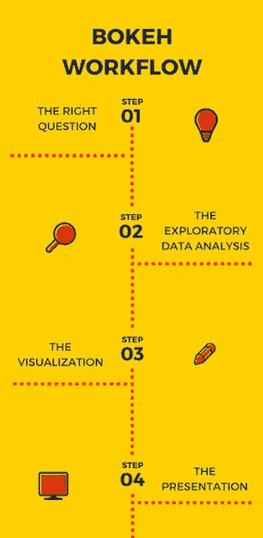
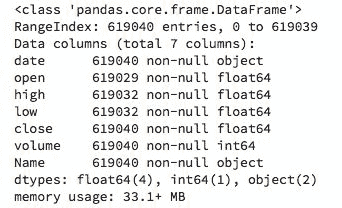
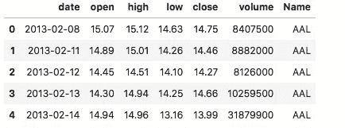
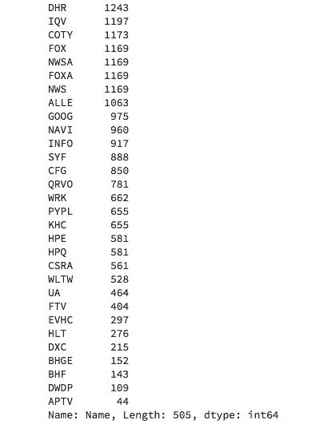
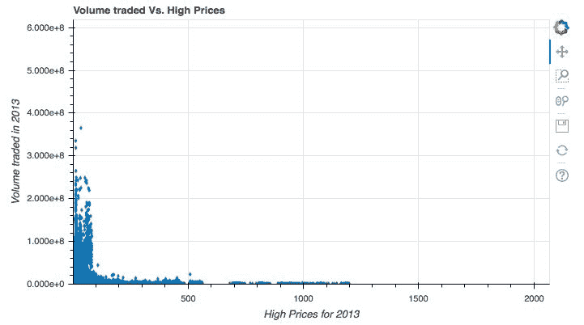
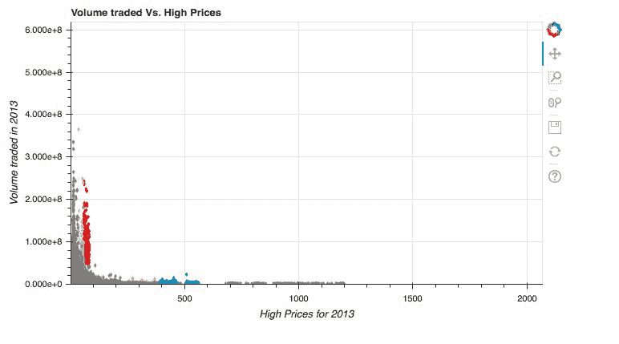
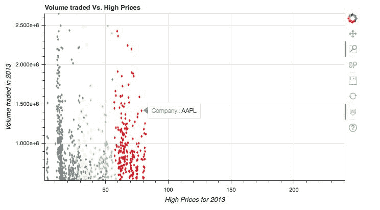

# 博克工作流——案例研究

当谈到从头开始构建自己的博克可视化时，一个很好的开发实践是永远不要从博克开始。相反，理想的方法是首先对您的数据进行一些探索性的分析，以便可视化您可以使用 Bokeh 创建的能够为您的用户提供最大价值的应用程序。

这样的方法，首先探索你的数据集，帮助你制定你可能想要呈现给你的观众的理想的可视化。

在本章中，您将学习需要遵循的确切工作流程，从获取数据到想要呈现的最终可视化。

Bokeh 和大多数数据可视化工具一样，最适合在遵循逻辑步骤序列的工作流中使用，这将允许您向您的受众提供有影响力的见解。该工作流程可以总结为四个步骤:



在本章中，您将学习如何:

*   在可视化数据之前，问正确的问题
*   对真实数据集执行探索性数据分析
*   构建交互式可视化，提供具体的见解
*   展示你的结果

# 技术要求

您需要在系统上安装 Python。最后，为了使用本书的 Git 存储库，用户需要安装 Git。

本章的代码文件可以在 GitHub:
[https://GitHub . com/PacktPublishing/动手-数据-可视化-with-Bokeh](https://github.com/PacktPublishing/Hands-on-Data-Visualization-with-Bokeh) 上找到。

查看以下视频，了解代码的运行情况:

[http://bit.ly/2sLSoX1](http://bit.ly/2sLSoX1)。

# 问正确的问题

就数据可视化而言，问正确的问题是最重要的一步。你寻求的答案是什么？

在决定可视化数据之前，您需要问自己一些最常见的问题:

*   我想观察两个特征的关联程度吗？
*   我是否怀疑我的数据中存在潜在的异常值，除非我将数据可视化，否则我无法看到这些异常值？
*   我想看看我的数据是否显示了一段时间内的特定趋势？
*   我是否希望观察数据中各个要素/列的分布？
*   我是否希望查看我的数据中是否有可以从中提取价值的集群/组？
*   我相信可视化可以告诉我的观众一个关于数据的故事吗？

如果其中任何一个问题的答案是肯定的，那么你知道你需要可视化你的数据。你想问自己的第二个问题是，“我用什么工具来可视化我的数据？”

在决定工具时，您最想问的一些常见问题是:

*   我想让我的观众和我的剧情互动吗？如果是的话，Bokeh 和 Tableau 是一个不错的选择。
*   我想做探索性的数据分析而不想做别的吗？如果是，Python 中的 Matplotlib 和 Seaborn 是不错的选择。
*   我想在一个能被广大读者阅读的出版物上发表我的情节吗？如果是的话，Bokeh 和 Tableau 是一个不错的选择。

一旦你决定了数据可视化是必须的，并且你决定了你将要使用的工具，下一步就是问正确的关于你当前拥有的数据的问题。让我们看看在本书的整个过程中，我们可以问的关于股票的问题:

*   特定股票或多只股票的高低价格之间是否存在相关性？
*   苹果股票的开盘价如何随时间变化？
*   微软、苹果、谷歌等科技股的行为是否有相似之处？

你的可视化效果只和你随身携带的数据一样好。如果你的数据质量不好，那么你的可视化效果也会随之受损。您可以采取以下步骤来提高数据质量:

*   基于现有功能创建新功能，以更好地增强可视化效果
*   将多个数据集合并在一起，这有助于揭示更好的见解
*   以有意义的方式处理空值
*   调查数据的收集方式

这些步骤将通过揭示原始数据集本身所不具备的洞察力，极大地提高您的演示质量。

一旦我们清楚地了解了我们想要回答的问题，我们就可以继续下一步了。

# 探索性数据分析

由于我们已经广泛使用了来自 Kaggle 的标准普尔 500 股票数据，我们将使用该数据集来创建我们的应用程序。数据集可以在这里找到:[https://www.kaggle.com/camnugent/sandp500/data](https://www.kaggle.com/camnugent/sandp500/data)。

第一步是将数据读入 Jupyter Notebook，了解数据的样子。这可以使用下面显示的代码来完成:

```py
#Import packages

import pandas as pd

#Read the data into the notebook

df = pd.read_csv('all_stocks_5yr.csv')

#Extract information about the data

df.info()
```

这将呈现此屏幕截图中显示的输出:



这可以显示数据集的行数、每列的数据类型、变量的数量以及任何缺少的值。

下一步是了解数据集所有列中包含的信息类型。我们可以通过使用这里显示的代码来做到这一点:

```py
df.head()
```

这将产生如下所示的输出:



我们可以很快看到我们有日期，这是一个时间序列属性。开放、高、低和关闭是连续的数字数据，可用于生成散点图。成交量也是连续的，但是数值要比其他四个数字栏大很多，Name 是一个分类栏，有每只股票的名称。

由于名称是一个分类列，包含每只股票的名称，因此了解变量的总类别数可能会很有用。我们可以通过使用这里显示的代码来做到这一点:

```py
df['Name'].value_counts()
```

这将产生如下所示的输出:



我们现在了解到股票数据中列出了 505 家公司。

# 创建有洞察力的可视化

既然我们已经对数据包含的内容有了一个基本的概念，我们就可以进行可视化了。第一步是确保我们已经准备好可视化的基础。

# 创建基准图

基础由您想要可视化的基础图组成。在我们的例子中，我们希望看到一段时间内股票交易量与高价格之间的关系。为了构建这个应用程序，我们使用这里显示的代码:

```py
#Import the required packages

from bokeh.io import curdoc
from bokeh.models import ColumnDataSource
from bokeh.plotting import figure
import pandas as pd

#Read the data into the notebook

df = pd.read_csv('all_stocks_5yr.csv')

#Convert the date column to a datetime object and extract the year only.

df['date'] = pd.to_datetime(df['date']).apply(lambda x:x.strftime('%Y'))

#Create the ColumnDataSource Object

data = ColumnDataSource(data = {
    'high' : df[df['date'] == '2013'].high,
    'low' : df[df['date'] == '2013'].low,
    'open' : df[df['date'] == '2013'].open,
    'close': df[df['date'] == '2013'].close,
    'volume': df[df['date'] == '2013'].volume,
    'Name' : df[df['date'] == '2013'].Name
})

#Specify the range of the x and y axis

xmin, xmax = min(df.high), max(df.high)
ymin, ymax = min(df.volume), max(df.volume)

#Create the plot

plot = figure(title = 'Volume traded Vs. High Prices', plot_height = 400, plot_width = 700, x_range = (xmin, xmax),
             y_range = (ymin, ymax))

plot.diamond(x = 'high', y = 'volume', source = data)

plot.xaxis.axis_label = 'High Prices for 2013'

plot.yaxis.axis_label = 'Volume traded in 2013'

#Add the plot to the application

curdoc().add_root(plot)

curdoc().title = 'Volume and High prices of stocks'
```

在前面的代码中，我们首先读入数据，并将其存储在名为`df`的数据帧中。在下一行中，我们将`date`列转换为`datetime`对象。我们使用`apply`函数将日期列中的每个元素转换为年格式，即`2011`、`2012`等等。`lambda`功能用于将这种格式变化应用到日期列的每个元素中的日期。

然后，我们创建了一个列数据源元素，其中我们仅基于 2013 年的数据过滤了数据框的每一列。例如，代表股票高价格的`high`栏将只有 2013 年的数据。

最后，我们指定了 *x-* 和 *y-* 轴的范围，并在交易量和高价格之间创建了一个简单的散点图。

将前面的脚本保存为`bokeh.py`后，我们可以使用如下所示的命令启动它:

```py
bokeh serve --show bokeh.py
```

这导致了此屏幕截图中显示的应用程序:



我们已经可以看到，股票交易量和高价格之间是有关系的。看起来价格非常高的股票比价格较低的股票交易频率要低得多。

# 绘制科技股地图

现在，如果我们有兴趣投资和购买科技巨头——谷歌、脸书、亚马逊、微软或苹果——的一些股票，我们可能想知道这些公司与标准普尔 500 指数中的其他公司相比表现如何。

这可以通过使用下面显示的代码来实现:

```py
#Import the required packages

from bokeh.io import curdoc
from bokeh.models import ColumnDataSource, CategoricalColorMapper
from bokeh.plotting import figure
from bokeh.palettes import Spectral5
import pandas as pd

#Read the data into the notebook

df = pd.read_csv('all_stocks_5yr.csv')

df['date'] = pd.to_datetime(df['date']).apply(lambda x:x.strftime('%Y'))

#List the tech giants

tech_giants = ['GOOGL', 'FB', 'MSFT', 'AMZN', 'AAPL']

#Create the color map

color_map = CategoricalColorMapper(factors = tech_giants, palette = Spectral5)

#Create the ColumnDataSource Object

data = ColumnDataSource(data = {
    'high' : df[df['date'] == '2013'].high,
    'low' : df[df['date'] == '2013'].low,
    'open' : df[df['date'] == '2013'].open,
    'close': df[df['date'] == '2013'].close,
    'volume': df[df['date'] == '2013'].volume,
    'Name' : df[df['date'] == '2013'].Name
})

#Create ranges for the x and y axis

xmin, xmax = min(df.high), max(df.high)
ymin, ymax = min(df.volume), max(df.volume)

#Create the plot

plot = figure(title = 'Volume traded Vs. High Prices', plot_height = 400, plot_width = 700, x_range = (xmin, xmax),
             y_range = (ymin, ymax))

plot.diamond(x = 'high', y = 'volume', source = data, color = dict(field = 'Name', transform = color_map))

plot.xaxis.axis_label = 'High Prices for 2013'

plot.yaxis.axis_label = 'Volume traded in 2013'

#Add the plot to the application

curdoc().add_root(plot)

curdoc().title = 'Volume and High prices of stocks'
```

然后，我们使用终端/外壳中显示的命令启动应用程序:

```py
bokeh.serve --show bokeh.py
```

这将产生如下所示的应用程序:



现在，我们可以清楚地看到科技巨头在数量和高价格方面的位置。

# 添加悬停工具

下一步是添加一个悬停工具，以便在我们与可视化交互时帮助我们准确地识别公司的名称。我们可以通过使用这里显示的代码来做到这一点:

```py
#Import the required packages

from bokeh.io import curdoc
from bokeh.models import ColumnDataSource, CategoricalColorMapper
from bokeh.plotting import figure
from bokeh.palettes import Spectral5
import pandas as pd
from bokeh.models import HoverTool

#Read the data into the notebook

df = pd.read_csv('all_stocks_5yr.csv')

df['date'] = pd.to_datetime(df['date']).apply(lambda x:x.strftime('%Y'))

#List the tech giants

tech_giants = ['GOOGL', 'FB', 'MSFT', 'AMZN', 'AAPL']

#Create the color map

color_map = CategoricalColorMapper(factors = tech_giants, palette = Spectral5)

#Create the ColumnDataSource Object

data = ColumnDataSource(data = {
    'high' : df[df['date'] == '2013'].high,
    'low' : df[df['date'] == '2013'].low,
    'open' : df[df['date'] == '2013'].open,
    'close': df[df['date'] == '2013'].close,
    'volume': df[df['date'] == '2013'].volume,
    'Name' : df[df['date'] == '2013'].Name
})

#Create ranges for the x and y axis

xmin, xmax = min(df.high), max(df.high)
ymin, ymax = min(df.volume), max(df.volume)

#Create the hover tool

hover_tool = HoverTool(tooltips = [('Company:', '@Name')])

#Create the plot

plot = figure(title = 'Volume traded Vs. High Prices', plot_height = 400, plot_width = 700, x_range = (xmin, xmax),
             y_range = (ymin, ymax))

plot.diamond(x = 'high', y = 'volume', source = data, color = dict(field = 'Name', transform = color_map))

#Adding the hover tool to the plot

plot.add_tools(hover_tool)

plot.xaxis.axis_label = 'High Prices for 2013'

plot.yaxis.axis_label = 'Volume traded in 2013'

#Add the plot to the application

curdoc().add_root(plot)

curdoc().title = 'Volume and High prices of stocks'
```

我们现在可以使用终端/外壳中显示的命令来启动这个应用程序:

```py
bokeh serve --show bokeh.py
```

放大应用程序并使用悬停工具，我们可以在可视化中获得股票名称的相关信息，如下所示:



缩放工具是右上角 Bokeh 徽标下的第二个工具。这是 Bokeh 在您创建的每个可视化中发布的默认工具之一。

# 使用 WebGL 提高性能

创建快速渲染的 Bokeh 可视化的最后一步是使用 WebGL 来提高其性能。我们可以使用这里显示的代码来实现这一点:

```py
#Import the required packages

from bokeh.io import curdoc
from bokeh.models import ColumnDataSource, CategoricalColorMapper
from bokeh.plotting import figure
from bokeh.palettes import Spectral5
import pandas as pd
from bokeh.models import HoverTool

#Read the data into the notebook

df = pd.read_csv('all_stocks_5yr.csv')

df['date'] = pd.to_datetime(df['date']).apply(lambda x:x.strftime('%Y'))

#List the tech giants

tech_giants = ['GOOGL', 'FB', 'MSFT', 'AMZN', 'AAPL']

#Create the color map

color_map = CategoricalColorMapper(factors = tech_giants, palette = Spectral5)

#Create the ColumnDataSource Object

data = ColumnDataSource(data = {
    'high' : df[df['date'] == '2013'].high,
    'low' : df[df['date'] == '2013'].low,
    'open' : df[df['date'] == '2013'].open,
    'close': df[df['date'] == '2013'].close,
    'volume': df[df['date'] == '2013'].volume,
    'Name' : df[df['date'] == '2013'].Name
})

#Create ranges for the x and y axis

xmin, xmax = min(df.high), max(df.high)
ymin, ymax = min(df.volume), max(df.volume)

#Create the hover tool

hover_tool = HoverTool(tooltips = [('Company:', '@Name')])

#Create the plot

plot = figure(title = 'Volume traded Vs. High Prices', plot_height = 400, plot_width = 700, x_range = (xmin, xmax),
             y_range = (ymin, ymax), output_backend = 'webgl')

plot.diamond(x = 'high', y = 'volume', source = data, color = dict(field = 'Name', transform = color_map))

#Adding the hover tool to the plot

plot.add_tools(hover_tool)

plot.xaxis.axis_label = 'High Prices for 2013'

plot.yaxis.axis_label = 'Volume traded in 2013'

#Add the plot to the application

curdoc().add_root(plot)

curdoc().title = 'Volume and High prices of stocks'
```

使用此处显示的命令执行脚本:

```py
bokeh serve --show bokeh.py
```

你会注意到执行速度的不同。由于您使用 WebGL 来增强 Bokeh 的性能，您的可视化现在将呈现得更快！

# 展示您的结果

正确的可视化不仅仅局限于选择正确的绘图类型，例如散点图或条形图。它扩展到选择正确的颜色、形状、标记和特征。

选择正确的可视化时，您需要问自己以下一些问题:

*   我想向我的读者传递积极的信息吗？如果是的话，绿色和蓝色是很好的选择
*   我是否想向我的读者传达一个警告/负面信息，表明某种形式的危险/拒绝？如果是，红色效果最好
*   我是否想展示两个不同的细分市场/类别之间的差异？如果是，使用红色和蓝色等对比色效果很好

在创建理想的可视化时，您想要传达的洞察力和信息的基调至关重要。

# 摘要

在本章中，您学习了如何构建实时 Bokeh 可视化，可以用来从头开始分析股票的表现。您学习了如何执行初始探索性数据分析，以确定您想要创建的可视化类型。然后，您创建了可视化，并使用 WebGL 提高了它的性能。

最后，您学习了构成 Bokeh 工作流程不可或缺的一部分的四个步骤。您学习了如何在任何数据可视化项目中提出正确的问题，然后是探索性数据分析。你还学会了如何展示你的结果不仅限于你使用的情节类型，还包括你想传达给观众的信息的语气。

这本书到此结束！我希望这本书给了你一个丰富的，对博克世界的实际介绍！我希望你能继续利用你在这里学到的技能，制作出能吸引广大观众的互动剧情！