# 1.Python 3 简介

欢迎大家来到 Matplotlib 和相关库(如 NumPy、Pandas 和 Seaborn)的激动人心的数据可视化之旅。

本章涵盖了 Python 编程语言的基础知识，包括它的历史、安装和应用。您将编写一些简单的介绍性 Python 3 程序，并学习如何在各种操作系统平台上执行它们。

然后，我们将开始探索科学的 Python 生态系统。我们将简要讨论科学 Python 生态系统的成员库，最后，我们将探索 Jupyter Notebook，以便我们可以在本书的其余部分使用它。

具体来说，本章包含以下主题:

*   Python 编程语言

*   各种平台上的 Python 安装

*   Python 模式

*   Python IDEs

*   科学 Python 生态系统

*   Jupyter 笔记本概述和设置

*   Jupyter 笔记本中的运行代码

*   蟒蛇

阅读完这一章后，您将会对 Python 3 编程语言在各种平台上的各种模式下的安装和基本用法驾轻就熟。

## Python 3 编程语言简介

Python 3 是一种通用的高级解释编程语言。在这一节中，我们将讨论 Python 编程语言及其哲学。

### Python 编程语言的历史

Python 是 ABC 编程语言的继承者，ABC 编程语言本身受到 ALGOL 68 和 SETL 编程语言的启发。Python 是吉多·范·罗苏姆在 20 世纪 80 年代末度假期间作为业余项目创作的，当时他在荷兰的 Centrum Wiskunde & Informatica(英文:“国家数学和计算机科学研究所”)工作。范·罗森在荷兰出生并长大。他获得了阿姆斯特丹大学的数学和计算机科学硕士学位。他曾为谷歌和 Dropbox 工作，之后退休。然而，2020 年 11 月，他加入了微软。

自 Python 编程语言最初发布至 2018 年 7 月，Guido 一直是这个项目的首席开发者和终身慈善独裁者(BDFL)。他在 2019 年一直在 Python 的指导委员会工作，但在 2020 年，他撤回了对指导委员会连任的提名。

以下是 Python 发布时间表中的重要里程碑:

*   【1991 年 2 月 : Van Rossum 向`alt.sources`发布了代码(标签为 0.9.0 版)。

*   【1994 年 1 月:1.0 版本发布。

*   【2000 年 10 月 : Python 2.0 发布。

*   【2006 年 12 月 : Python 3.0 发布。

*   【2019 年 12 月 : Python 2。 *x* 正式退役，不再受 Python 软件基金会支持。

如你所见，Python 2。随着 Python 2 的退役，不再支持 x 版本。Python 3 不向后兼容 Python 2。Python 3 是 Python 编程语言的最新版本，也是受支持的版本。因此，我们将在整本书中使用 Python 3 编程来演示所涵盖的概念。除非明确提到，否则在本书中，Python 指的是 Python 3。

### Python 增强提案

为了指导 Python 的开发、维护和支持，Python 领导层提出了 *Python 增强提案* (PEPs)的概念。它们是 Python 项目中建议新特性和修复问题的主要机制。您可以通过以下网址了解有关 pep 的更多信息:

```py
https://www.python.org/dev/peps/
https://www.python.org/dev/peps/pep-0001/

```

### Python 编程语言的哲学

Python 的哲学在 PEP20 中有详细介绍。被称为蟒之禅，在 [`https://www.python.org/dev/peps/pep-0020/`](https://www.python.org/dev/peps/pep-0020/) 。以下是人教版的要点。有几个很搞笑。

*   漂亮总比难看好。

*   显性比隐性好。

*   简单比复杂好。

*   复杂总比复杂好。

*   扁平的比嵌套的好。

*   疏比密好。

*   可读性很重要。

*   特例不足以特殊到打破规则。
    *   虽然实用性战胜了纯粹性。

*   错误永远不会无声无息地过去。
    *   除非明确沉默。

*   面对暧昧，拒绝猜测的诱惑。

*   应该有一种——最好只有一种——显而易见的方法来做这件事。
    *   尽管这种方式一开始可能并不明显，除非你是荷兰人。

*   现在总比没有好。
    *   虽然永远也不会比现在的*对*好。

*   如果实现很难解释，这是一个坏主意。

*   如果实现很容易解释，这可能是一个好主意。

*   名称空间是一个非常棒的想法——让我们多做一些吧！

这些是继续影响 Python 编程语言发展的基本原则。

### Python 的应用

如你所知，Python 是一种通用编程语言；它在以下领域有许多应用:

*   Web 开发

*   GUI 开发

*   科学和数值计算

*   软件开发

*   系统管理员

你可以在 [`https://www.python.org/success-stories/`](https://www.python.org/success-stories/) 阅读 Python 的案例分析。

## 在各种平台上安装 Python

Python *实现*是一个程序(Python 解释器的实际二进制可执行文件)，它支持用 Python 编程语言编写的程序的执行。Guido van Russom 创建的最初实现被称为 *CPython* ，并作为参考实现。在整本书中，我们将使用 CPython。它可以在 Python 网站上获得，在这一节中，您将学习如何在 Windows 操作系统上安装它。我更喜欢在 Windows 电脑或装有 Raspberry Pi 操作系统的 Raspberry Pi 电脑上编写 Python 程序。您可以在 [`https://www.python.org/download/alternatives/`](https://www.python.org/download/alternatives/) 找到备选 Python 实现的列表。

我认为现在是讨论各种 Python 发行版的好时机。你看到了 Python 的实际解释程序被称为*实现*。当它与一些有用的东西捆绑在一起时，比如集成开发环境(IDE)、工具和库，它被称为*发行版*。你可以在 [`https://wiki.python.org/moin/PythonDistributions`](https://wiki.python.org/moin/PythonDistributions) 找到 Python 发行版列表。

现在，让我们看看如何在这两个平台上安装 Python。

### 在 Windows 电脑上安装

访问位于 [`https://www.python.org/downloads/`](https://www.python.org/downloads/) 的 Python 3 下载页面，为您的计算机下载 Python 3 的安装文件。页面会自动检测您电脑上的操作系统，并显示合适的可下载文件，如图 [1-1](#Fig1) 所示。

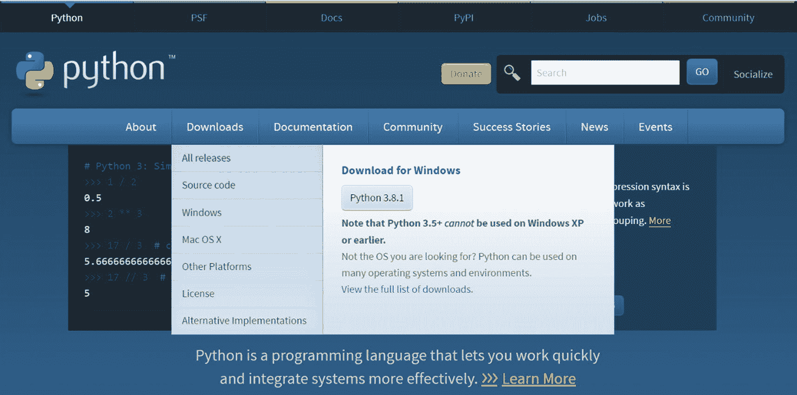

图 1-1

带有下载选项的 Python 项目主页

运行安装文件来安装 Python 3。在安装过程中，选中与将 Python 3 添加到 PATH 变量相关的复选框(图 [1-2](#Fig2) )。

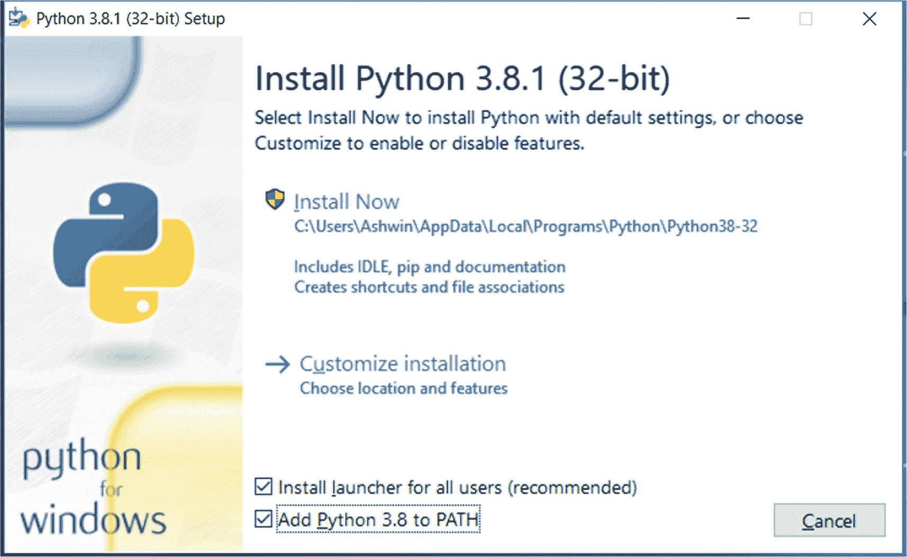

图 1-2

Python 安装向导

此外，选择“自定义安装”选项。这将带您进入更多选项，如图 [1-3](#Fig3) 所示。

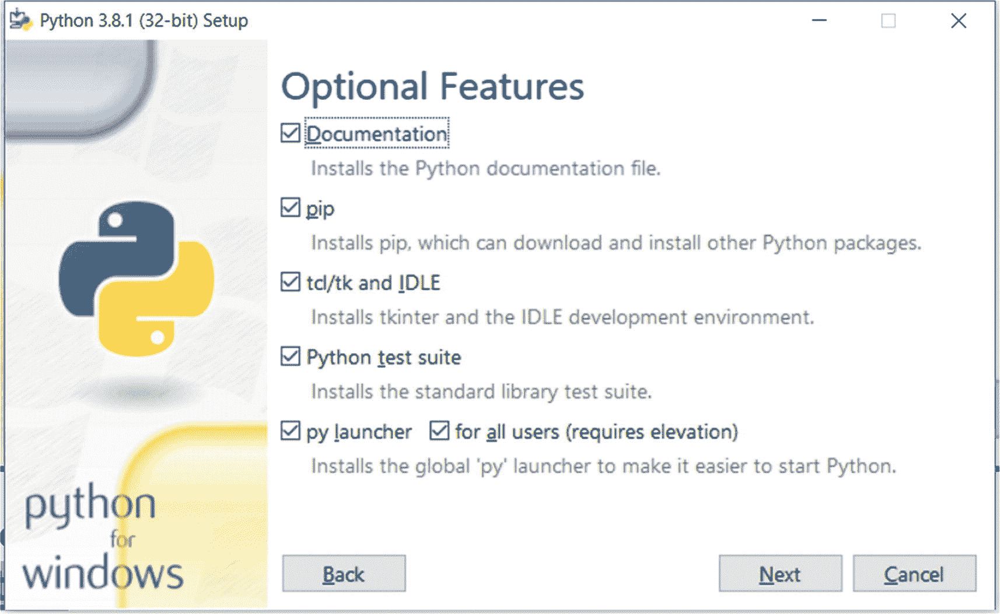

图 1-3

Python 安装选项

选择所有复选框，然后单击“下一步”按钮继续设置。完成设置。Python 的二进制可执行程序在 Windows 上的名字是`python`。安装完成后，在 Windows 命令提示符下运行以下命令，`cmd`:

```py
python -V

```

这会返回 Python 3 的版本，如下所示:

```py
Python 3.8.1

```

您也可以按如下方式检查 pip 的版本:

```py
pip3 -V

```

一个递归缩写， *pip* 代表“pip 安装 Python”或“Pip 安装软件包”。它是 Python 编程语言的一个包管理器。您可以使用 pip 实用程序为我们的演示安装其他所需的 Python 库。

要找出 Python 的确切位置，可以运行如下的`where`命令:

```py
where python

```

这将返回以下结果:

```py
C:\Users\Ashwin\AppData\Local\Programs\Python\Python38-32\python.exe

```

同样，您可以通过运行以下命令找到 pip3 实用程序的位置:

```py
where pip3

```

我们将在整本书中大量使用这个工具，在我们使用的计算机上安装和管理 Python 3 库。以下命令列出了所有已安装的软件包:

```py
pip3 list

```

### 在 Ubuntu/Debian 衍生产品上安装

Debian 是一个流行的发行版。Ubuntu Linux 和 Raspberry Pi OS 是基于 Debian 的其他流行发行版。Python 3 和 pip3 预装在所有 Debian 发行版和衍生版本中，如 Ubuntu 或 Raspberry Pi OS。因此，我们不必单独安装它们。我在一台 8 GB 内存的 Raspberry Pi 4B 上使用 Raspberry Pi 操作系统作为我的 Linux 计算机。Python 的两个主要版本，Python 2 和 Python 3，都预装在所有的 Debian 衍生版本中。它们的解释器可执行文件在 Python 2 和 Python 3 中分别命名为`python`和`python3`。我们将使用`python3`进行演示。要找出所需的二进制可执行文件的版本和位置，请逐一运行以下命令:

```py
python3 -V
pip3 -V
which python3
which pip3

```

几乎所有其他流行的 Linux 发行版都预装了 Python。

## 使用 Python 模式

Python 编程语言有各种执行程序(和语句，您很快就会看到)的模式。让我们逐一讨论。但是在我们开始讨论之前，让我们看看什么是空闲。IDLE 是 Python 软件基金会为 Python 编程开发的集成开发和学习环境。在 Windows 上安装 Python 3 的 CPython 实现时，也会安装 IDLE。您可以通过多种方式在 Windows 操作系统上启动它。第一种方法是在 Windows 搜索栏中输入 **IDLE** 进行搜索，如图 [1-4](#Fig4) 所示。

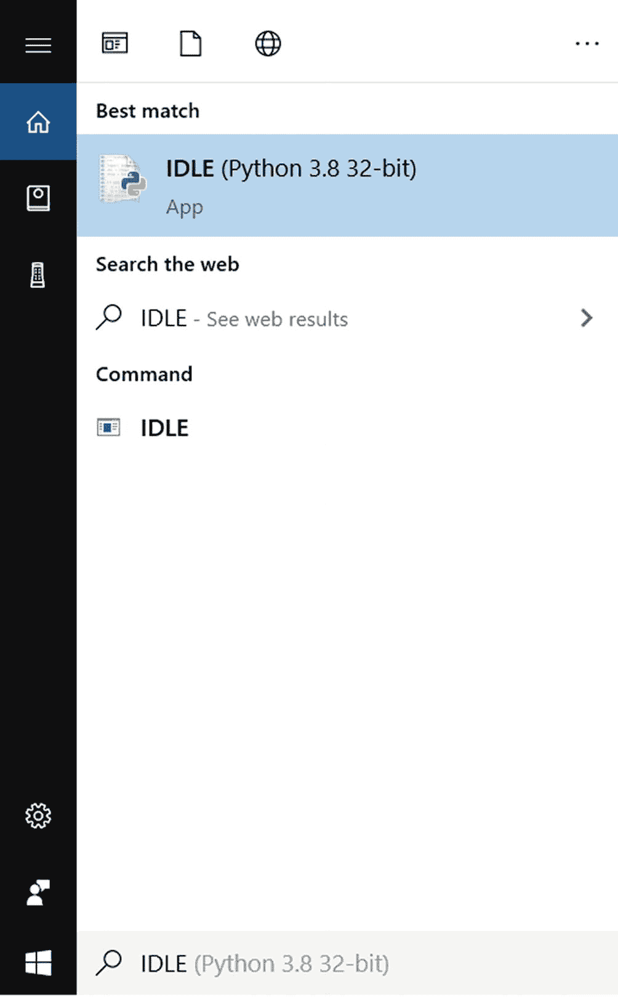

图 1-4

Python 在 Windows 上空闲

另一种方法是通过运行以下命令从命令提示符(`cmd`)启动它:

```py
idle

```

这将启动如图 [1-5](#Fig5) 所示的窗口。

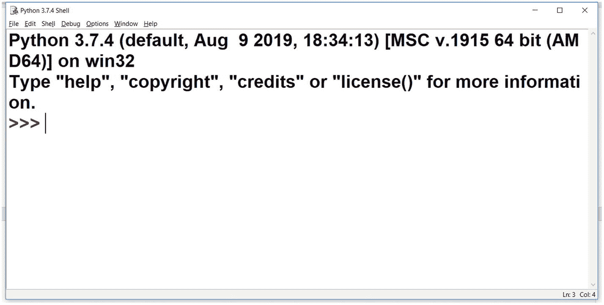

图 1-5

Python 空闲

在继续之前，您需要自定义 IDLE，以便它为您工作。您可以通过选择选项➤配置空闲来更改字体，如图 [1-6](#Fig6) 所示。

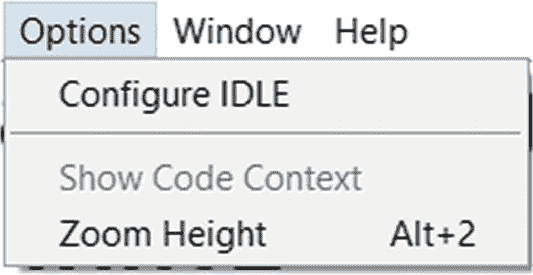

图 1-6

配置空闲

图 [1-7](#Fig7) 所示的窗口打开，您可以在空闲时更改字符的字体和大小。

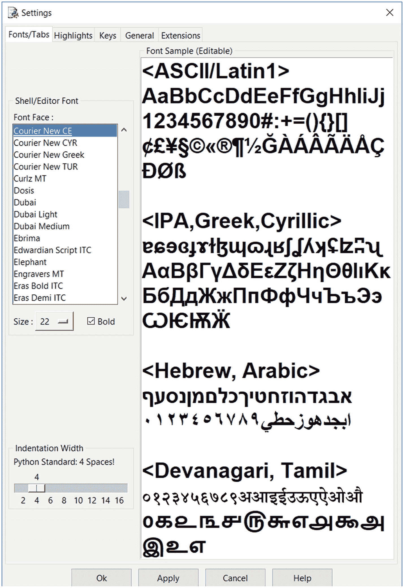

图 1-7

空闲配置窗口

根据自己的喜好调整选项。

并非所有的 Linux 发行版都预装了 IDLE。您可以通过依次运行以下命令，将它安装在 Debian 及其衍生物(Ubuntu 和 Raspberry Pi OS)上:

```py
sudo apt-get update
sudo apt-get install idle3

```

一旦安装完成，你可以在菜单中找到 IDLE(这里是 Raspberry Pi OS 菜单)，如图 [1-8](#Fig8) 所示。

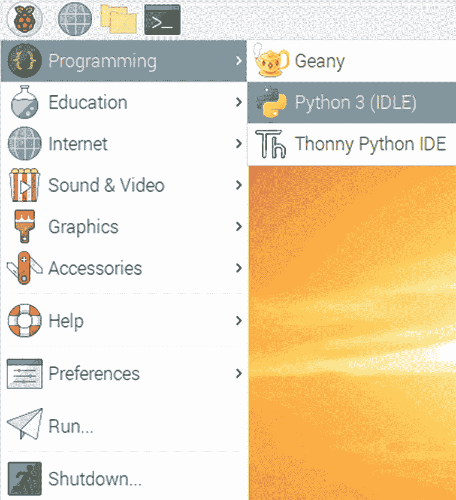

图 1-8

在 Raspberry Pi 操作系统菜单中空闲

您也可以通过运行以下命令在 Linux 上启动 IDLE:

```py
idle

```

现在我们来讨论一下 Python 的各种模式。

### 对话方式

Python 的交互模式就像一个命令行 shell，执行当前语句，并在控制台上给出即时反馈。它会立即运行提供给它的语句。当新的语句被输入解释器并由解释器执行时，代码被求值。当您打开 IDLE 时，您会看到一个命令行提示。这是 Python 的交互模式。为了看一个简单的例子，让我们在交互提示中键入习惯的 **Hello World** 程序，如下所示:

```py
print('Hello World!')

```

按 Enter 键将该行输入解释器并执行它。图 [1-9](#Fig9) 显示了输出。

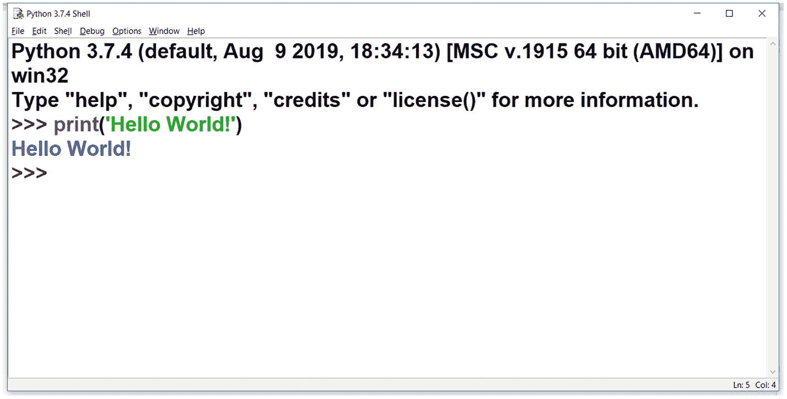

图 1-9

空闲时的 Python 交互模式

您也可以从命令提示符启动 Python 的交互模式。在 Linux 命令提示符下(例如 lxterminal)，运行命令`python3`，在 Windows 命令提示符下(`cmd`，运行命令`python`。图 [1-10](#Fig10) 显示了 Windows 命令提示符下的交互模式。


图 1-10

Python 交互模式，Windows 命令提示符

### 脚本模式

你可以写一个 Python 程序，保存到磁盘。然后你可以用多种方式启动它。这被称为*脚本模式*。让我们在空闲时演示一下。您可以使用任何文本编辑器来编写 Python 程序。但是因为 IDLE 是一个 IDE，所以使用 IDLE 编写和运行 Python 程序很方便。让我们先看看那个。在空闲状态下，选择文件➤新文件。这将创建一个新的空白文件。向其中添加以下代码:

```py
print('Hello World!')

```

然后用名称`prog01.py`保存在磁盘上(图 [1-11](#Fig11) )。

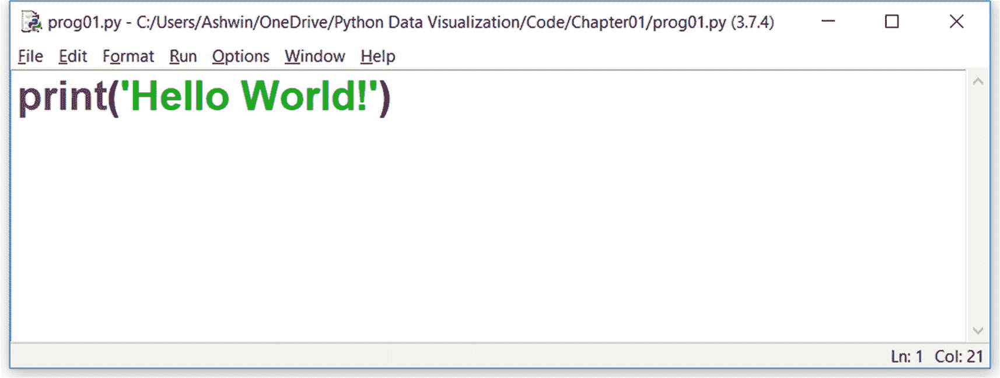

图 1-11

空闲代码编辑器中的 Python 程序

在菜单中，选择运行➤运行模块。这将在 IDLE 的提示下执行程序，如图 [1-12](#Fig12) 所示。


图 1-12

在空闲提示符下执行的 Python 程序

你甚至可以在操作系统的命令提示符下用 Python 的解释器启动程序。打开操作系统的命令提示符，导航到存储程序的目录。在 Windows 命令提示符下，运行以下命令:

```py
python prog01.py

```

在 Linux 终端中，您必须运行以下命令提示符:

```py
python3 prog01.py

```

然后解释器将在命令提示符下运行程序，输出(如果有的话)将出现在那里。

在 Linux 中，有另一种方法可以运行程序，而不需要显式地使用解释器。您可以在代码文件的开头添加一个 shebang 行。例如，假设我们的代码文件如下所示:

```py
#!/usr/bin/python3
print('Hello World!')

```

第一条线被称为 *shebang* 线。它告诉 shell 使用什么解释器及其位置。然后运行以下命令更改文件权限，使其对所有者可执行，如下所示:

```py
chmod 755 prog01.py

```

然后你可以像其他可执行文件一样用`./`直接启动你的 Python 程序文件，如下所示:

```py
./prog01.py

```

shell 将执行程序并在终端中打印输出。请注意，这仅适用于类 Unix 系统(Linux 和 macOS ),因为它们支持像这样执行程序。在整本书中，你会学到更多关于 Python 编程的知识。

## 使用 Python IDEs

您已经学习了如何使用 Python 解释器和 IDLE 来运行 Python 3 语句和程序。您可以使用其他免费提供的 ide 和插件，让 ide 与 Python 一起工作。下面是一些著名的 Python 3 和插件的列表，以及它们主页的 URL:

*   PyCharm 社区版( [`https://www.jetbrains.com/pycharm/`](https://www.jetbrains.com/pycharm/) )

*   标枪 IDE ( [`https://www.spyder-ide.org/`](https://www.spyder-ide.org/)

*   Thonny Python 编辑( [`https://thonny.org/`](https://thonny.org/) )

*   穆编辑( [`https://codewith.mu/`](https://codewith.mu/) )

*   Eclipse 的 PyDev 插件( [`https://www.pydev.org/`](https://www.pydev.org/) )

所有这些 ide 和插件都可以免费下载和使用。作为本章的一个练习，您可能想要探索它们以找到您最熟悉的 IDE。

## 探索科学 Python 生态系统

科学 Python 生态系统是用于科学计算的开源 Python 库的集合。它有以下核心组件:

*   *Python* :这是一种编程语言。

*   NumPy:这是数值计算的基础库。科学 Python 生态系统中几乎所有的库都是基于 NumPy 的。它提供了一种被称为*Ndarray*(N 维数组)的通用数据结构。

*   这个库有许多科学计算的例程。

*   Matplotlib :这是一个可视化的库。它的`pyplot`模块有 Matlab 风格的可视化例程。

所有这些组件一起提供了类似 Matlab 的功能:

*   这是一个数据科学的图书馆，提供了高性能、易于使用的数据结构，比如用于存储数据的系列和数据框架。

*   这是给符号数学和代数的。

*   这是一个表示和可视化图形和网络的库。

*   这是一个用于图像处理的库。

*   *Scikit-learn* :这是一个机器学习和人工智能的库。

除了这些库，IPython 还为 Python 解释器提供了更好的交互环境。IPython 的交互环境可以通过使用 Jupyter Notebook 的基于网络的笔记本来访问。

这一章的其余部分着重于朱庇特笔记本。

## Jupyter 笔记本介绍

在本章的前面，您学习了运行 Python 语句的各种方法。您在脚本中和解释器的交互模式下运行 Python 语句。使用交互模式的主要优势是即时反馈。这种模式的主要缺点是，如果您在输入的语句中出现任何错误，您必须重新编写整个语句才能重新执行。另外，很难将其保存为程序。可以在菜单的文件选项中找到保存要在解释器上运行的语句的选项。但是，所有的语句及其输出将以纯文本格式保存，扩展名为`.py`。如果有任何图形输出，它将单独显示，不能与语句一起存储。

由于解释器中交互模式的限制，我们将使用更好的工具在 web 浏览器中交互运行 Python 语句。这个工具被称为 Jupyter 笔记本。它是一个服务器程序，可以在网络浏览器中创建交互式笔记本。

Jupyter Notebook 是一个基于 web 的笔记本，用于各种编程语言的交互式编程，如 Python、Octave、Julia 和 r。它很受研究领域工作人员的欢迎。Jupyter Notebook 可以将代码、可视化、输出和富文本保存在一个文件中。Jupyter Notebook 相对于 Python 自带的交互提示的优势在于，你可以编辑代码，即时看到新的输出，这在 Python 的交互模式下是做不到的。另一个优点是，您将代码、富文本元素和代码输出(可以是图形或富文本格式)放在磁盘上的同一个文件中。这使得分发变得容易。您可以通过互联网或使用便携式存储设备保存和共享这些笔记本。网上有很多服务可以帮助你在云服务器上存储和执行你的笔记本脚本。

## 设置 Jupyter 笔记本

通过在命令提示符下运行以下命令，您可以在任何计算机上轻松安装 Jupyter 笔记本服务器程序:

```py
pip3 install jupyter

```

现在让我们看看如何使用 Jupyter Notebook 来编写和执行 Python 语句。在操作系统的命令提示符下运行以下命令，启动 Jupyter 笔记本服务器进程:

```py
jupyter notebook

```

Jupyter 笔记本服务器进程将被启动，命令提示符窗口显示服务器日志，如图 [1-13](#Fig13) 所示。

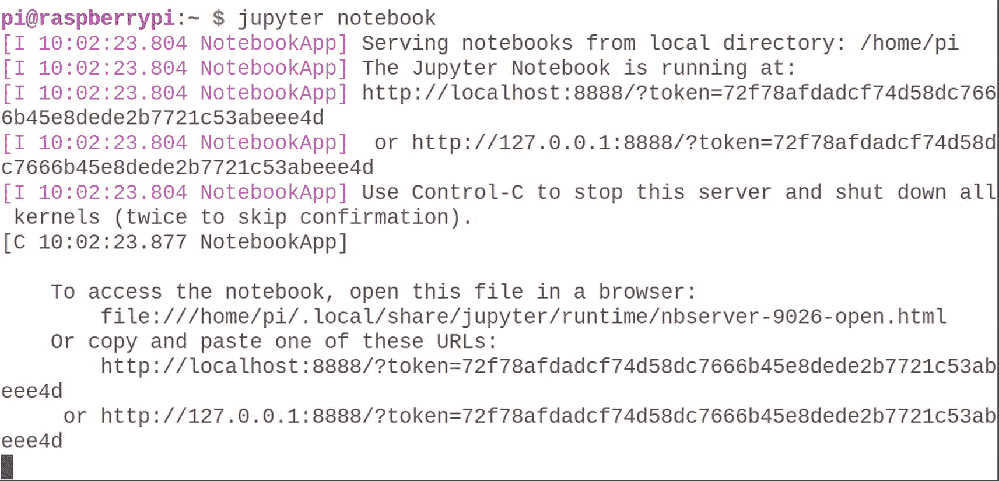

图 1-13

启动新的 Jupyter 笔记本流程

此外，它会在操作系统的默认浏览器中启动一个网页。如果浏览器窗口已经打开，则它会在同一浏览器窗口的新选项卡中启动页面。打开页面的另一种方法(如果您关闭运行 Jupyter Notebook 的浏览器窗口)是在浏览器中访问`http://localhost:8888/`。显示如图 [1-14](#Fig14) 所示的页面。


图 1-14

使用令牌登录

以下几行文本是服务器日志。

`To access the notebook, open this file in a browser:`

```py
file:///C:/Users/Ashwin/AppData/Roaming/jupyter/runtime/nbserver-8420-open.html

```

`Or copy and paste one of these URLs:`

```py
http://localhost:8888/?token=e4a4fab0d8c22cd01b6530d5daced19d32d7e0c3a56f925c
http://127.0.0.1:8888/?token=e4a4fab0d8c22cd01b6530d5daced19d32d7e0c3a56f925c

```

在前面的日志中，您可以看到几个 URL。它们引用同一个页面(localhost 和 127.0.0.1 是同一个主机)。您可以直接在浏览器选项卡的地址栏中复制并粘贴这些 URL，然后打开 Jupyter 笔记本主页，或者您可以访问前面讨论过的`http://localhost:8888/`，然后在服务器日志中粘贴令牌(在我们的示例中是`e4a4fab0d8c22cd01b6530d5daced19d32d7e0c3a56f925c`)并登录。这将把你带到同一个主页。

请注意，Jupyter 笔记本服务器的每个实例都有自己的令牌，因此书中显示的令牌不适用于您的笔记本。该令牌仅对该服务器进程有效。

因此，如果您遵循前面解释的任何一条路线，您将在浏览器窗口中看到一个主页选项卡，如图 [1-15](#Fig15) 所示。

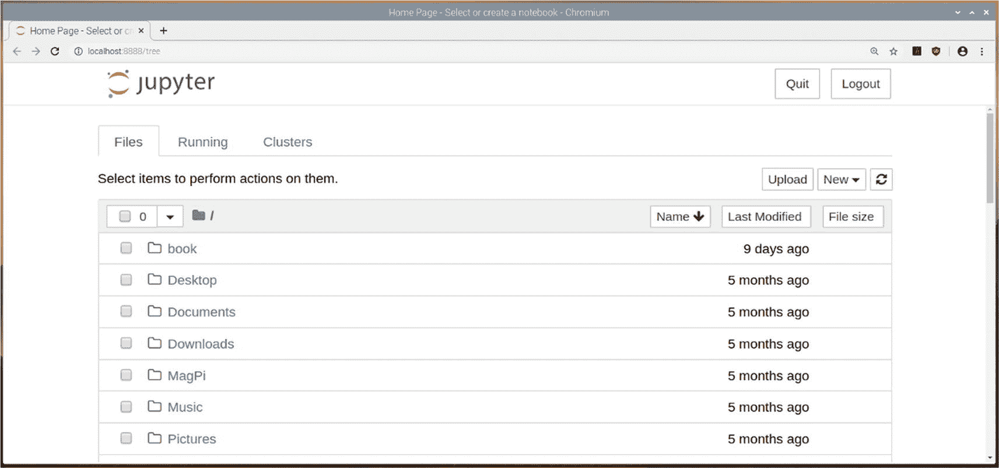

图 1-15

木星笔记本的新主页标签

如您所见，网页上有三个选项卡:文件、运行和集群。“文件”选项卡显示从命令提示符启动笔记本服务器的目录中的目录和文件。在前面的例子中，我从我的 Raspberry Pi 的 lxterminal 执行了命令`jupyter notebook`。当前工作目录是`pi`用户`/home/pi`的`home`目录。这就是为什么你可以在图 [1-15](#Fig15) 中看到我的树莓派电脑主目录下的所有文件和目录。

在右上角，您可以看到退出和注销按钮。如果您单击“注销”按钮，它将从当前会话中注销，要登录，您还需要笔记本服务器日志中嵌入了令牌的令牌或 URL，如前所述。如果你点击退出按钮，那么它会停止在命令提示符下运行的笔记本服务器进程，并显示如图 [1-16](#Fig16) 所示的模态消息框。


图 1-16

单击退出按钮后显示的消息

要使用 Jupyter 笔记本，您需要在命令提示符下再次执行命令`jupyter notebook`。

在右上角，就在退出和注销按钮的下方，您可以看到一个带有刷新符号的小按钮。此按钮刷新主页。您还有一个新按钮。点击后会显示下拉列表，如图 [1-17](#Fig17) 所示。

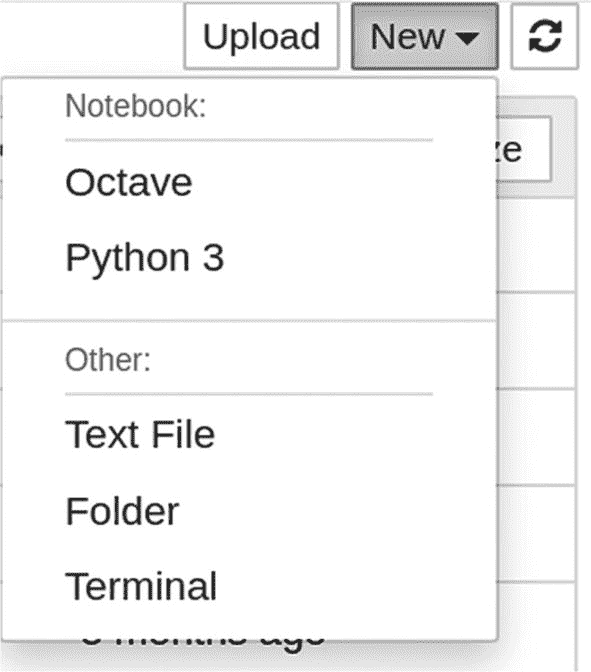

图 1-17

新笔记本的选项

如您所见，下拉列表分为两个部分，笔记本和其他。您可以创建 Octave 和 Python 3 笔记本。如果您的计算机安装了 Jupyter Notebook 支持的更多编程语言，那么所有这些语言都会显示在这里。您也可以创建文本文件和文件夹。您可以通过点按“终端”在 web 浏览器中打开命令提示符。图 [1-18](#Fig18) 显示 lxterminal 在单独的 web 浏览器选项卡中运行。

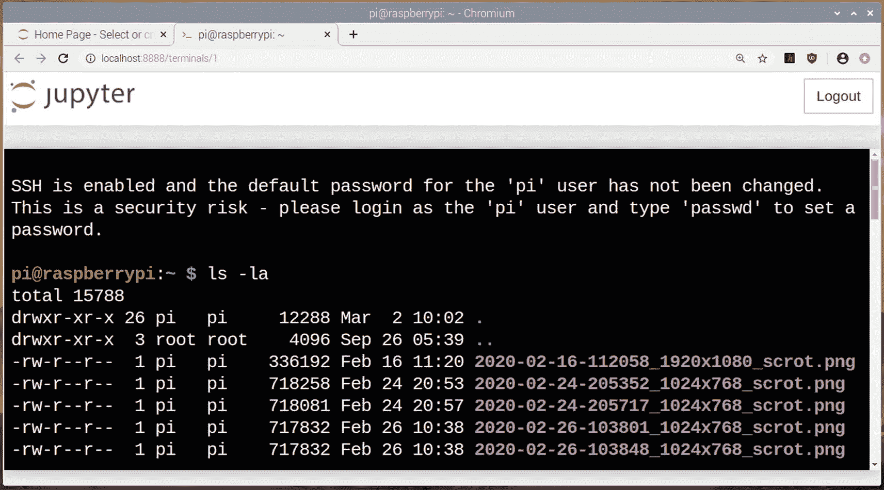

图 1-18

浏览器中的新 lxterminal 窗口

点击下拉列表中的 Python 3，创建一个新的 Python 3 笔记本，如图 [1-19](#Fig19) 所示。

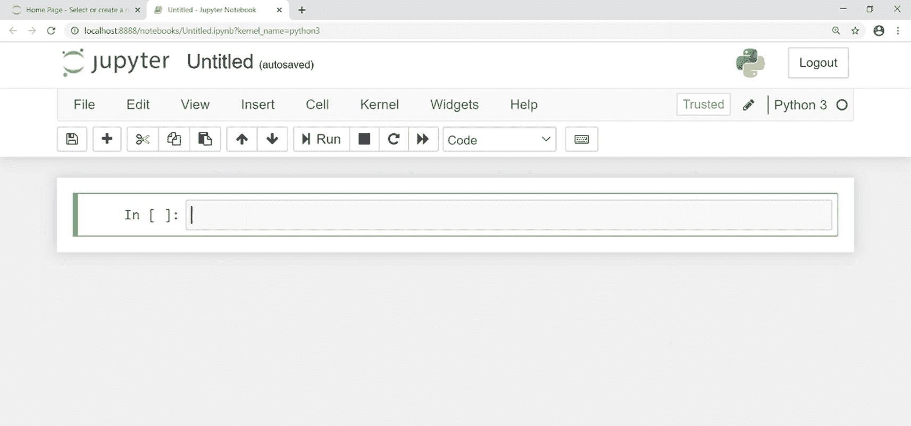

图 1-19

新的 Python 3 笔记本

如果在浏览器中点击首页标签页再次进入首页，然后在首页打开运行标签页，可以看到终端和 Python 3 笔记本对应的条目，如图 [1-20](#Fig20) 所示。

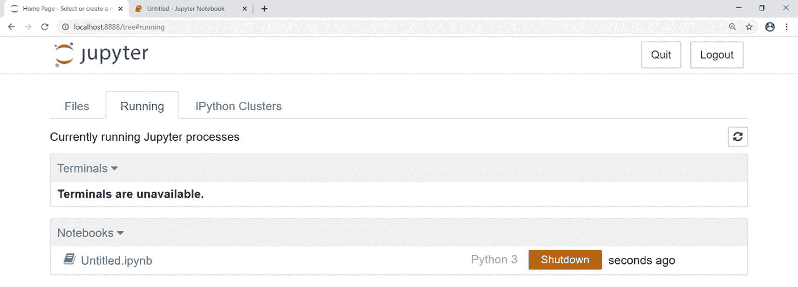

图 1-20

当前 jupiter 笔记本子流程摘要

## Jupyter 笔记本中的运行代码

再次转到 Python 3 的 Untitled1 选项卡，在文本区域(也称为*单元格*)中键入以下语句:

```py
printf("Hello, World!\n");

```

然后点击运行按钮。Jupyter 会将该语句作为 Python 3 语句执行，并在单元格正下方显示结果，如图 [1-21](#Fig21) 所示。

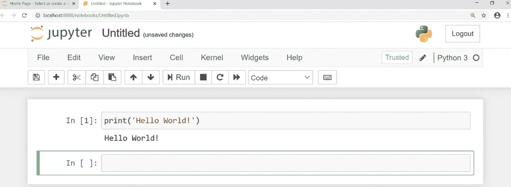

图 1-21

Jupyter 笔记本中的代码输出

如您所见，在执行之后，它会自动在结果下方创建一个新的单元格，并将光标放在那里。让我们讨论菜单栏和编程单元上方的图标。您可以通过单击软盘图标来保存文件。您可以通过单击+图标在当前单元格后添加一个新的空单元格。接下来的三个图标是剪切、复制和粘贴。使用向上和向下箭头可以分别上下移动当前单元格的位置。下一个选项是运行单元，您已经看到了。接下来的三个图标分别用于中断内核、重启内核和重新运行笔记本中的所有单元。旁边有一个下拉框，告诉您应该是哪种类型的单元格。图 [1-22](#Fig22) 显示点击时的下拉。

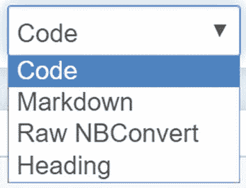

图 1-22

Jupyter 笔记本中的细胞类型

选择代码选项时，该单元被视为 Python 3 代码单元。当您选择降价选项时，它被视为降价单元格。Markdown 是一种可以创建富文本输出的标记语言。例如，任何跟在`#`后面的都创建一个标题，任何跟在`##`后面的都创建一个副标题，等等。只需在 Markdown 单元格中键入以下行并执行它们:

```py
# Heading 1
## Heading 2

```

在我们的 Python 3 演示中，我们将主要对标题使用 Markdown。但是，您可以通过访问 https:// jupyter-notebook 来进一步探索 Markdown。阅读文档。io/en/stable/examples/Notebook/Working %20 含%20 降价% 20 单元。html 。图 [1-23](#Fig23) 显示了之前演示的输出。

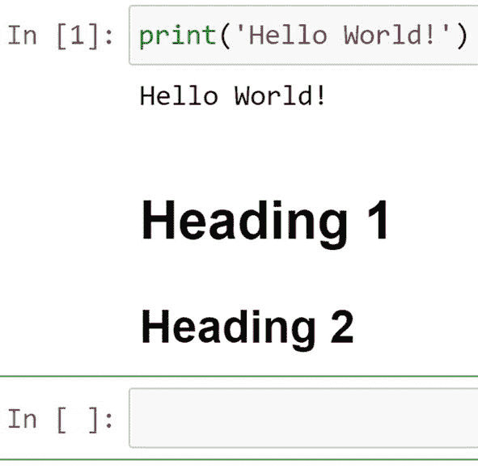

图 1-23

降价中的标题

您甚至可以通过单击笔记本顶部的文件名来更改笔记本文件的名称。点击后，你会看到一个用于重命名的模态框，如图 [1-24](#Fig24) 所示。


图 1-24

在 Jupyter 中重命名笔记本

如果需要，可以重命名笔记本。如果您在命令提示符下浏览磁盘上启动 Jupyter 笔记本的位置，您会发现扩展名为`.ipynb`的文件(意思是“IPython 笔记本”)。

同样的，你可以使用 Jupyter Notebook 与其他支持 Jupyter 的编程语言进行交互编程。我们将主要使用这种笔记本格式来存储交互式会话的代码片段。这是因为一切都保存在一个文件中，可以很容易地共享，如前所述。

您可以清除一个单元格或整个笔记本的输出。在菜单栏中，单击单元格菜单。在下拉列表中,“当前输出”和“所有输出”有一个清除选项，用于清除单元格的输出。图 [1-25](#Fig25) 显示了选项。

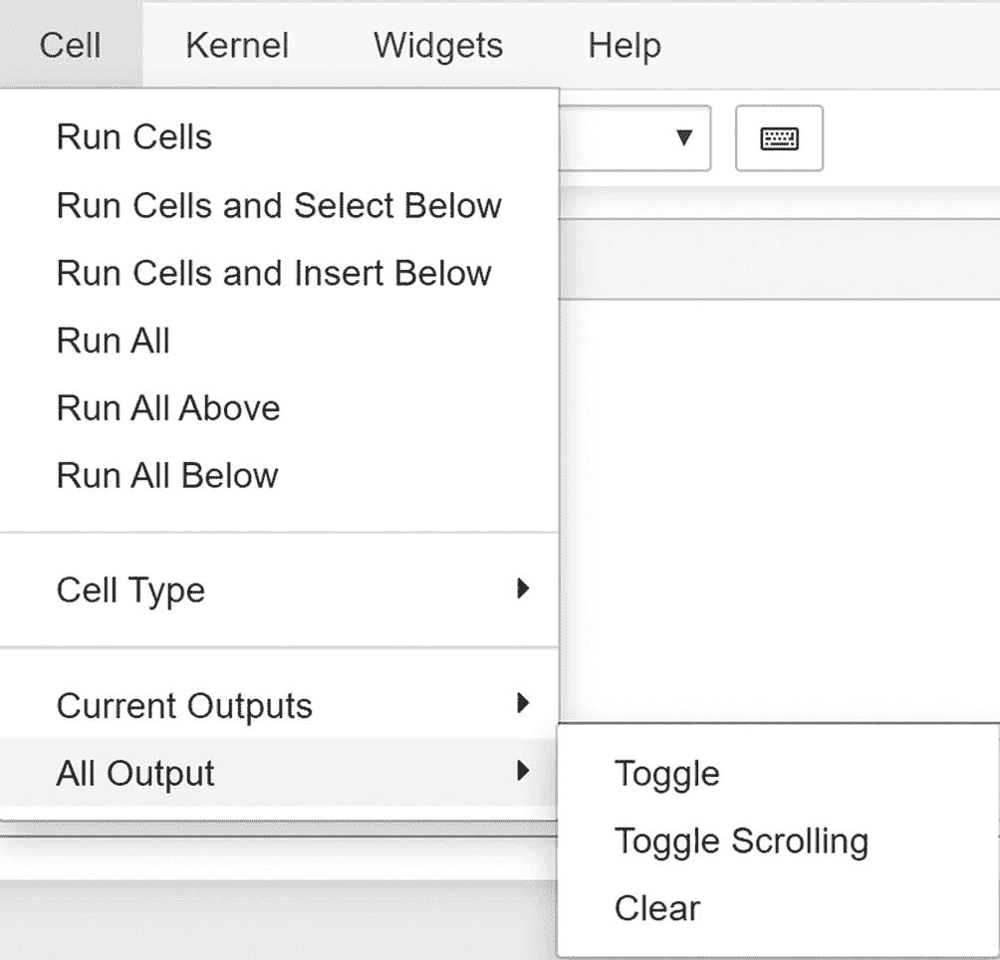

图 1-25

清除 Jupyter 中的输出

Jupyter Notebook 最显著的优点之一是，如果有任何语法错误或者您只是想更改代码，您可以编辑已经执行的单元格。Jupyter Notebook 就像一个运行在 web 浏览器中的 IDE，并在同一个窗口中生成输出。这种将代码、富文本和输出保存在同一个文件中的交互性和便利性使得 Jupyter Notebook 项目在世界范围内大受欢迎。运行 Python 程序的内核来自 IPython 项目。正如我前面提到的，您也可以将它用于其他编程语言。我用它来运行 GNU Octave 程序。

您可以在以下网址找到关于 Jupyter Notebook 和 IPython 的更多信息:

```py
https://jupyter.org/
https://ipython.org/

```

## 蟒蛇

在我们结束本章之前，我们需要讨论一下 Python 发行版。Python 发行版只不过是与 Python 库捆绑在一起的 Python 解释器。Anaconda 就是这样一个受欢迎的发行版。您可以在 Linux、Windows 和 macOS 上下载并安装 Anaconda。Anaconda 有很多版本。其中一个是免费的，仅供个人使用。你可以在 [`https://www.anaconda.com/products/individual`](https://www.anaconda.com/products/individual) 找到它。

Anaconda 附带了一个开源的包管理器，可以为 Python 和其他程序安装包。它被称为康达。你可以在 [`https://docs.conda.io/en/latest/`](https://docs.conda.io/en/latest/) 找到更多关于康达包管理器的信息。

如果你已经从 Python 的网站安装了 Python，我推荐你用另一台电脑安装 Anaconda。拥有多个解释器和 Python 发行版可能会令人困惑。

## 摘要

在本章中，你学习了 Python 编程语言的基础。您学习了如何编写基本的 Python 程序，以及如何以各种方式执行它们。您学习了在 Windows 和 Linux 等各种操作系统上使用 Python。您还学习了 Python 编程语言的各种模式，以及如何从各种操作系统的命令提示符下启动 Python。您学习了 Python 内置包管理器 pip 的基础知识。我们还简要讨论了 Python 的其他 ide。

然后，简要介绍了科学 Python 生态系统。我们将在接下来的章节中探索这个生态系统的许多组成部分。您还学习了如何在各种平台上安装 Jupyter Notebook，并探索了如何在 Jupyter Notebook 中运行简单的 Python 语句。您了解了可以将代码和相同代码的输出存储在一个文件中，该文件可以通过 Internet 和其他媒体(如便携式存储设备)轻松共享。

在下一章，我们将从 NumPy 开始。