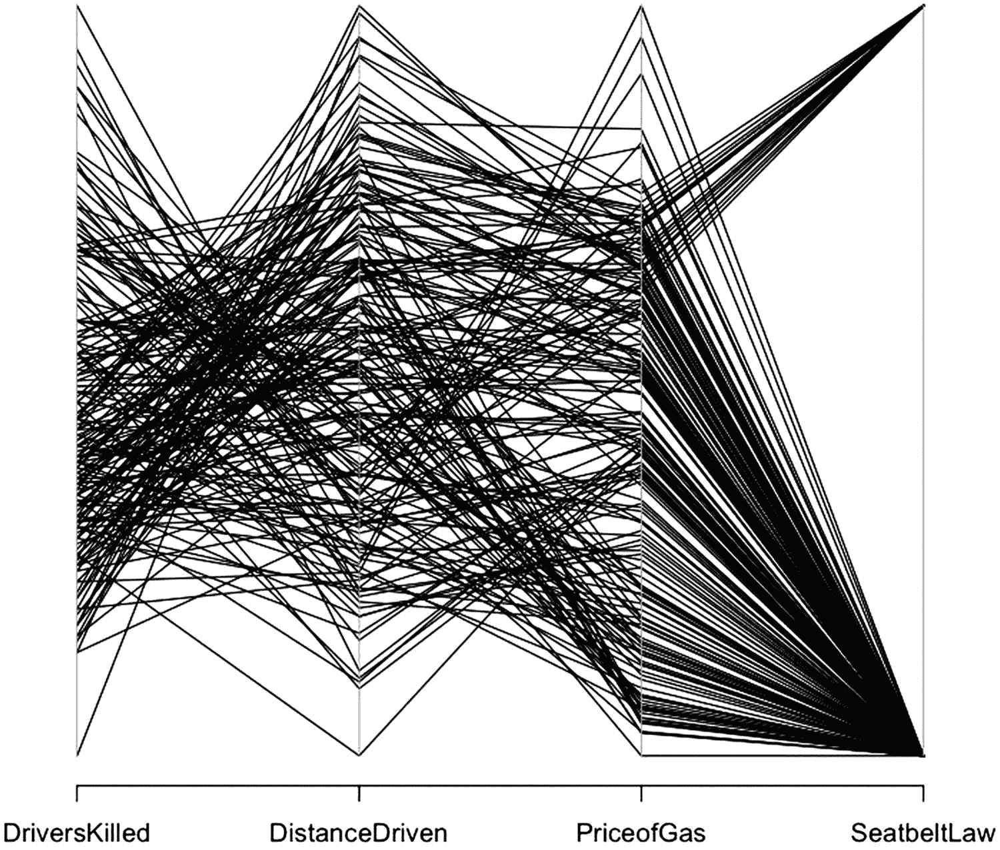
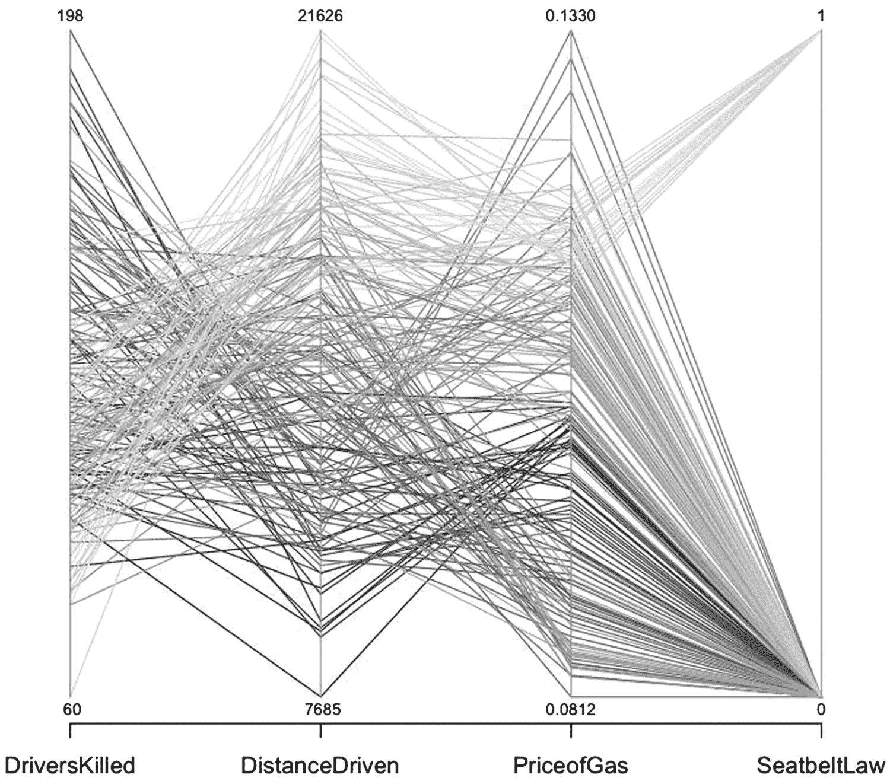
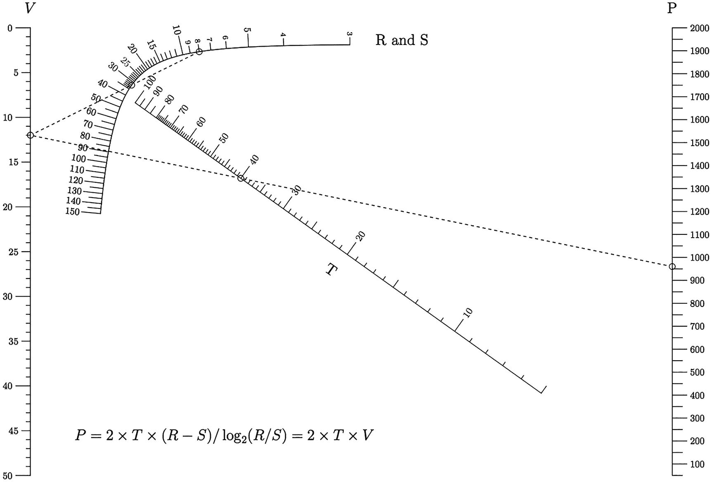
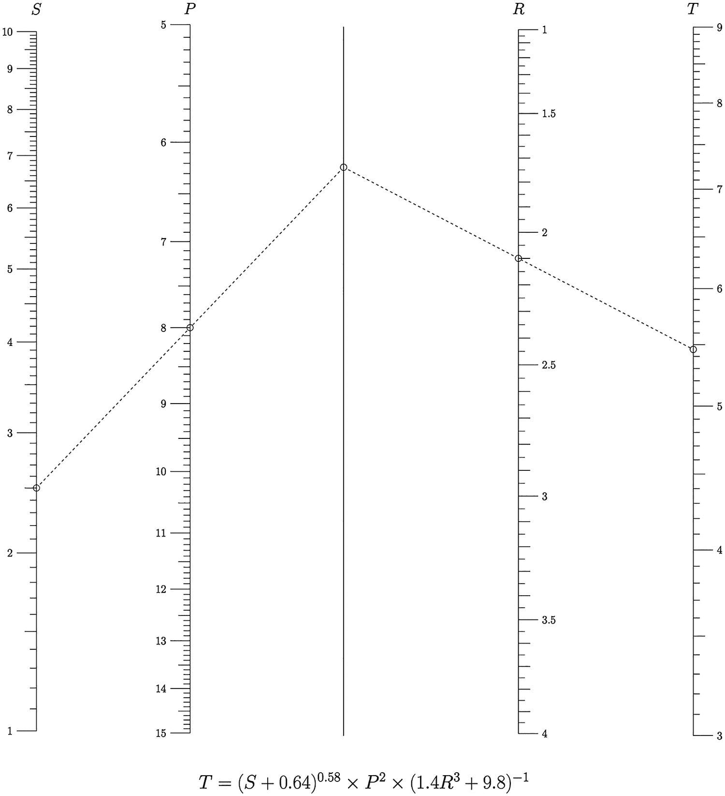
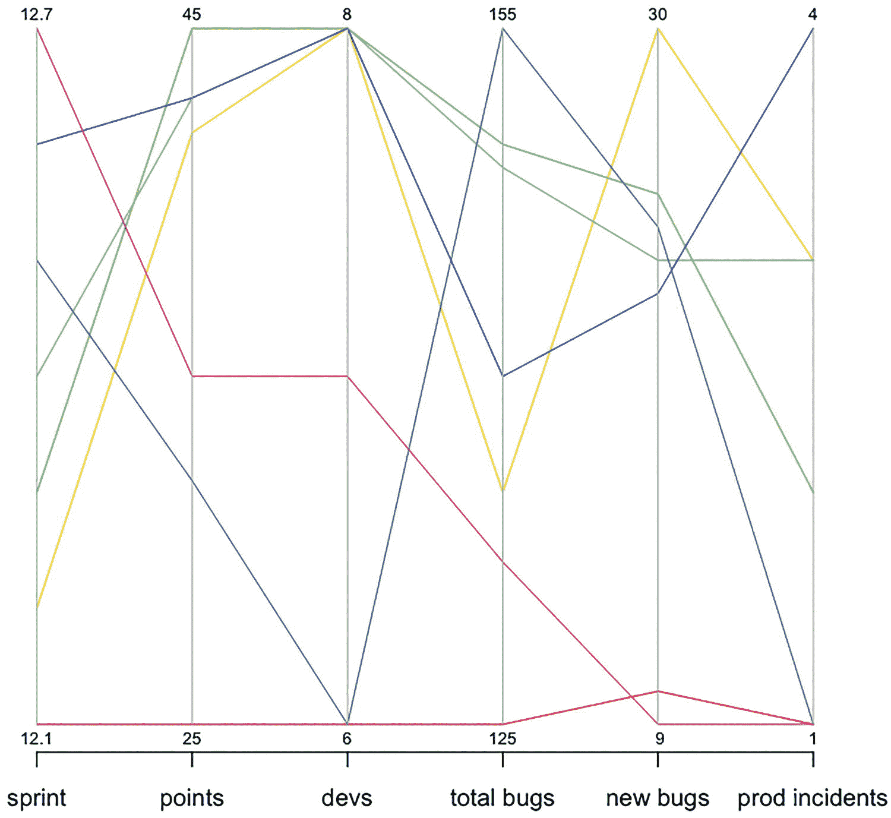
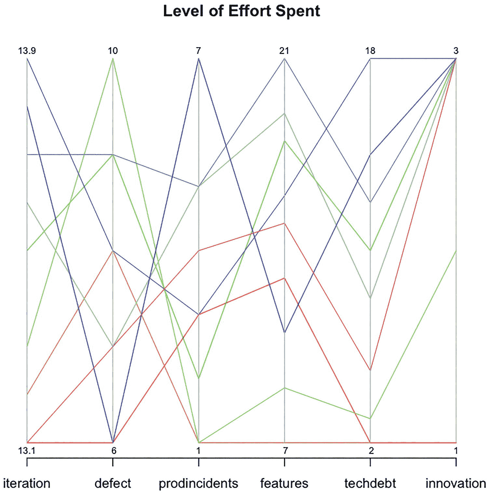
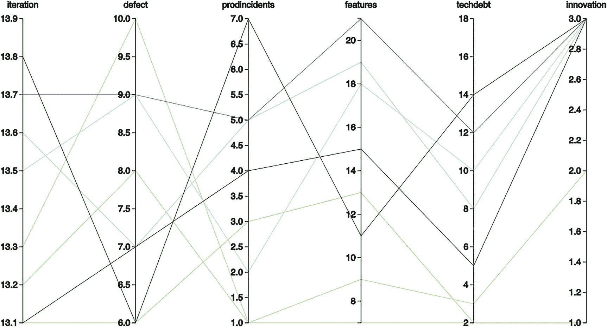
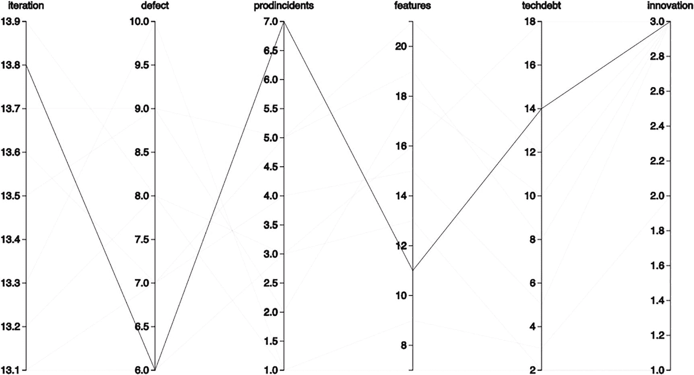

# 九、使用平行坐标可视化交付和质量的平衡

最后一章着眼于使用散点图来确定数据集之间的关系。它讨论了数据集之间可能存在的不同类型的关系，例如正相关和负相关。我们在团队动力学的前提下表达了这个想法:你看到团队中的人数和团队能够完成的工作量之间，或者完成的工作量和产生的缺陷数量之间有任何关联吗？

在这一章中，我们将一直在谈论的关键概念联系在一起:可视化、团队特征工作、缺陷和生产事件。我们将使用名为平行坐标的数据可视化将它们联系在一起，以显示这些工作之间的平衡。

## 什么是平行坐标图？

平行坐标图是由 N 个垂直轴组成的可视化图，每个轴代表一个唯一的数据集，并在轴上绘制线条。线条显示了轴之间的关系，很像散点图，线条形成的图案表明了这种关系。当我们看到一簇线时，我们还可以收集关于轴之间关系的细节。让我们以图 [9-1](#Fig1) 中的图表为例来看看这一点。



图 9-1

安全带数据集的平行坐标

我从 r 内置的数据集`Seatbelts`构建了图 [9-1](#Fig1) 中的图表。安全带在 R 命令行。我提取了可用列的子集，以便更好地突出显示数据中的关系:

```py
cardeaths <- data.frame(Seatbelts[,1], Seatbelts[,5], Seatbelts[,6], Seatbelts[,8])
colnames(cardeaths) <- c("DriversKilled", "DistanceDriven", "PriceofGas", "SeatbeltLaw")

```

该数据集代表了强制系安全带前后英国死于车祸的司机人数。坐标轴代表死亡司机的数量，行驶的距离，当时的汽油成本，以及是否有安全带法。

查看平行坐标有许多有用的方法。如果我们观察一对轴之间的连线，我们可以看到这些数据集之间的关系。例如，如果我们观察汽油价格和安全带法律之间的关系，我们可以看到，当安全带法律存在时，汽油价格受到非常严格的约束，但当安全带法律不存在时，汽油价格涵盖了很大范围的价格(即，许多不同的线汇聚在代表法律之前的时间的点上，一条窄带线汇聚在法律通过后的时间上)。这种关系可能意味着许多不同的事情，但因为我知道这些数据，我知道这是因为在法律实施后，我们的死亡样本量要小得多:在安全带法律实施前有 14 年的数据，但在安全带法律实施后只有 2 年的数据。

我们还可以沿着所有轴追踪线条，看看每个轴是如何关联的。对于所有颜色相同的线条，这是很难做到的，但是当我们改变线条的颜色和阴影时，我们可以更容易地看到图表上的图案。让我们拿现有的图表，给线条分配颜色(结果如图 [9-2](#Fig2) 所示；此外，如果您还没有软件包，您需要安装它):



图 9-2

安全带数据集的平行坐标，每条线有不同的灰色阴影

```py
library(MASS)
parcoord(cardeaths, col=rainbow(length(cardeaths[,1])), var.label=TRUE)

```

Note

您需要导入批量库来使用`parcoord()`功能。

图 [9-2](#Fig2) 开始显示数据中存在的模式。死亡人数最少的线路行驶的距离也最长，并且主要落在安全带法颁布后的时间点。同样，请注意，安全带后法律的样本量确实比安全带前法律的样本量小得多，但您可以看到，能够追踪这些数据点的相互联系是多么有用和有意义。

## 平行坐标图的历史

在纵轴上使用平行坐标的想法是 1885 年由 Maurice d'Ocagne 发明的，当时他创建了诺模图和诺模图领域。诺模图是根据数学规则计算数值的工具。至今仍在使用的诺谟图的经典例子是温度计上同时显示华氏温度和摄氏温度的线条。或者想想尺子，一边以英寸显示数值，另一边以厘米显示数值。

Note

罗恩·多弗勒写了一篇关于诺模图的长篇论文，请点击这里: [`http://myreckonings.com/wordpress/2008/01/09/the-art-of-nomography-i-geometric-design/`](http://myreckonings.com/wordpress/2008/01/09/the-art-of-nomography-i-geometric-design/) 。Doerfler 还主持了一个名为 modern nomograms([`www.myreckonings.com/modernnomograms/`](http://www.myreckonings.com/modernnomograms/)`)`)的网站，该网站“提供专为当今应用而设计的引人注目且有用的图形计算器”

你可以在图 [9-3](#Fig3) 和 [9-4](#Fig4) 中看到现代诺谟图的例子，由罗恩·多弗勒提供。



图 9-4

罗恩·多弗勒、叶小开·罗舍尔和乔·马拉斯科提供的曲线比例尺诺谟图



图 9-3

展示函数 S、P、R 和 T 之间数值转换的诺模图，这是顺序概率比测试的基础

Note

术语*平行坐标*及其代表的概念是阿尔弗雷德·因塞尔伯格在伊利诺伊大学学习期间推广并重新发现的。Inselberg 博士目前是特拉维夫大学的教授和圣地亚哥超级计算中心的高级研究员。Inselberg 博士还出版了一本关于这个主题的书，*平行坐标:视觉多维几何及其应用* (Springer，2009)。他还发表了一篇关于如何有效阅读和使用平行坐标的论文，题目是“多维侦探”，可从 IEEE 获得。

## 寻找平衡

我们知道平行坐标用于可视化多个变量之间的关系，但这如何应用于我们在本书中迄今为止一直在谈论的内容呢？到目前为止，我们讨论了量化和可视化缺陷积压、生产事件的来源，甚至我们团队承诺的工作量。可以说，平衡产品开发的这些方面可能是团队所做的最具挑战性的活动之一。

在每一次正式或非正式的迭代中，团队成员都必须决定他们应该在每一个关注点上投入多少精力:开发新功能、修复现有功能的缺陷，以及根据用户的直接反馈解决生产事件。这些只是每个产品团队必须处理的细微差别的一个例子；他们可能还必须考虑花费在技术债务或更新基础设施上的时间。

我们可以使用平行坐标来形象化这种平衡，既可以作为文档，也可以作为开始新的 sprints 时的分析工具。

### 创建平行坐标图

创建平行坐标图有几种不同的方法。使用前一章的数据，我们可以查看每次迭代的运行总数。回想一下，数据是每个迭代中提交的点的总数，以及每个团队的 backlog 中有多少 bug 和产品事件，在迭代中有多少新 bug，以及团队中有多少成员。数据看起来很像这样:

```py
  Sprint TotalPoints TotalDevs Team   BugBacklog BugsOpened ProductionIncidents
  1      12.10       25        6 Gold 125        10         1
  2      12.20       42        8 Gold 135        30         3
  3      12.30       45        8 Gold 150        25         2
  4      12.40       43        8 Gold 149        23         3
  5      12.50       32        6 Gold 155        24         1
  6      12.60       43        8 Gold 140        22         4
  7      12.70       35        7 Gold 132         9         1
...

```

为了利用这些数据，我们可以把它读入 R，就像我们在上一章所做的那样:

```py
tvFile <- "/Applications/MAMP/htdocs/teamvelocity.txt"
teamvelocity <- read.table(tvFile, sep=",", header=TRUE)

```

然后，我们可以创建一个新的数据框，其中包含来自`teamvelocity`变量的所有列，除了`Team`列。该列是一个字符串，如果我们在传递给它的对象中包含字符串，我们在本例中使用的 R `parcoord()`函数就会抛出一个错误。团队信息在这种情况下也没有意义。图表中的线条将代表我们的团队:

```py
t<- data.frame(teamvelocity$Sprint, teamvelocity$TotalPoints, teamvelocity$TotalDevs, teamvelocity$BugBacklog, teamvelocity$BugsOpened, teamvelocity$ProductionIncidents)
colnames(t) <- c("sprint", "points", "devs", "total bugs", "new bugs", "prod incidents")

```

我们将新对象传递给`parcoord()`函数。我们还将`rainbow()`函数传递给`color`参数，并将`var.label`参数设置为`true`，以使每个轴的上下边界在图表上可见:

```py
parcoord(t, col=rainbow(length(t[,1])), var.label=TRUE)

```

这段代码产生了如图 [9-5](#Fig5) 所示的可视化效果。



图 9-5

整个组织度量的不同方面的平行坐标图，包括每个迭代的承诺点、团队的总开发人员、总 bug backlog、新 bugs open 和生产事件

图 [9-5](#Fig5) 为我们呈现了一些有趣的故事。我们可以看到，在我们的数据集中，一些团队在承担更多分价值的工作时会产生更多的错误。其他团队有大量的 bug backlog，但在每次迭代中没有创建大量的新 bug，这意味着他们没有关闭他们打开的 bug。有些团队比其他团队更稳定。所有这些都包含团队可以用来反思和持续改进的见解。但最终这张图表是反应性的，围绕主要问题展开讨论。它告诉我们每个 sprint 对我们各自的积压工作的影响，包括 bug 和生产事件。它还告诉我们在每个 sprint 期间打开了多少个 bug。

图中没有显示的是针对每个积压工作所花费的工作量。为了说明这一点，我们需要做一些准备工作。

### 增加努力

在过去的章节中，我提到了 Greenhopper 和 Rally，它们是计划迭代、对积压工作进行优先级排序以及跟踪用户故事进展的方法。无论你选择哪种产品，它都应该提供某种方式来用元数据对你的用户故事进行分类或标记。不需要您的软件支持就可以完成这种分类的一些非常简单的方法包括:


图 9-6

按类别、缺陷、特性或产品事件标记的用户故事(由 Rally 提供)

*   在每个用户故事的标题中添加标签(参见图 [9-6](#Fig6) 中的例子，看看在 Rally 中会是什么样子)。使用这种方法，您需要手动地或者以编程的方式合计每个类别的工作量。

*   为每个工作描述嵌套子项目。

无论您如何着手创建这些存储桶，您都应该有一种方法来跟踪您的类别在每个 sprint 期间所花费的工作量。为了直观显示这一点，只需将其从您最喜欢的工具中导出到一个平面文件中，类似于下面所示的结构:

```py
iteration,defect,prodincidents,features,techdebt,innovation
13.1,6,3,13,2,1
13.2,8,1,7,2,1
13.3,10,1,9,3,2
13.5,9,2,18,10,3
13.6,7,5,19,8,3
13.7,9,5,21,12,3
13.8,6,7,11,14,3
13.9,8,3,16,18,3
13.10,7,4,15,5,3

```

为了开始使用这些数据，我们需要将平面文件的内容导入到 r 中。我们将数据存储在一个名为`teamEffort and`的变量中，并将`teamEffort`传递给`parcoord()`函数:

```py
teFile <- "/Applications/MAMP/htdocs/teamEffort.txt"
teamEffort <- read.table(teFile, sep=",", header=TRUE)
parcoord(teamEffort, col=rainbow(length(teamEffort[,1])), var.label=TRUE, main="Level of Effort Spent")

```

该代码生成如图 [9-7](#Fig7) 所示的图表。



图 9-7

每个计划所花费的努力水平的平行坐标图

这个图表不是关于数据隐含的关系，而是关于每个 sprint 的明确的努力程度。在真空中，这些数据点是没有意义的，但是当您查看这两个图表并比较总的 bug 积压和总的生产事件时，与解决其中任何一个所花费的努力水平相比，您开始看到团队需要解决的盲点。盲点可能是有大量 bug 积压或生产事件计数的团队没有花费足够的精力来解决这些积压。

## 用 D3 刷平行坐标图

阅读密集平行坐标图的诀窍是使用一种称为刷的技术。笔刷会淡化图表上所有线条的颜色或不透明度，除了您想要沿坐标轴描摹的线条。我们可以使用 D3 实现这种程度的交互性。

### 创建基础结构

让我们首先使用我们的基本 HTML 框架结构创建一个新的 HTML 文件:

```py
<!DOCTYPE html>
<html>
  <head>
          <meta charset="utf-8">
    <title></title>
</head>
<body>
<script src="d3.v3.js"></script>
</body>
</html>

```

然后我们创建一个新的`script`标签来保存图表的 JavaScript。在这个标记中，我们首先创建设置图表的高度和宽度所需的变量、保存边距值的对象、轴列名的数组以及 x 对象的 scale 对象。

我们还创建了引用 D3 SVG line 对象的变量，一个对 D3 轴的引用，以及一个名为`foreground`的变量来保存所有路径的分组，这些路径将是图表中轴之间绘制的线:

```py
<script>
var margin = {top: 80, right: 160, bottom: 200, left: 160},
     width = 1280 - margin.left - margin.right,
     height = 800 - margin.top - margin.bottom,
         cols = ["iteration","defect","prodincidents","features","techdebt","innovation"]
var x = d3.scale.ordinal().domain(cols).rangePoints([0, width]),
    y = {};
var line = d3.svg.line(),
    axis = d3.svg.axis().orient("left"),
    foreground;
</script>

```

我们将 SVG 元素绘制到页面上，并将其存储在一个名为 **svg** 的变量中:

```py
var svg = d3.select("body").append("svg")
    .attr("width", width + margin.left + margin.right)
    .attr("height", height + margin.top + margin.bottom)
  .append("g")
    .attr("transform", "translate(" + margin.left + "," + margin.top + ")");
We use d3.csv to load in the teameffort.txt flat file:
d3.csv("teameffort.txt", function(error, data) {
}

```

到目前为止，我们遵循与前几章相同的格式:在顶部布置变量，创建 SVG 元素，并加载数据；大多数数据相关的逻辑发生在匿名函数中，该函数在数据加载后触发。

对于平行坐标，这个过程在这里稍有改变，因为我们需要为数据中的每一列创建 y 轴。

### 为每列创建一个 Y 轴

要为每一列创建 y 轴，我们必须遍历保存列名的数组，将每一列的内容显式转换为数字，在`y`变量中为每一列创建一个索引，并为每一列创建一个 D3 `scale`对象:

```py
cols.forEach(function(d) {
        //convert to numbers
        data.forEach(function(p) { p[d] = +p[d]; });
        //create y scale for each column
        y[d] = d3.scale.linear()
                .domain(d3.extent(data, function(p) { return p[d]; }))
               .range([height, 0]);
});

```

### 划清界限

我们需要画出穿过每个轴的线，所以我们创建一个 SVG 分组来聚集和保存所有的线。我们将`foreground`类分配给分组(这样做很重要，因为我们将通过 CSS 处理刷行):

```py
foreground = svg.append("g")
        .attr("class", "foreground")

```

我们将 SVG 路径附加到这个分组中。我们将数据附加到路径上，将路径的颜色设置为随机生成的颜色，并找出`mouseover`和`mouseout`事件处理程序。我们还将路径的`d`属性设置为我们将要创建的函数`path()`。

我们一会儿将回到这些事件处理程序。

```py
foreground = svg.append("g")
    .attr("class", "foreground")
  .selectAll("path")
    .data(data)
  .enter().append("path")
.attr("stroke", function(){return "#" + Math.floor(Math.random()*16777215).toString(16);})
    .attr("d", path)
    .attr("width", 16)
        .on("mouseover", function(d){
        })
        .on("mouseout", function(d){
        })

```

让我们来充实一下`path()`函数。在这个函数中，我们接受一个名为`d`的参数，它将是`data`变量的索引。该函数返回带有 x 和 y 刻度的路径坐标映射。

```py
function path(d) {
     return line(cols.map(function(p) { return [x(p), y[p](d[p])]; }));
}

```

`path()`函数返回如下所示的数据——一个多维数组，每个索引和数组由两个坐标值组成:

```py
[[0, 520], [192, 297.14285714285717], [384, 346.6666666666667], [576, 312], [768, 491.1111111111111], [960, 520]]

```

### 淡化线条

让我们退一步想想。为了处理笔刷，我们需要创建一个样式规则来淡化线条的不透明度。所以让我们回到页面的`head`部分，创建一个`style`标签和一些样式规则。

我们将`path.fade`设置为选择器，并将笔画不透明度设置为 4%。同时，我们还设置了正文字体样式和路径样式。

```py
<style>
body {
  font: 15px sans-serif;
  font-weight:normal;
}
path{
  fill: none;
  shape-rendering: geometricPrecision;
  stroke-width:1;
}
path.fade {
  stroke: #000;
  stroke-opacity: .04;
}
</style>

```

让我们回到 stubbed out 事件处理程序。D3 提供了一个名为`classed()`的函数，允许我们将类添加到选择中。在`mouseover`处理程序中，我们使用`classed()`函数将刚刚创建的`fade`样式应用于前景中的每条路径。它会淡出每一行。接下来，我们将针对当前选择，使用`d3.select(this)`和`classed()`来关闭淡入淡出样式。

在`mouseout`处理程序中，我们关闭了`fade`样式:

```py
foreground = svg.append("g")
     .attr("class", "foreground")
   .selectAll("path")
     .data(data)
   .enter().append("path")
 .attr("stroke", function(){return "#" + Math.floor(Math.random()*16777215).toString(16);})
     .attr("d", path)
     .attr("width", 16)
         .on("mouseover", function(d){
                 foreground.classed("fade",true)
                 d3.select(this).classed("fade", false)
        })
        .on("mouseout", function(d){
                 foreground.classed("fade",false)
        })

```

### 创建轴

最后，我们需要创建轴:

```py
var g = svg.selectAll(".column")
               .data(cols)
             .enter().append("svg:g")
               .attr("class", "column")
                   .attr("stroke", "#000000")
               .attr("transform", function(d) { return "translate(" + x(d) + ")"; })
           // Add an axis and title.
           g.append("g")
               .attr("class", "axis")
               .each(function(d) { d3.select(this).call(axis.scale(y[d])); })
             .append("svg:text")
               .attr("text-anchor", "middle")
               .attr("y", -19)
               .text(String);

```

我们的完整代码如下:

```py
<!DOCTYPE html>
<html>
  <head>
          <meta charset="utf-8">
    <title></title>
<style>
body {
  font: 15px sans-serif;
  font-weight:normal;
}
path{
  fill: none;
  shape-rendering: geometricPrecision;
  stroke-width:1;
}
path.fade {
  stroke: #000;
  stroke-opacity: .04;
}
</style>
</head>
<body>
<script src="d3.v3.js"></script>
<script>
var margin = {top: 80, right: 160, bottom: 200, left: 160},
     width = 1280 - margin.left - margin.right,
     height = 800 - margin.top - margin.bottom,
         cols = ["iteration","defect","prodincidents","features","techdebt","innovation"]
var x = d3.scale.ordinal().domain(cols).rangePoints([0, width]),
    y = {};
var line = d3.svg.line(),
    axis = d3.svg.axis().orient("left"),
    foreground;
var svg = d3.select("body").append("svg")
    .attr("width", width + margin.left + margin.right)
    .attr("height", height + margin.top + margin.bottom)
  .append("g")
    .attr("transform", "translate(" + margin.left + "," + margin.top + ")");
d3.csv("teameffort.txt", function(error, data) {
        cols.forEach(function(d) {
                //convert to numbers
            data.forEach(function(p) { p[d] = +p[d]; });
            y[d] = d3.scale.linear()
                .domain(d3.extent(data, function(p) { return p[d]; }))
                .range([height, 0]);
                   });
           foreground = svg.append("g")
               .attr("class", "foreground")
             .selectAll("path")
               .data(data)
             .enter().append("path")
           .attr("stroke", function(){return "#" + Math.floor(Math.random()*16777215).toString(16);})
               .attr("d", path)
               .attr("width", 16)
                  .on("mouseover", function(d){
                          foreground.classed("fade",true)
                          d3.select(this).classed("fade", false)
                  })
                  .on("mouseout", function(d){
                           foreground.classed("fade",false)
                  })
           var g = svg.selectAll(".column")
               .data(cols)
             .enter().append("svg:g")
               .attr("class", "column")
                   .attr("stroke", "#000000")
               .attr("transform", function(d) { return "translate(" + x(d) + ")"; })
           // Add an axis and title.
           g.append("g")
               .attr("class", "axis")
               .each(function(d) { d3.select(this).call(axis.scale(y[d])); })
             .append("svg:text")
               .attr("text-anchor", "middle")
               .attr("y", -19)
               .text(String);
                function path(d) {
                     return line(cols.map(function(p) { return [x(p), y[p](d[p])]; }));
                 }
          });
</script>
</body>
</html>

```

该代码生成如图 [9-8](#Fig8) 所示的图表。



图 9-8

在 D3 中创建的平行坐标图

如果我们将鼠标滑过任何线条，我们会看到如图 [9-9](#Fig9) 所示的笔刷效果，其中除了鼠标当前滑过的线条，所有线条的不透明度都会缩小。



图 9-9

交互式刷图平行坐标图

## 摘要

本章介绍了平行坐标图。你可以领略一下它们的历史——它们最初是如何以列线图的形式出现的，用来显示价值转换。您在可视化团队如何在迭代过程中平衡产品开发的不同方面的上下文中查看了它们的实际应用。

平行坐标是本书涵盖的最后一种可视化类型，但它远不是最后一种可视化类型。这本书远不是这个问题的最终结论。每学期结束时，我都会告诉我的学生，我希望他们能继续使用他们在我的课上学到的东西。只有通过使用所涵盖的语言或主题，通过不断地使用它，探索它，并测试它的边界，学生才会将这一新工具融入他们自己的技能组合中。否则，如果他们离开课堂(或者，在这种情况下，合上书)并且很长一段时间不思考这个主题，他们可能会忘记我们所学的大部分内容。

如果你是一名开发人员或技术领导者，我希望你读了这本书，并受到启发，开始跟踪自己的数据。这只是你可以追踪的一小部分东西。正如我的书*Pro JavaScript Performance:Monitoring and Visualization*中所述，您可以对代码进行检测以跟踪性能指标，或者您可以使用 Splunk 等工具来创建仪表板，以可视化使用数据和错误率。您可以直接进入源代码存储库数据库，获得诸如一周中哪些时间和哪些天有最多的提交活动之类的指标，以避免在这些时间安排会议。

所有这些数据跟踪的要点是自我完善——建立你目前所处位置的基线，并跟踪你想要达到的目标，不断完善你的技能，并在你所做的事情上表现出色。