# 四、`plot()`的辅助函数

一旦 plot()运行(或当 plot()运行时), R 中有一些函数可用于添加到绘图中。这样的函数可以做一些事情，比如给散点图添加一条回归线，或者在一个点旁边放置文本。在这一章中，我们将介绍图形和统计软件包中的辅助函数。本章分为四个部分:整体外观、将对象分配到位置的函数、绘制线或线状对象的函数以及专用函数。

plot.default()有几个参数在第 3 章中没有涉及到——包括 panel.first 和 panel.last。将 panel.first 或 panel.last 设置为辅助函数分别在 plot()中 y 相对于 x 绘制之前或之后运行该函数。此外，可以在 plot()中设置的许多参数也可以在 plot()运行后在辅助函数中设置。

## 4.1 影响整体外观的函数

有七个函数影响一个图的整体外观:title()，用于标题和轴标签；axis()，用于设置单个轴；axTicks()，生成轴刻度线位置；box()，在地块周围放置边框；grid()，在绘图中设置网格；clip()，设置辅助函数输出的剪辑位置；和 rug()，将“rug”(单变量数据图)放在图的一侧。

调用 plot()后运行时，辅助函数将在 plot()调用中绘制的任何内容上绘制。对于轴标签，第二组标签绘制在第一组标签之上。两者都是可见的，结果通常是不可读的。在 ann 设置为 FALSE 的情况下运行 plot()，给出一个移除了标题和轴标签注释的图。

轴和轴记号注释也可以在对 plot()的调用中排除。在轴等于 FALSE 的情况下运行 plot()会给出一个移除了轴和轴刻度注释的图。

### 标题( )函数

title()函数可用于在绘图上放置标题、副标题以及 x 和 y 轴标签。该函数接受六个指定的参数，加上 par()中的许多参数。指定的参数是 main，用于绘图的标题；sub，为剧情的副标题；xlab，为 x 轴上的标签；ylab，为 y 轴上的标签；line，用于在 main、sub、xlab 和/或 ylab 中绘制文本的行；和 outer，用于确定是否在外部边距中打印文本。

在 plot()中使用的 main、sub、xlab 和 ylab 参数也可以在 title()中以同样的方式使用。通过另一种方法，对于 main、sub、xlab 和 ylab 中的每一个，参数可以被设置为等于最多四个元素的列表。列表中的第一个元素是要绘制的文本。其他参数是 font、col 和/或 cex。

字体。*、列*和 cex。*在 plot()中使用的参数也可以在 title()中使用。通过将参数 family 设置为字体系列名称，也可以在 title()中更改字体系列。对于所有这些，参数采用与 plot()中相同类型的值。

要调整文本在绘图侧的打印位置，可以使用参数 adj。(论点 adj 在 plot()中也起作用。)该参数是一个单元素数值向量，值介于 0 和 1 之间，包括 0 和 1。如果 adj 等于 0，则标题、副标题和 x 轴标签在 x 轴的开始处绘图；y 轴标签绘制在 y 轴的下起点。如果 adj 等于 1，则标题、副标题和 x 轴标签在 x 轴右端绘图；y 轴标签绘制在 y 轴的顶端。如果 adj 介于 0 和 1 之间，则元素在两个极端值之间按比例绘制。默认值为 0.5。

两个参数可用于控制标题和轴标签绘制在哪一行:line 和 mgp。在 R 中，线条从图的边缘开始排序，从零开始。默认情况下，在我的设备上，标题和轴标签以 1.7 行绘制，副标题以 2.7 行绘制。

参数行告诉 title()在哪一行绘制标题、副标题、xlab 和/或 ylab。line 的值可以是任何非负的数字向量，但是只使用第一个元素。如果在 title()中设置了 line，并且使用了副标题和 x 轴标签，则会出现问题，因为 x 轴标签和副标题会重叠。

以下是处理这个问题的几种方法。如果标题的默认位置是可接受的，那么参数 mgp 可以用来放置轴标签和副标题。参数 mgp 是 par()的一个参数，是一个包含非负元素的三元素数值向量。title()中只使用了第一个元素。(另外两个在 axis()中使用。)该值给出了轴标签所绘制的直线。然后，字幕绘制在相对于轴更极端的一行。mgp 的默认值是 c( 3，1，0)。

另一种方法是运行 title()两次，一次使用 line 绘制标题，一次使用 mgp 绘制标签和副标题。或者运行 title()三四次，每次设置一行，每次绘制一两个元素。

使用 par()，可以设置外部边距(参见第 6.2.1.1 节)。(默认情况下，外部边距在所有边上都是零行深。)如果设置了外部边距，title()有一个参数 outer–用于将标题和/或轴标签放在边距中。参数 outer 是一个单元素逻辑向量，默认情况下等于 FALSE。

有时数学表达式包含在标题或标签中。函数 expression()可以用来生成大量的数学表达式。(函数表达式()也可以用在 plot()中。)要查看表达式列表，请转到 plotmath 的帮助页面。

要在标题或轴标签中包含数学表达式，请将表达式()中的字符串粘贴在一起。比如:main = expression(paste(" An Integral:"，integral( sin(x)*dx，-pi，pi)))。

在清单 [4-1](#PC1) 中，给出了使用 title()的示例代码。

```py
plot(
  pop75.ordered, pop15.ordered,
  ann=F
)

title(
  main=expression(
    paste(
      "Example of expression():",
      integral( sin(x)*dx, -pi, pi )
    )
  ),
  cex.main=1.5,
  font.main=4,
  col.main=gray( 0.3 ),
  line=2,
  adj=0
)

title(
  xlab=list(
    "population over 75",
    cex=1.2,
    font=4,
    col=gray( 0.7 )
  ),
  line=2.5,
  adj=0.5,
  family="serif"
)

title(
  ylab="population under 15"
)

title(
  sub=list(
    "bottom left",
    cex=1.3,
    font=1,
    col=gray( 0.5 )
  ),
  line=2.5,
  adj=0,
  family="mono"
)

title(
  sub=list(
    "bottom right",
    cex=1.3,
    font=1,
    col=gray( 0.5 )
  ),
  line=2.5,
  adj=1,
  family="sans"
)

Listing 4-1Code for an example of setting main, sub, xlab, ylab in repeated calls to title()

```

在图 [4-1](#Fig1) 中，显示了运行清单 [4-1](#PC1) 中代码的结果。

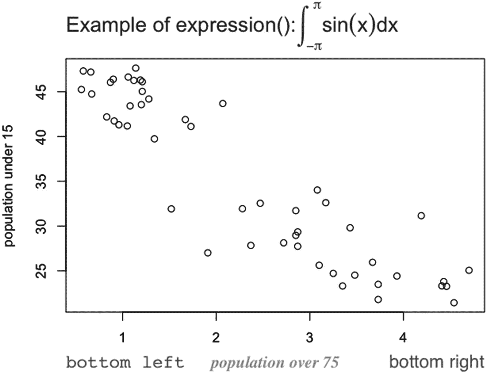

图 4-1

使用对 title()的重复调用设置标题、x 轴标签、y 轴标签和两个字幕的示例

请注意，已经绘制了两个字幕，都在 x 轴标签的同一行上，但是通过设置 adj 向左和向右偏移。而且，在绘制标题的调用中，字体粗细被忽略，因为参数是一个表达式。x 轴上的字体系列从左到右各不相同，包括 mono、serif 和 sans。

在清单 [4-2](#PC2) 中，给出了使用 line 和 mgp 的示例代码。

```py
plot(
  pop75.ordered, pop15.ordered,
  ann=F,
  col.axis=gray( 0.7 )
)

title(
  main=list(
    "Example of mgp & line",
    font=4
  )
)

title( ylab = "line=0", line=0, adj=0 )
title( ylab = "line=1", line=1, adj=0 )
title( ylab = "line=2", line=2, adj=0 )
title( ylab = "line=3", line=3, adj=0 )

title( sub = "subtitle", xlab = "mgp[1]=0", mgp=c( 0, 1, 0 ), adj=.22 )
title( sub = "subtitle", xlab = "mgp[1]=1", mgp=c( 1, 1, 0 ), adj=0.5 )
title( sub = "subtitle", xlab = "mgp[1]=2", mgp=c( 2, 1, 0 ), adj=0.78 )
title( sub = "subtitle", xlab = "mgp[1]=3", mgp=c( 3, 1, 0 ), adj=0.97 )

Listing 4-2Code demonstrating line spacing using line and mgp

```

在图 [4-2](#Fig2) 中，代码已经运行。

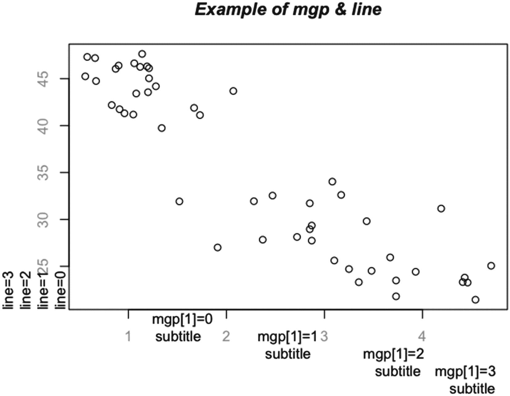

图 4-2

使用直线和 mgp[1]进行直线放置

请注意，这些线与预期的一样，不在图中。此外，副标题位于 x 轴标签下方。

### 4 . 1 . 2 axis()和 axTicks()函数

通过在轴设置为 FALSE 的情况下运行 plot()，并使用函数 axis()和可选的 axTicks()来创建轴，可以将轴单独放在图上。在 axis()的帮助页面中，该函数接受 16 个指定的参数以及来自 par()的附加参数。

#### 4.1.2.1 轴( )函数

axis()的前八个参数是 side 表示要放置轴的一侧，at 表示轴上要放置刻度线的位置，labels 表示要放置刻度线的标签，tick 表示是否绘制轴和刻度线，line 表示要放置轴的远离绘图的行数，pos 表示要放置轴的轴上垂直于要绘制的轴的位置，outer 表示在外部边距中绘制轴，font 表示轴刻度线标签的字体粗细。

副参数采用四个整数值之一:1、2、3 或 4。对应的边是底部、左侧、顶部和右侧。side 没有默认值。

at 参数是一个数值向量，它告诉 R 在哪里放置刻度线。缺省值是 NULL——也就是说，R 根据 par()中 xaxp 或 yaxp(取决于边)的值决定在哪里放置刻度线。at 的值可以延伸到绘图界限之外。默认情况下，如果刻度线在绘图范围内，R 将只绘制刻度线。但是，如果 xpd 设置为 TRUE 或 NA，将绘制轴的完整范围，分别在绘制区域边缘或设备区域边缘有一个限制。

如果 labels 的值不是逻辑模式，则该值的长度必须与 at 相同，并且是一个向量，其元素的模式为数字、复杂、原始或字符。参数可以是一个列表。如果标签元素设置为非限定值(NA、Inf、-Inf 或 NaN)，则不会为该元素绘制标签。labels 的默认值为 TRUE——也就是说，R 创建了“漂亮”的数字标签。如果设置为 FALSE，则不绘制标签。

tick 参数是长度为 1 的逻辑向量。如果设置为 TRUE(默认值),则绘制轴和刻度。如果设置为 FALSE，则不绘制轴和记号。

line、mgp[3]和 pos 参数都告诉 R 在哪里放置轴。如果设置了 pos，则忽略 line 和 mgp[3]。如果 pos 为 NA 且 line 被置位，则 mgp[3]被忽略。如果 line 和 pos 都是 NA，并且 mgp[3]的值是默认值 0，则坐标轴绘制在线 0 处。pos 的默认值是 NA，line 的默认值是 NA，mgp[3]的默认值是 par()中的值，默认为 0。

参数 line 或 mgp[3](参数 mgp[2]给出绘制轴刻度线标签的线)是一个单值数值向量，以远离绘图的线为单位进行测量。论点可以是否定的。参数 pos 也是一个单值数值向量，对于边 1 和 3(水平边)，它给出了绘制轴的 y 坐标。对于边 2 和 4(垂直边)，pos 给出了绘制轴的 x 坐标。

参数 outer 指示是否将轴放在外部边距中。参数是长度为 1 的逻辑向量，默认情况下为 FALSE。

参数 font 是轴刻度标签的字体粗细。字体可以采用所用字体系列允许的字体值。缺省值是 NA，它使用 par()中 font 的值——在我的设备上缺省值是 1。

参见清单 [4-3](#PC3) 中侧边、at、标签和位置的示例代码。

```py
plot(
  pop75.ordered, pop15.ordered,
  axes=FALSE
)

title(
  main="Example of side, at, labels, pos, & xpd",
  font.main=1,
  line=3
)

axis(
  1,
  at=c( .25, 1, 2, 3, 4, 5 ),
  labels=c(NA, 1:4, NA),
  pos=20,
  xpd=TRUE
)

axis(
 2,
  at=c( 20, 30, 40, 50 ),
  labels=c( NA, 30, 40, NA ),
  pos=0.25,
  xpd=TRUE
)

axis(
  3,
  at=c( 0.25, 1, 2, 3, 4, 5 ),
  labels=FALSE,
  pos=50,
  xpd=TRUE
)

axis(
  4,
  at=c( 20, 30, 40, 50 ),
  labels=FALSE,
  pos=5,
  xpd=TRUE
)

Listing 4-3Code for the example of side, at, labels, and pos – using xpd

```

在图 [4-3](#Fig3) 中，运行清单 [4-3](#PC3) 中的代码。

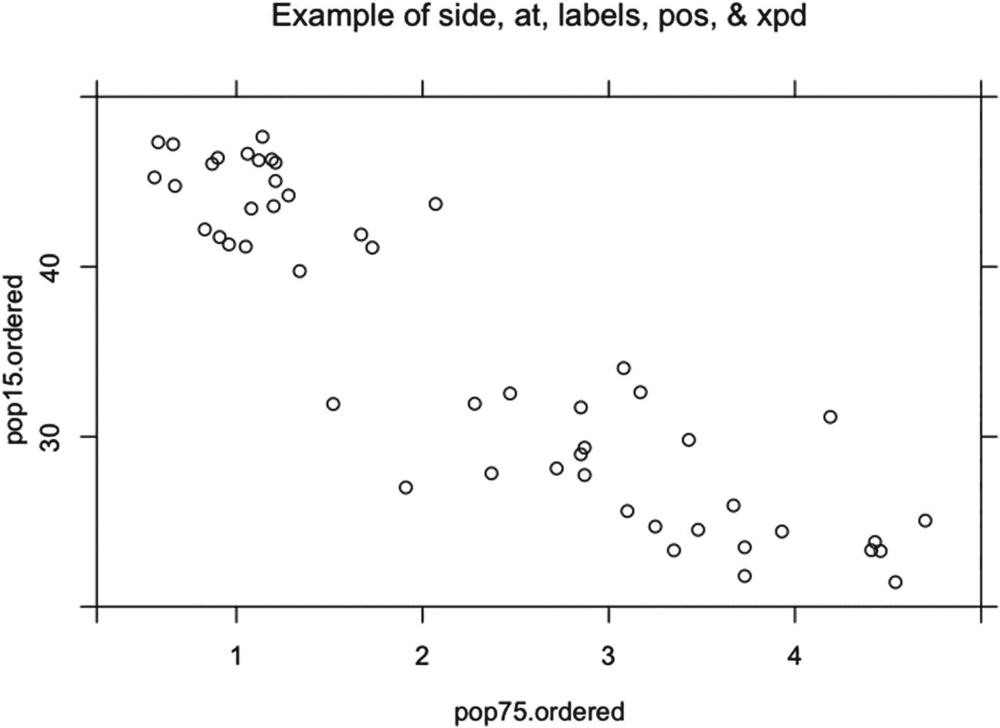

图 4-3

使用 side、at、labels、pos 和 xpd 的示例

请注意，轴是手动创建的。手动指定轴记号标签名称，以及轴开始和停止的位置。刻度线设置在特定位置，轴可以在绘图区域外绘图。

接下来的八个参数是用于轴和轴刻度线的线型的 lty，用于轴的线宽的 lwd，用于轴刻度线的线宽的 lwd.ticks，用于轴的颜色的 col，用于轴刻度线的颜色的 col.ticks，用于在平行于标签读取方向的方向上调整轴刻度标签位置的 hadj， padj 在垂直于标签读取方向的方向上调整轴刻度标签位置，gap.axis 在刻度标签过于靠近下一个刻度标签时停止绘图。

当在 plot()中使用时，参数 lty 采用相同的值。默认值为“固体”。

在 plot()中使用时，参数 lwd 和 lwd.ticks 的值与 lwd 相同。将 lwd 和/或 lwd.ticks 设置为小于或等于 0 的值将抑制直线和/或记号。lwd 的默认值为 1，lwd.ticks 的默认值为 lwd。

当在 plot()中使用 col 时，参数 col 和 col.ticks 采用与 col 相同的值。col 和 col.ticks 的默认值为 NULL，这告诉 R 使用与 par()中 fg 的值相关联的颜色——在我的设备上默认为黑色。

参数 hadj 是一个单值数值向量，取值范围为 0 到 1(包括 0 和 1 ),或者取一个非有限值(n a、Inf、-Inf 或 NaN)。值为 0 时，hadj 将轴刻度标签放在右边——在阅读方向上。值 1 将标签放在阅读方向的左侧。hadj 的默认值是 NA。如果读取方向平行于轴，NA 值或任何非限定值将标签置于刻度线的中心。如果阅读方向垂直于轴，则轴刻度标签与轴相邻的一侧对齐。

参数 padj 是一个数值向量，其长度可以大于或等于 1。如果向量短于标签的数量，则参数采用 0 和 1 之间的值(包括 0 和 1)或无限值并循环。如果参数 padj 为 0，R 会将轴刻度标签放在标签所能到达的最远位置——朝阅读方向看。值为 1 会将标签尽可能向下放置，即朝阅读方向看。padj 的默认值是 NA——这意味着 padj 采用 par()(在我的设备上为 0)中参数 las 的默认值——就像 padj 对任何非限定值所做的那样。

最后一个参数 gap.axis 采用单值数值向量，可以是负数。根据 axis()的帮助页面，将“m”的字符大小乘以 gap.axis 来确定标签之间的最小可接受间隙。如果为负值，则允许标签重叠的大小为“m”乘以 gap.axis 值的负值。默认值为 NA，对于平行于轴的轴刻度线标签，将“m”的大小乘以 1，对于垂直于轴的轴刻度线标签，将“m”的大小乘以 0.25。

本页信息来自 r 中 axis()的帮助页。有关设置 lty、lwd、lwd.ticks、col、col.ticks、side 和 font 的示例代码，请参见清单 [4-4](#PC4) 。

```py
plot(
  pop75.ordered, pop15.ordered,
  axes=FALSE,
  xlab=""
)

title(
  "Example of lty, lwd, lwd.ticks, col, col.ticks, & font",
  font.main=1
)

axis(
  1,
  at=c( .25, 1, 2, 3, 4, 5 ),
  labels=c(
    rep(
      "mmmmmmmmmm",
      6
    )
  ),
  hadj=0.3,
  padj=( 1:6 )/7,
  gap.axis=-1,
  line=3
)

axis(
  1,
  at=c( .25, 1, 2, 3, 4, 5 ),
  labels=c(
    rep(
      "mmmmmmmmmm",
      6
    )
  ),
  hadj=0.3,
  padj=( 1:6 )/7,
  gap.axis=-2
)

axis(
  2,
  at=c( 20, 30, 40, 50 ),
  labels=c( 20, 30, 40, 50 ),
  lty="dashed",
  lwd=3,
  lwd.ticks=4,
  col=gray( 0.8 ),
  col.ticks=gray( 0.6 ),
  col.axis=gray( 0.6 ),
  font=2
)

Listing 4-4Code for the example of lty, lwd, lwd.ticks, col, col.ticks, side, and font in axis()

```

在图 [4-4](#Fig4) 中，运行清单 [4-4](#PC4) 中的代码。

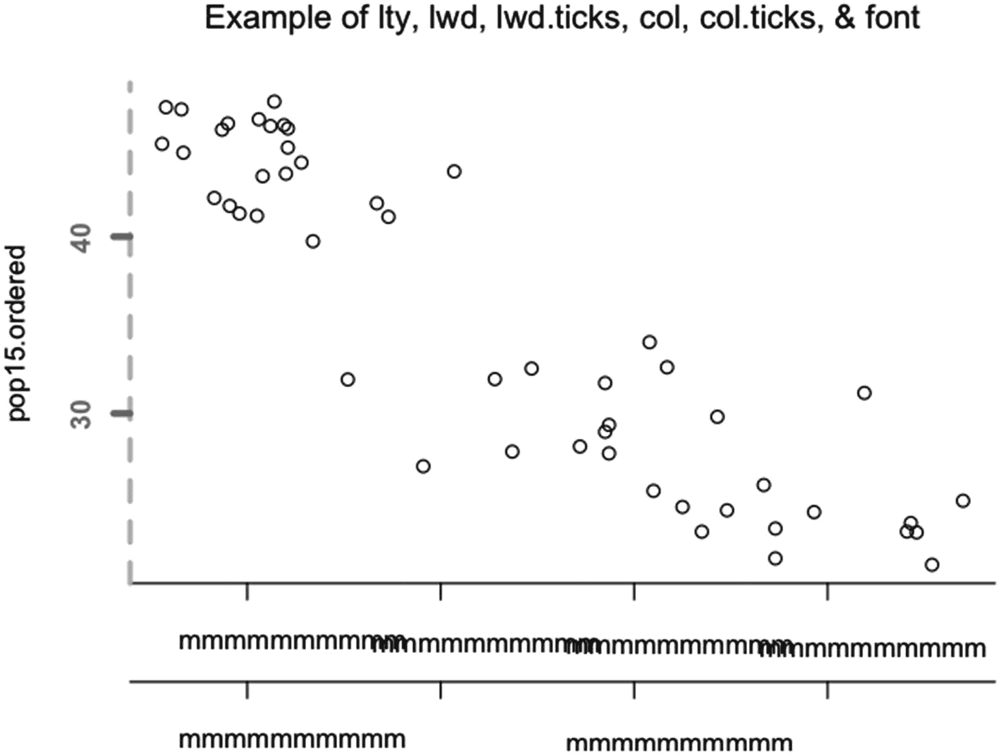

图 4-4

在 axis()中使用 lty、lwd、lwd.ticks、col、col.ticks 和 font 的示例

注意，在对 axis 的第一次调用中(第 1 面第 3 行)，gap.axis 等于-1，因此允许一个“m”的重叠，并且只绘制了两个标签。在第二次调用中(第 1 面第 0 行)，gap.axis 等于-2，因此允许两个“m”重叠，并且所有四个标签都绘制出来。padj 的值也从左向右增加。

在第三次调用 axis 时(在第 2 面)，axis 的线型已被更改。此外，轴和轴刻度线的线宽和颜色也已更改。参数 col.axis 用于更改轴刻度标签的颜色。类似地，也可以设置 cex.axis。

#### 4.1.2.2 轴柄( )函数

axTicks()函数生成轴刻度，并可用作 axis()中 at 的参数。对于对数刻度，必须调用包含带有对数刻度的边的 plot()来设置刻度。

该函数有五个参数:side 表示绘制轴的一侧，axp 表示设置轴极值的位置和轴刻度之间的间隔数的轴刻度指南()，usr 表示以用户坐标为单位的轴限制，log 表示使用对数刻度，nintLog 表示使用对数刻度时对数刻度的轴刻度间隔数的下限–这只是 r 的指南。此信息来自轴刻度的帮助页()。

参数端是一个单元素整数向量，与 axis()中的相同。该参数没有默认值。

参数 axp 是一个三元素数值向量，对于边等于 1 或 3 的情况，其行为类似于 plot()中的 xaxp，对于边 2 和 4 的情况，其行为类似于 plot()中的 yaxp。axp 的三个值给出了刻度线位置的下限和上限以及刻度线之间的间隔数(和只是对 axTicks()的指导)。

axp 的缺省值是 NULL——对于这种情况，axTicks()使用的值是 par()中 xaxp 或 yaxp 的值，具体取决于哪一方。

参数 usr 是一个两元素的数值向量，它给出了轴的极限位置。如果 log 为真，那么 usr 的单位是 10 的幂。参数 axp 和参数 usr 在一起使用时会发生奇怪的事情，因此应该使用其中的一个。usr 的默认值为 NULL，在这种情况下，usr 被设置为等于 par()中 x 轴的 usr[1:2]或 y 轴的 usr[3:4]的值。

自变量 log 是一个单元素逻辑向量，表示轴的对数刻度。仅当在图()中为图的给定侧设置了对数刻度时，该参数才应设置为 TRUE。缺省值为 NULL，在这种情况下 log 被设置为等于 par()中 xlog 或 ylog 的值，这取决于绘制的是哪一侧。

参数 nintLog 是对数刻度的最小间隔数，根据 axTicks()的帮助页，仅当 Log 为 TRUE 时才有效。默认值为 NULL，对于该值，参数采用 par()中 lab 的第一个或第二个元素的值——取决于边是 1、3、2 还是 4。这个论点似乎没有效果。

在清单 [4-5](#PC5) 中，给出了一些运行 axTicks()的例子。

```py
>  #open an empty plotting window (with no x and(or) y).

> plot.new()

> axTicks(
2,
axp=c( 20, 50, 6 )
)
[1] 20 25 30 35 40 45 50

> axTicks(
2,
usr=c( 20, 50 )
)
[1] 0.0 0.2 0.4 0.6 0.8 1.0

> axTicks(
2,
axp=c( 20, 50, 6 ),
usr=c( 20, 50 )
)
[1] 20 25 30 35 40 45 50

> axTicks(
2,
axp=c( 20, 5000, 3 ),
log=TRUE,
nintLog=8
)
[1]  4 10

> axTicks(
2,
usr=c( 0.6, 3.8 ),
log=TRUE,
nintLog=8
)
Error in axTicks(2, usr = c(0.6, 3.8), log = TRUE, nintLog = 8) :
  invalid positive 'axp[3]'

> axTicks(
2,
axp=c( 20, 5000, 3 ),
usr=c( 0.6, 3.8 ),
log=TRUE,
nintLog=8
)
 [1]    4   10   20   40  100  200  400 1000 2000 4000

> # open a plotting window with a log scale on the y axis

> plot(
pop75.ordered, dpi.ordered,
axes=FALSE,
log="y"
)

> # the y axis

> 10^c( 0.6, 3.8 )
[1]    3.981072 6309.573445

> axTicks(
2
)
[1]  100  200  500 1000 2000

> axTicks(
2,
axp=c( 20, 5000, 3 ),
log=TRUE,
nintLog=8
)
[1]   20   40  100  200  400 1000 2000 4000

> axTicks(
2,
usr=c( 0.6, 3.8 ),
log=TRUE,
nintLog=8
)
[1]   20   50  100  200  500 1000 2000 5000

> axTicks(
2,
axp=c( 20, 5000, 3 ),
usr=c( 0.6, 3.8 ),
log=TRUE,
nintLog=8
)
 [1]    4   10   20   40  100  200  400 1000 2000 4000

> # the x axis

> axTicks(
1
)
[1] 1 2 3 4

> axTicks(
1,
axp=c( 0, 5, 5 )
)
[1] 0 1 2 3 4 5

> axTicks(
1,
usr=c( 0, 5 )
)
[1] 1 2 3 4

> axTicks(
1,
axp=c( 0, 5, 5 ),
usr=c( 0, 5 )
)
[1] 0 1 2 3 4 5

Listing 4-5Examples of using axp, usr, log, and nintLog in axTicks()

```

请注意，如果尚未运行绘图，axp 会给出正确的值，但 usr 会假设一个单位长度轴。此外，如果没有绘制对数标度，使用对数等于真会产生不稳定的结果。

### 4 . 1 . 3 box()、grid()、clip()和 rug()函数

box()、grid()、clip()和 rug()函数会影响绘图的整体外观。颜色、线条样式和线条宽度方面的灵活性可以使图形更容易阅读。

#### 4.1.3.1 盒子( )函数

函数的作用是:在图的周围放一个方框。该函数接受两个参数，以及 par()的一些参数。

第一个论点是哪个。该参数有四个可能的值:“绘图”、“人物”、“内部”和“外部”。值“plot”会在绘图周围放置一个框。对于没有外部边界的单一绘图，“图形”、“内部”和“外部”都给出相同的结果-在图形的外部放置一个方框。

对于图形中的多个图，且没有外部边界，使用“图形”会在最后绘制的图形周围放置一个方框。值“内部”和“外部”都在整个图形周围放置了一个框。如果有外边界，“内”会在该组图形周围和外边界内放置一个框，“外”会框住外边界。其缺省值是“绘图”。

第二个参数是线类型的 lty。该参数与 plot()中的参数 lty 采用相同的值。lty 的默认值是“固体”。

根据 box()的帮助页面，如果 col 不是 NA，则 box 的颜色由 col 设置。如果 col 是 NA，fg 不是 NA，则颜色由 fg 的值给出。如果 col 和 fg 都是 NA，则框的颜色由 par()中 col 的值给出——在我的设备上默认为“黑色”。

在清单[中，4-6](#PC6) 是使用 box()的示例代码。

```py
plot(
  pop75.ordered, dpi.ordered,
  axes=FALSE,
  log="y"
)

title(
  main="Example of which, lty, col, & lwd in box()",
  font.main=1
)

box(
  which="plot",
   lty="dashed",
  col=gray( 0.8 ),
  lwd=2
)

box(
  which="figure",
  lty="longdash",
  col=gray( 0.2 ),
  lwd=2
)

Listing 4-6Code demonstrating which, lty, col, and lwd in box()

```

在图 [4-5](#Fig5) 中，运行清单 [4-6](#PC6) 中的代码。

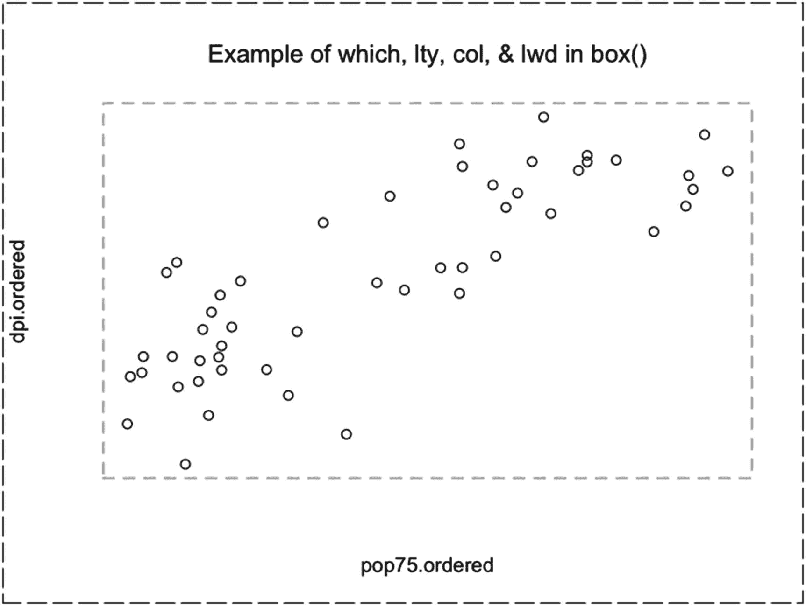

图 4-5

在 box()中使用 which、lty、col 和 lwd 的示例

注意外盒是深灰色，内盒是浅灰色。此外，外盒使用长破折号，而内盒使用破折号。外盒在图的周围。内框在剧情周围。对于这两个框，线宽都是 2。

#### 4.1.3.2 网格( )函数

grid()函数有六个参数——不能使用 par()中的参数。前两个参数是 nx 和 ny，代表水平和垂直维度上的单元格数量。nx 的默认值为 NULL，ny 的默认值为 nx 的值。如果 nx 或 ny 设置为等于 NULL，R 将绘制 x 或 y 维的网格线，如果使用 axTicks()中的默认值，刻度线将位于此处。如果设置为 NA，则不绘制 x 轴或 y 轴的网格。

第三个参数是代表网格颜色的 col，默认值等于“浅灰色”；第四个参数是线条类型的 lty，默认值为“dotted”。第五个参数是 lwd，表示线的宽度。lwd 的默认值是 lwd 在 par()中的值。所有这三个参数都使用 plot()中指定的相同值，并且可以是多元向量。争论循环往复。

第六个参数是等对数——一个单元素逻辑向量，它告诉 R 如果轴上的刻度是对数刻度，例如 1、10、100 和 1000，是否绘制等距网格。如果 nx 或 ny 是对数刻度并且 equilogs 设置为 FALSE，则在轴上的每个刻度处绘制一条网格线。equilogs 的默认值为 TRUE。在 grid()的帮助页面中，仅当 x 或 y 上的比例为对数比例，并且相应的 n x 或 ny 值为空时，该参数才会影响绘图。

```py
plot(
  pop75.ordered, dpi.ordered,
  log="y",
  cex=2,
  panel.first=grid(
    col=gray(
      ( 0:4 )/5
    ),
    lty=1:5,
    lwd=( 2:6 ),
    equilogs=FALSE
  )
)

title(
  main="Example of col, lty, lwd, and equilogs in grid()"
)

Listing 4-7Code for an example of setting col, lty, lwd, and equilogs in grid()

```

列表 [4-7](#PC7) 生成的图如图 [4-6](#Fig6) 所示。

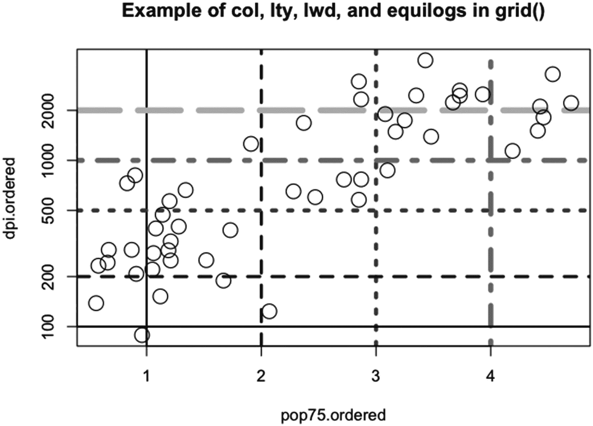

图 4-6

在 grid()中使用 col、lty、lwd 和 equilogs 的示例

请注意，grid()是在 plot()中使用 panel.first 运行的，因此网格是在点之前绘制的。因此，这些点会覆盖在网格上。如果首先绘制点，网格将覆盖这些点。此外，线条样式、线条宽度和线条颜色会随着 x 和 y 值的增加而改变。

#### 4.1.3.3 剪辑( )函数

clip()函数设置剪辑区域——辅助函数在其中绘图的区域。对于剪辑区域的角，该函数采用四个参数 x1、x2、y1 和 y2。参数以 x 轴和 y 轴上的单位度量。

根据 clip()的帮助页面，线、矩形和多边形是在内部处理的，但文本的处理是由显示图形的设备完成的，因此可能不会像预期的那样运行。当新的绘图完成或参数 xpd 改变时，剪辑区域被重置。

在清单 [4-8](#PC8) 中，给出了使用 clip()的示例代码。

```py
red = seq( 1, 50, 4.3 )[ -5 ]
plot(
  pop75.ordered, pop15.ordered,
  type="n",
  main="Example of using clip()"
)

clip(
  -0.5, 6, 19, 52
)

text(
  pop75.ordered[ red ], pop15.ordered[ red ],

  row.names(
    LifeCycleSavings
  )[ ord ] [ red ],
  cex=.7
)

Listing 4-8Code for the example of using clip()

```

在图 [4-7](#Fig7) 中，运行清单 [4-8](#PC8) 中的代码。

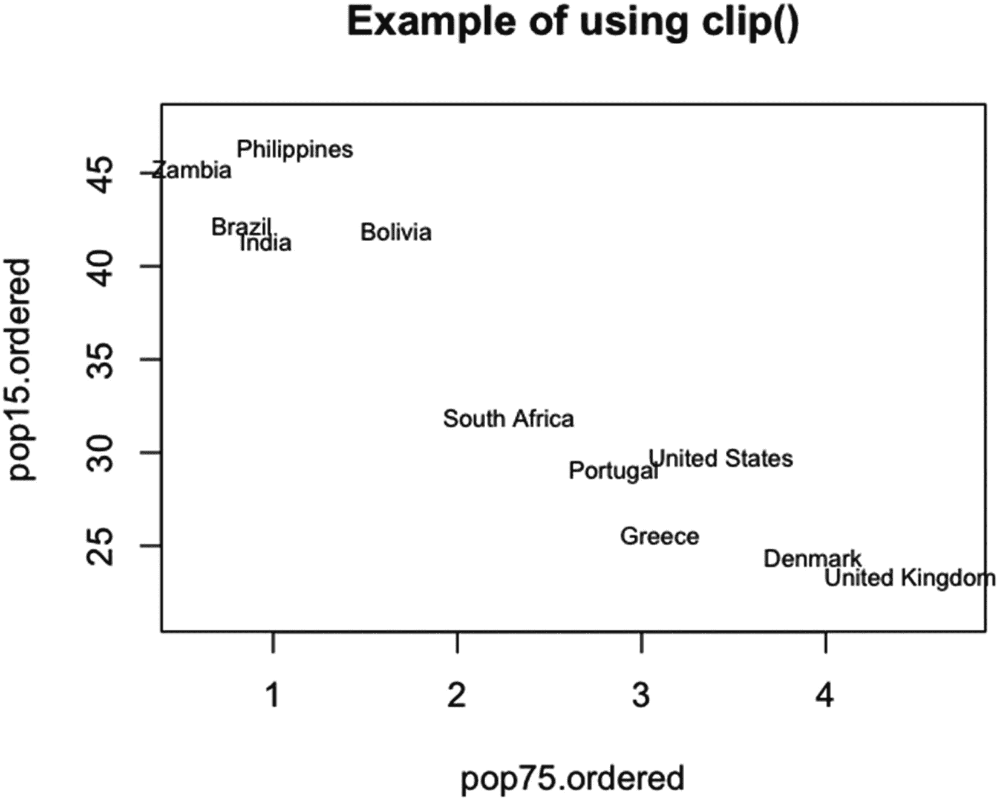

图 4-7

使用 clip()的示例

请注意，文本已被允许在绘图区域之外打印。还可以在绘图区域内使用裁剪来设置不同的颜色(请参见 clip()的帮助页面上给出的示例)。

#### 地毯 4.1.3.4()函数

函数的作用是:沿着图的一边绘制一个一维图。垂直于点所在的边绘制线条，所有线条的高度相同。

rug()的参数是 x，表示要绘制的数据向量；ticksize，代表线的长度；side，用于绘制地毯的一侧；lwd，代表线条的宽度；col，代表线条的颜色；quiet，用于告诉 R 当数据超出轴的范围时是否打印警告；以及 axis()的一些参数——比如 line 和 pos。这些信息来自 rug()的帮助页面。

参数 x 取任意长度的数值向量。x 没有默认值。

参数 ticksize 采用一个元素的数值向量。默认值为 0.03。负的刻度大小远离侧边而不是进入图中。

参数端接受一个单元素整数向量，其值可以是 1、2、3 和 4，分别代表底部、左侧、顶部和右侧。默认值为 1。

参数 lwd 和 col 是 par()的标准参数。两个参数都可以将多元向量作为值，但只使用第一个元素。随钻测井的默认值等于 0.5；col 的默认值是 par()中 fg 的值。

参数 quiet 可以取值 TRUE 或 FALSE。如果 R 选项“warn”小于 0，则默认值为 TRUE，否则为 FALSE。在 R 提示符下运行 get option(“warn”)以查看“warn”的值——在我的设备上该值为 0，因此 quiet 为 FALSE。

在清单 [4-9](#PC9) 中，给出了在 rug()中使用 ticksize、side、col、lwd 和 line 的示例代码。

```py
plot(
  pop75.ordered,
  dpi.ordered,
  log="y",
  main="Example of x, ticksize, side, lwd, and col in rug()"
)

rug(
  pop75.ordered,
  ticksize = 0.03,
  side = 1,
  lwd=1,
  line=2.5,
  col=gray( 0.4 )
)

rug(
  dpi.ordered,
  ticksize = -0.04,
  side = 4,
  lwd=1,
  col=gray( 0.2 )
)

Listing 4-9Code for an example of using x, ticksize, side, col, lwd, and line in rug()

```

在图 [4-8](#Fig8) 中，运行清单 [4-9](#PC9) 中的代码。

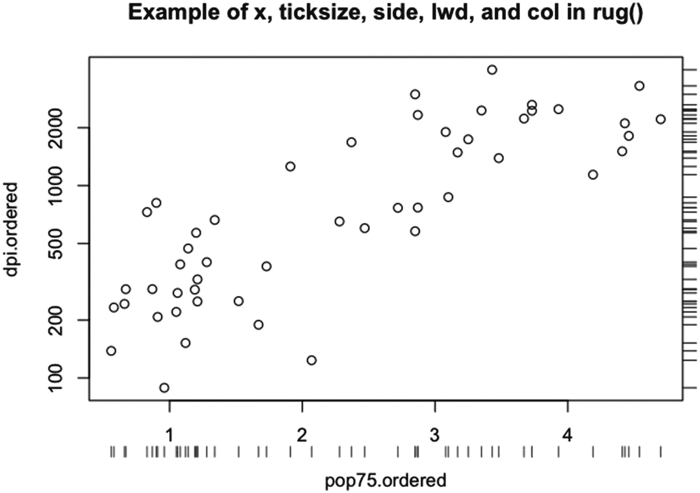

图 4-8

地毯中 x、ticksize、side、col、lwd 和 line 的示例()

请注意，第 1 面上的地毯位于安讯士标签和安讯士刻度标签之间。参数 line 设置为 2.5，参数 ticksize 为正。对于第 4 面，ticksize 为负，且未设置线。

## 4.2 点定义的函数

在这一节中，我们将介绍 stats 和 graphics 包中通过点位置绘制对象的辅助函数。描述了 points()、text()、symbols()、image()和 rasterImage()函数。

### 4.2.1 积分( )函数

我们看的第一个函数是 points()。该函数采用与第 3.3 节中 plot.default()的绘图参数相同的参数。一些参数是 x，y，type，pch，col，bg，cex 和 lwd。有关更多信息，请参见第 3.3 节或点的帮助页面()。

在清单 [4-10](#PC10) 中，给出了使用 points()的示例代码。

```py
tri1 = quantile( dpi.ordered, 0.33)
tri2 = quantile( dpi.ordered, 0.67)

plot(
  pop75.ordered, dpi.ordered,
  log="xy",
  main="Example of points()",
  font.main=1,
  type="n"
)

points(
  pop75.ordered, dpi.ordered,
  pch=ifelse(
    dpi.ordered<=tri2,
    ifelse(
      dpi.ordered<=tri1,
      "L",
      "M"
    ),
    "H"
  ),
  cex=0.7
)

Listing 4-10Code for an example of using points() to annotate the data with the income tercile: low, middle, and high terciles of income

```

在图 [4-9](#Fig9) 中，运行清单 [4-10](#PC10) 中的代码。

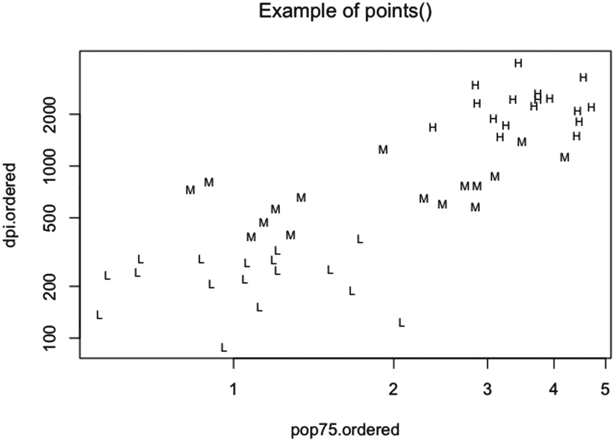

图 4-9

使用点注释图中点的示例，用字母表示 y 变量所在的区域

请注意，使用 L、M 和 H 的值允许用户查看 75 岁以上人口百分比值按收入区间的分布。R 函数 quantile()用于查找术语。

### text()函数

text()函数与 points()类似，它将字符串放在不同的位置，但是字符串中可以有多个字符。text()的参数是 x 和 y，表示点的位置；标签，用于在点上打印的字符串；adj，用于调整围绕该点的圆圈中标签的位置；pos，将标签放置在该点周围的四个位置；偏移量，用于 pos 使用的偏移量；vfont，使用 Hershey 字体系列和标签的粗细；以及标准的 cex、col 和 font。

x 参数没有默认值，它是一个可以强制转换为数值的向量值。y 参数的默认值为 NULL，即 x 变为 y，索引变量变为 x。如果给定 y，y 不一定与 x 的长度相同，y 将循环，但 y 必须是可以强制为数字的向量。

labels 参数是一个字符向量(或可以强制为字符的向量)，包含分配给索引和 x(或 x 和 y)位置的标签。labels 参数不一定与 x 和 cycles 的长度相同。根据 text()上的帮助页面，如果 labels 长于 x，那么 x(如果使用 y，则 y)将循环，直到 labels 到达 labels 的最后一个元素。labels 的缺省值是 seq_along( x$x)，它给出了一个从 1 到 x 长度的数字序列。

adj 参数采用长度为 1 或 2 的数字向量。值为 0 告诉 R 将标签放置在点的右侧。值 0.5 以点为中心绘制标签。值为 1 时，R 在点的左侧绘制标签。标签在垂直方向居中。

对于长度为 2 的向量，第二个值告诉 R 在垂直方向的何处绘制字符串；值为 1 表示 R 在点的正下方绘制，值为 0.5 表示在点的标高处绘制，值为 0 表示在点的正上方绘制。

对于大多数设备，adj 的任何值都可以，但不是所有设备都能够为 0 到 1 之间的值绘制文本。负值可以在大多数设备上使用。

对于 adj，字符串和点之间的距离取决于字符串的大小。adj 的缺省值是 NULL–它使文本在水平和垂直方向上居中。

pos 参数也定位标签。参数可以取值为 1、2、3 和 4，分别表示点的下方、左侧、上方和右侧。offset 参数与 pos 一起使用，给出了从标注绘制点的距离。

pos 和 offset 的默认值为 NULL 和 0.5。如果设置了 pos，则忽略 adj 的值。

par()中影响 text()中字符串打印的一个参数是 srt，用于旋转字符串。该参数采用一个单元素数值向量，并按参数值旋转字符串，其中该值以从 0(平行于 x 轴)开始的旋转度数为单位。str 的默认值是 par()中 string 的值，在我的设备上是 0。

par()中另一个影响行高的参数是 lheight。该参数增加或减少多行字符串的行间距。根据 par()的帮助页面，lheight 的值乘以 cex 的值得到一个新的行高。lheight 的默认值是 1。该参数仅在 text()和函数 strheight()中使用。

在清单 [4-11](#PC11) 中，给出了使用 adj、pos、offset 和 srt 的示例代码。

```py
plot(
  pop75.ordered, pop15.ordered,
  main="Example of adj, pos, offset, srt in text()",
  font.main=1,
   xlim=c( 1, 1.8 ),
  ylim=c( 39, 45.5 ),
  col=grey( 0.4 )
)

# adj

text(
  pop75.ordered[16], pop15.ordered[16],
  labels="(1,0)",
  adj=c( 1, 0 ),
  cex=0.7
)
text(
  pop75.ordered[16], pop15.ordered[16],
  labels="(0,0)",
  adj=c( 0, 0 ),
  cex=0.7
)
text(
  pop75.ordered[16], pop15.ordered[16],
  labels="(0,1)",
  adj=c( 0, 1 ),
  cex=0.7
)
text(
  pop75.ordered[16], pop15.ordered[16],
  labels="(1,1)",
  adj=c( 1, 1 ),
  cex=0.7
)
text(
  pop75.ordered[17], pop15.ordered[17],
  labels="(1.5,-0.5)",
  adj=c( 1.5, -0.5 ),
  cex=0.7
)
text(
  pop75.ordered[17], pop15.ordered[17],
  labels="(-0.5,-0.5)",
  adj=c( -0.5, -0.5 ),
  cex=0.7
)
text(
  pop75.ordered[17], pop15.ordered[17],
  labels="(-0.5,1.5)",
  adj=c( -0.5, 1.5 ),
  cex=0.7
)
text(
  pop75.ordered[17], pop15.ordered[17],
  labels="(1.5,1.5)",
  adj=c( 1.5, 1.5 ),
  cex=0.7
)

# pos

text(
  pop75.ordered[22], pop15.ordered[22],
  labels="pos=1",
  pos=1,
  cex=0.7
)
text(
  pop75.ordered[22], pop15.ordered[22],
  labels="pos=2",
  pos=2,
  cex=0.7
)
text(
  pop75.ordered[22], pop15.ordered[22],
  labels="pos=3",
  pos=3,
  cex=0.7
)
text(
  pop75.ordered[22], pop15.ordered[22],
  labels="pos=4",
  pos=4,
  cex=0.7
)

# pos and offset

text(
  pop75.ordered[20], pop15.ordered[20],
  labels="pos=1 offset=1",
  pos=1,
  offset=1,
  cex=0.7
)
text(
  pop75.ordered[20], pop15.ordered[20],
  labels="pos=2 offset=1",
  pos=2,
  offset=1,
  cex=0.7
)
text(
  pop75.ordered[20], pop15.ordered[20],
  labels="pos=3 offset=1",
  pos=3,
  offset=1,
  cex=0.7
)
text(
  pop75.ordered[20], pop15.ordered[20],
  labels="pos=4 offset=1",
  pos=4,
  offset=1,
  cex=0.7
)

#  str

text(
  pop75.ordered[10], pop15.ordered[10],
  labels="srt=45",
  srt=45,
  cex=0.7
)

Listing 4-11The

code for the example of using adj, pos, offset, and srt in text()

```

在图 [4-10](#Fig10) 中，运行清单 [4-11](#PC11) 中的代码。

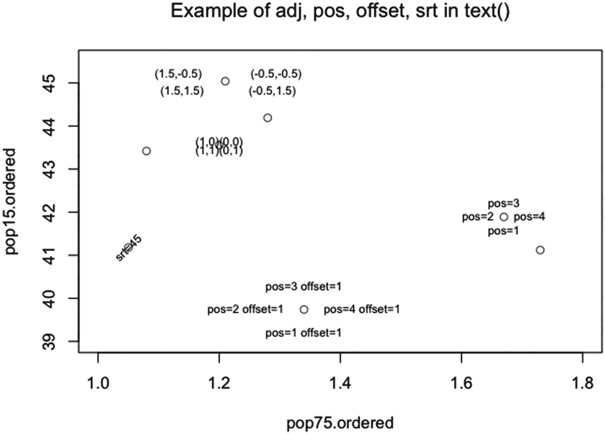

图 4-10

在 text()中设置 adj、pos、offset 和 srt 的示例

vfont 参数允许 text()使用 Hershey 字体系列和字体粗细。该参数采用两个元素的字符向量或 NULL 值。第一个元素是字体的系列，第二个元素是字体的粗细——例如，vfont=c( "serif "，" plain ")。(字体系列和字体粗细的名称列在通过运行 demo(“Hershey”)生成的 pdf 的第一个 pdf 上)。)如果没有设置 vfont，如果在 text()中没有指定字体系列和字体，则字体系列和字体粗细是 par()中的字体系列和字体粗细。vfont 的默认值为 NULL。

参数 cex 设置字符的大小，并接受一个正数向量。在 text()中，R 将 par()中的 cex 值乘以 text()中的 cex 值，得到设备默认字符大小的乘数。text()中 cex 的默认值是 1。

参数 col 和 font(以及 family)的值与 plot()中的值相同，默认情况下，它们的值来自 par()。cex、col 和 font 都可以有多个元素，并且值是循环的。

在清单 [4-12](#PC12) 中，给出了在 text()中使用 cex、col、font 和 lheight 的示例代码。

```py
plot(
  pop75.ordered, pop15.ordered,
  main="Example of cex, col, font, & lheight in text()",
  font.main=1,
  xlim=c( 1, 1.8 ),
  ylim=c( 39, 45.5 )
)

text(
  pop75.ordered[ 10:23 ], pop15.ordered[ 10:23 ],
  labels="pos=2\nlheight=1.2",
  pos=2,
  lheight=1.2,
  cex=3:17/15,
  col=grey( 6:19/25 ),
  font=c( 1, 3 )
)

Listing 4-12The code to demonstrate using cex, col, font, and lheight in text()

```

在图 [4-11](#Fig11) 中，运行清单 [4-12](#PC12) 中的代码。

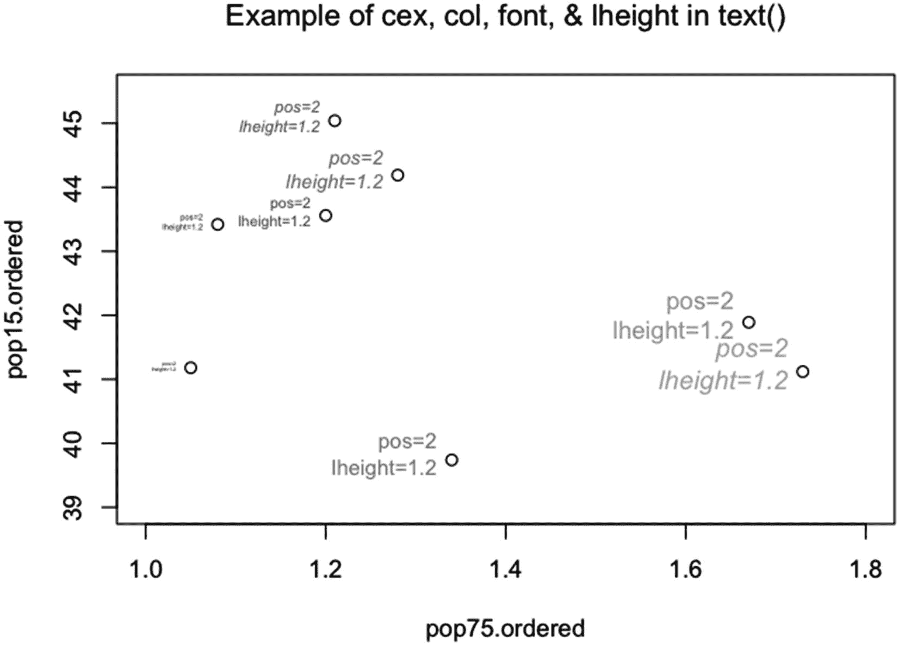

图 4-11

在 text()中使用 cex、col、font 和 lheight 的示例

在清单 [4-13](#PC13) 中，给出了使用 pos 小心地在点上放置标签的代码，以便标签不会重叠。

```py
nms =c( 4, 3, 1, 4, 4, 1, 3, 4, 2, 1, 3, 1, 1, 4, 3, rep( 4, 35 ) )

plot(
  pop75.ordered, pop15.ordered,
  main="Example of cleaning up label overlaps in text()",
  font.main=1,
  cex=0.3,
  xlim=c( 0.5, 2.2 ),
  ylim=c( 39, 48.5 )
)

text(
  pop75.ordered, pop15.ordered,
  row.names(
    LifeCycleSavings[ ord, ]
  ),
  cex=0.6,
  pos=nms,
  offset=0.3
)

Listing 4-13An example of carefully using pos to move text so that labels do not overlie

```

在图 [4-12](#Fig12) 中，运行清单 [4-13](#PC13) 中的代码。

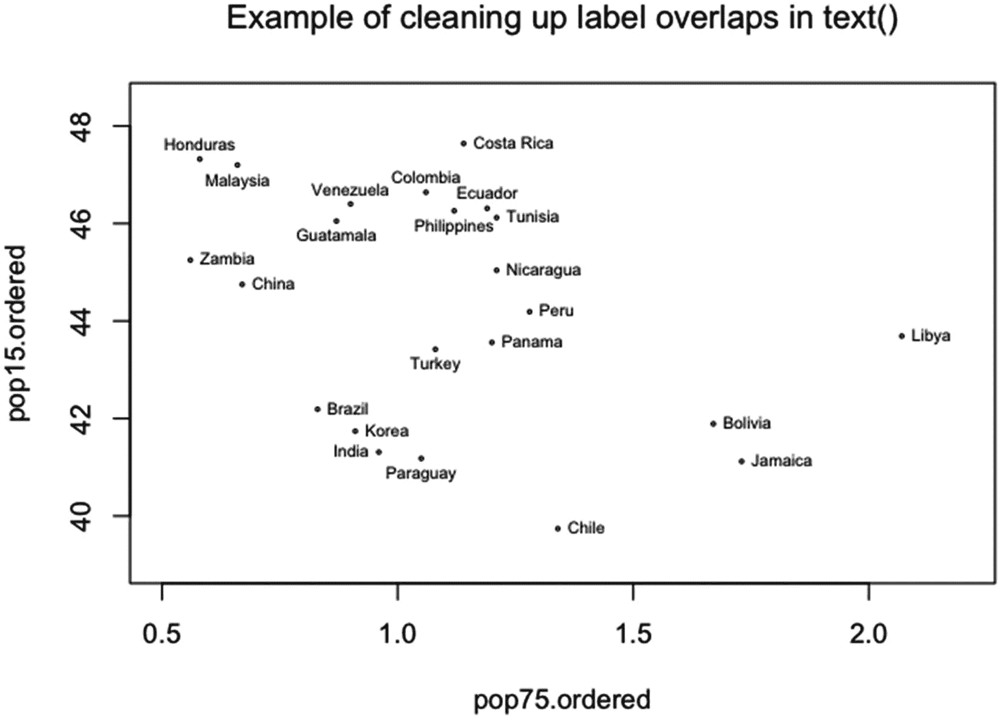

图 4-12

使用 pos in text()清除覆盖标签的示例

注意，向量 nms 包含 50 个元素，每个元素为 50 个标签中的每一个分配一个值。还要注意，并非所有的数据点都在图的 x 和 y 界限内，不在界限内的数据点不会被绘制出来。

### 符号( )函数

symbols()函数在绘图上的特定点绘制形状。可以绘制的形状有圆形、正方形、矩形、星形、温度计和箱线图。与文本()和点()不同，函数符号()既是一个独立的函数，也是一个可用作绘图()辅助函数的函数。在这一章中，我们把符号()看作一个辅助函数。

符号()的参数是 x 和 y，表示点的位置；圈子，要图谋圈子；方块，要画方块；矩形，绘制矩形；明星，要剧情明星；温度计，绘制一级或二级温度计；箱线图，绘制箱线图；英寸，代表形状的大小；添加，以确定该图是否独立；fg，对于像外形轮廓这样的颜色；bg，用于填充形状背景的颜色；而且，如果 symbols 被用作一个独立的函数，许多相同的参数在 plot()中使用。参数 x 和 y 或者是两个长度相同的数值向量，或者是 x 设置为数值向量，y 设置为空。x 没有默认值，y 的默认值为 NULL。

circles 参数采用一个长度等于 x 长度的数值向量。然后，绘制的圆的半径根据参数的值进行缩放。实际大小取决于参数英寸的值。

squares 参数也采用一个长度等于 x 长度的数值向量。绘制的正方形的边长根据参数值进行缩放。同样，实际大小取决于参数英寸的值。

rectangles 参数采用一个行数等于 x 的长度、有两列的数值矩阵。第一列给出了矩形的宽度，第二列给出了矩形的高度——实际尺寸取决于英寸值。

stars 参数采用一个行数等于 x 长度且至少有三列的数字矩阵。星形图连接位置-矩阵中的每一列有一个位置。这些位置距离 x-y 点有一定距离。实际距离取决于英寸值。对于设置为 NA 的值，到该点的距离设置为零，这可用于绘制不同距离的尖峰。

温度计参数采用一个数字矩阵，其行数等于 x 的长度，有三列或四列。第一列给出了温度计的宽度。第二列给出了高度。第三列(和第四列，如果使用的话)的值应该在 0 和 1 之间，包括 0 和 1。该函数根据第三(和第四)列中的比例，在温度计上按比例绘制一条线(如果使用第四列，则绘制两条线)。温度计的实际尺寸取决于英寸值。

boxplots 参数采用一个行数等于 x 长度、有五列的数值矩阵。第一列给出了盒子的宽度。第二列给出了盒子的高度。第三和第四列分别给出了下部和上部胡须的长度。第五列给出了绘制中值的框上方的比例距离，应该在 0 和 1 之间，包括 0 和 1。箱线图的实际大小取决于英寸值。

圆形、正方形、矩形、星形、温度计和箱线图参数没有默认值。如果其中一个参数的元素是 NA，则不会绘制该点，但星号除外，在星号中，点的值设置为零。

inches 参数可以是逻辑向量，也可以是数值向量，长度都是任意的。仅使用第一个值。如果设置为 TRUE 或 numeric，则参考尺寸为一英寸。

如果设置为 FALSE，则参考尺寸是一个或两个轴上的一个单位。根据符号()的帮助页面，圆、正方形和星形使用 x 轴上的单位。对于矩形，宽度使用 x 轴的单位，高度使用 y 轴的单位。对于温度计，使用 y 轴单位。对于箱线图，宽度使用 x 轴单位，高度和胡须使用 y 轴单位。默认值为 TRUE。

所绘制形状的大小与参考大小成比例。对于圆，参考尺寸乘以参数第三列中的值得出圆的半径长度。对于正方形、矩形和星形，大小是指形状的最大尺寸。

add 参数可以是任意长度的逻辑向量，但是如果长度超过一个元素，就会给出警告。仅使用第一个元素。如果参数设置为 FALSE，它会告诉 symbols()绘制新的图。如果设置为 TRUE，符号()将添加到现有绘图中。默认值为 FALSE。这里，我们只考虑 add 等于 TRUE 的情况。

最后两个感兴趣的参数是 fg 和 bg。参数 fg 和 bg 设置颜色，并且可以接受 par()中的参数 col 可以接受的任何参数(参见 3.4.1 节)。对于圆形、正方形、矩形和星形，fg 参数设置形状的轮廓颜色，bg 设置填充颜色。

对于温度计，如果参数中有三列，则 fg 的颜色填充温度计中水平线下方的区域和形状的轮廓，而 bg 的颜色填充形状的其余部分。温度计的两个手柄的颜色由参数 col 设置。对于四列温度计，fg 设置轮廓和两条水平线之间区域的颜色，bg 设置其余区域的颜色。

对于盒状图，轮廓的颜色由 fg 设置，盒内区域的颜色由 bg 设置，而胡须和中值的颜色由 col 设置。

fg 和 bg 都可以是多元向量，都是循环的。参数 col 也可以是多元素的，但只使用第一个元素。fg 的默认值是 par()中 col 的值，bg 的默认值是 NA–这提供了一个透明的背景。

在清单 [4-14](#PC14) 中，给出了使用 symbol()的示例代码。

```py
plot(
  pop75.ordered, pop15.ordered,
  main="Example of circles, squares, rectangles,\nstars,  thermometers, and boxplots in symbols()",
  type="n"
)

symbols(
  pop75.ordered[ 1:8 ], pop15.ordered[ 1:8 ],
  circles=1:8/8,
  inches=0.35,
  fg=grey( 1:8/20 ),
  bg=grey( 10:18/20 ),
  add=TRUE
)

symbols(
  pop75.ordered[ 9:16 ], pop15.ordered[ 9:16 ],
  squares=1:8/8,
  inches=0.35,
  fg=grey( 1:8/20 ),
  add=TRUE
)

symbols(
  pop75.ordered[ 17:24 ], pop15.ordered[ 17:24 ],
  rectangles=cbind( 1:8/8, 5:12/8 ),
  inches=0.35,
  fg=grey( 1:8/20 ),
  add=TRUE
)

symbols(
  pop75.ordered[ 25:32 ], pop15.ordered[ 25:32 ],
  stars=cbind( 1:8/8, 5:12/8, 1:8/8, 5:12/8 ),
  inches=0.35,
  fg=grey( 1:8/20 ),
  add=TRUE
)

symbols(
  pop75.ordered[ 33:40 ], pop15.ordered[ 33:40 ],
  thermometers=cbind( 1:8/8, 5:12/8, 1:8/20 ),
  inches=0.35,
  fg=grey( 0.5 ),
  add=TRUE
)

symbols(
  pop75.ordered[ 33:40 ], pop15.ordered[ 33:40 ],
  thermometers=cbind(
    1:8/8,
    5:12/8,
    1:8/20,
    1:8/20 + 8:1/20
  ),
  inches=0.35,
  fg=grey( 0.75 ),
  add=TRUE
)

symbols(
  pop75.ordered[ 41:50 ], pop15.ordered[ 41:50 ],
  boxplots=cbind(
    1:10/20,
    5:14/20,
    1:10/20,
    10:1/20,
    5:14/15
  ),
  inches=0.35,
  fg=grey( 0.75 ),
  add=TRUE
)

Listing 4-14Code for an example of using symbols() to plot circles, squares, rectangles, stars, thermometers, and boxplots

```

在图 [4-13](#Fig13) 中，运行清单 [4-14](#PC14) 中的代码。

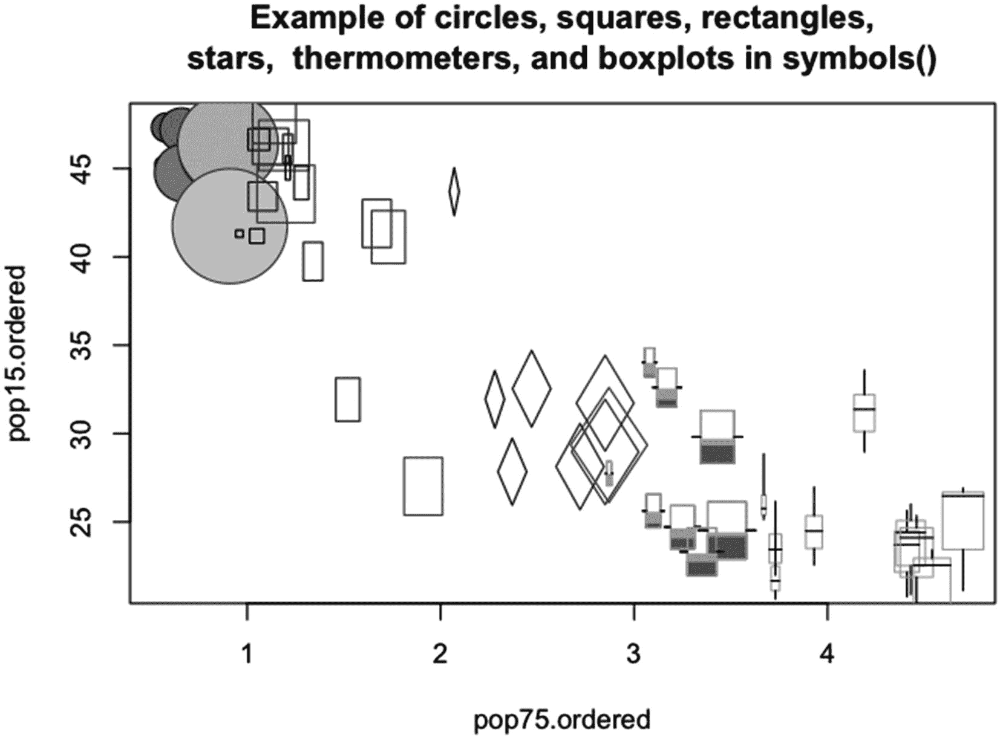

图 4-13

使用符号创建圆形、正方形、矩形、星形、温度计和箱线图的示例()

注意，圆比正方形大得多，因为半径是圆直径的一半，而正方形的边长相等。此外，需要两次调用 symbols 来绘制温度计，在液位下方使用两种不同的颜色。

### 4 . 2 . 4 image()和 rasterImage()函数

image()和 rasterImage()函数在网格中绘制一个数字矩阵，其中网格中的每个方块呈现一种颜色，该颜色取决于数字的值。函数 image()允许用户设置网格中每一行和每一列的坐标。函数 rasterImage()设置角点并允许图像旋转。

#### 4.2.4.1 图像( )函数

image()函数接受 15 个指定的参数和 par()的许多参数。像 symbols()一样，image()可以作为独立函数或辅助函数运行。15 个参数中只有 9 个作为辅助函数应用于 image()。

前六个参数是 x，为垂直网格线的 x 坐标；y，为水平网格线的 y 坐标；z(一个矩阵)，为要绘图的网格点；zlim，表示要绘制的 z 值的上限和下限；xlim 和 ylim 是来自 plot()的标准参数，仅在 image()作为独立函数运行时使用。

x 参数可以是一个有序的数值向量，也可以是一个包含 x、y 和可选的 z 的列表。x 或 x[[ 1 ]]的长度可以是 z 中的行数(用于将 x 放置在网格正方形的 x 轴中点)或 z 中的行数加 1(用于将 x 放置在网格正方形的 x 轴边界)。)同样，y–或 x[[2]]–是有序的数值向量；而 y 的长度，或 x[[ 2 ]]，是 z 中的列数或 z 中的列数加 1。x 和 y 参数没有默认值。

如果 x(或 y)是对数刻度，行数(或列数)加 1 是正确的选择，因为将网格线放在正方形的中点对于对数刻度没有意义。此外，网格正方形在左侧和底部是开放的，在右侧和顶部是封闭的——除了第一行和第一列，它们分别在左侧和右侧以及底部和顶部都是封闭的。

z–或 x[[3]]–参数是一个数字或逻辑矩阵，它包含用于创建颜色字符串矩阵的值，每个网格方块有一种颜色(通常不是唯一的)。如果要将图像添加到现有绘图中，则 z 和透明绘图的 NA 值是可接受的。z 参数没有默认值。

zlim 参数是一个两元素的数值向量，给出了 z 中实际绘制的点的最小和最大值。与缺失点一样，未绘制的点是透明的。zlim 的默认值是 z 的最小值和最大值。

最后九个参数是 col，表示要使用的色标；添加，用于是否创建独立地块；图()中的标准 xaxs、yaxs、xlab 和 ylab，仅用于独立图；断点，用于 z 值的断点，用于颜色分配；oldstyle，用于分配断点的方法；和 useRaster，了解为网格方块分配颜色的方法。

col 参数是标准颜色参数的向量(参见第 3.4.1 节),并设置颜色渐变——向量中的每种颜色都有一个分配给该颜色的 z 值范围。使用一个函数来生成颜色参数，比如 grey.colors()，使得选择颜色的任务变得简单。例如，将 grey( 4，rev=TRUE)指定给 col 会产生一个四色灰度，随着 z 值的增加，灰度从亮到暗。渐变中包含的颜色数量取决于网格的精细程度以及图像中包含的细节数量。col 的默认值是 hcl.colors( 12，" YlOrRd "，rev = TRUE)。

add 参数是一个逻辑向量，它可以有多个元素，但是只使用第一个元素，如果参数有多个元素，则会显示一条警告。add 的默认值为 FALSE–绘制独立的图。在这一章中，我们只讨论添加等于真的情况——添加到现有的图中。

breaks 参数是一个数值向量，长度等于 col 指定的颜色数加 1。向量必须按升序排序；或者，根据 image()的帮助页面，向量按 image()排序并给出警告。方格的颜色取决于 z 值落在哪个区间。休息时间没有默认值。对于有对数刻度的轴，必须设置断点。

oldstyle 参数是一个可以强制为逻辑的向量，并且可以有多个元素。如果参数有多个元素，则只使用第一个元素，并给出警告。

设 n 为 col 指定的颜色数，如果 oldstyle 设置为 TRUE，则 breaks 为 c( -0.5，0.5，1.5，…，n+0.5)/n *(zlim[2]–zlim[1])+zlim[1]，将第一个和最后一个间隔的中间值设置为 z 限制。如果 oldstyle 设置为 FALSE，则分隔符为 c( 0，1，2，…，n)/n *(zlim[2]–zlim[1])+zlim[1]，这将第一个间隔的开始和最后一个间隔的结束设置为 z 限制。

如果使用 breaks，则忽略 zlim。如果不使用中断，根据 image()的帮助页面，zlim 限制内的值范围被划分为等距间隔。如果范围基于间隔的中点，则间隔边缘的颜色可能会超出 zlim 限制，但仍会被绘制。

我们感兴趣的最后一个参数 useRaster 是一个逻辑向量(或者可以强制为 logical 的向量)，它可以是任意长度，但是只使用第一个元素，如果有多个元素，就会给出一个警告。如果设置为 TRUE，image()将创建并打印光栅图像。根据 image()的帮助页面，如果要将 useRaster 设置为 TRUE，网格方块必须等距。如果设置为 FALSE，则每个网格方块都基于多边形用给定的颜色绘制。

光栅图像在内存中效率更高。在 image()的帮助页面中，如果 useRaster 为 FALSE，则当 z 中没有 NAs 时，如果 getOption( "preferRaster ")为 TRUE 且 dev . capabilities(" raster image ")为" yes "或" non-missing "，仍会绘制光栅图像。在我的设备上，选项 preferRaster 为 NULL，设备功能参数 raster image 为" yes "，因此当 useRaster 为 FALSE 时，不会创建光栅图像。有关更多信息，请参见图像()的帮助页面。

在清单 [4-15](#PC15) 中，给出了在 image()中使用 zlim、col、add、oldstyle 和 useRaster 的示例代码。

```py
plot(
  pop75.ordered, pop15.ordered,
  main="Examples of col, add, zlim,\noldstlye, and useRaster in image()",
  xlim=c( 0.4, 5.1 ),
  type="n"
)

text(
  x=pop75.ordered[ c( 10, 25, 35, 47 ) ],
  y=34,
  labels=c(
    "oldstyle=FALSE\nzlim=c( 100, 170 )\ncolors=2\nmin( z )=94\nmax( z )=195",
    "oldstyle=TRUE\ncolors=2",
    "oldstyle=FALSE\nuseRaster=TRUE\ncolors=4",
    "oldstyle=TRUE\nuseRaster=TRUE\ncolors=4"
  ),
  cex=0.8
)

image(
  x=seq( -0.35, 0.35, length.out=87 ) +
    pop75.ordered[ 10 ],
  y=seq( -0.35, 0.35, length.out=61 ) * 9.64 * 61/87 +
    pop15.ordered[ 10 ],
  z=volcano,
  zlim=c( 100, 170 ),
  col=gray.colors( 2, rev=TRUE ),
  add=TRUE
)

image(
  x=seq( -0.35, 0.35, length.out=87 ) +
    pop75.ordered[ 25 ],
  y=seq( -0.35, 0.35, length.out=61 ) * 9.64 * 61/87 +
    pop15.ordered[ 25 ],
  z=volcano,
  col=gray.colors( 2, rev=TRUE ),
  useRaster=TRUE,
  add=TRUE
)

image(
  x=seq( -0.35, 0.35, length.out=87 ) +
    pop75.ordered[ 35 ],
  y=seq( -0.35, 0.35, length.out=61 ) * 9.64 * 61/87 +
    pop15.ordered[ 35 ],
  z=volcano,
  col=gray.colors( 4, rev=TRUE),
  add=TRUE
)

image(
  x=seq( -0.35, 0.35, length.out=87 ) +
    pop75.ordered[ 47 ],
  y=seq( -0.35, 0.35, length.out=61 ) * 9.64 * 61/87 +
    pop15.ordered[ 47 ],
  z=volcano,
  col=gray.colors( 4, rev=TRUE ),
  useRaster=TRUE,
  add=TRUE
)

Listing 4-15Code for the example of using zlim, col, add, oldstyle, and useRaster in image()

```

请注意，数据集 volcano 是数据集包中的一个数据集，因此对于大多数用户来说，默认情况下是可用的。数据集有 87 行和 61 列。根据 T2 火山的帮助页面，伊甸山是奥克兰火山区大约 50 座火山之一。该数据集给出了 Maunga Whau 在 10m×10m 网格上的地形信息。

—R 中火山的帮助页面

并且，从帮助页面来看，数据集是

> *一个 87 行 61 列的矩阵，行对应于东西走向的网格线，列对应于南北走向的网格线。*
> 
> —R 中火山的帮助页面

还要注意图像的位置是如何设置的，以给出统一和缩放的图像。首先，图像被设置为具有相同的宽度和高度，并且在 x 和 y 方向上都以零为中心。

但是，函数 image()将图像缩放到轴上的单位。所以 y 刻度乘以 9.64——就是(par(" cxy ")[2]/par(" CIN ")[2])/(par(" cxy ")[1]/par(" CIN ")[1])。公式是字符的 y 单位数除以字符的英寸高度，结果除以字符的 x 单位数除以字符的英寸宽度，即 y 轴上每英寸的单位数除以 x 轴上每英寸的单位数。然后 9.64 乘以 z 中的行数除以 z 中的列数，得到的图像比例与矩阵的比例相同。最后，图像的位置被添加到缩放的图像中。

在图 [4-14](#Fig14) 中，运行清单 [4-15](#PC15) 中的代码。

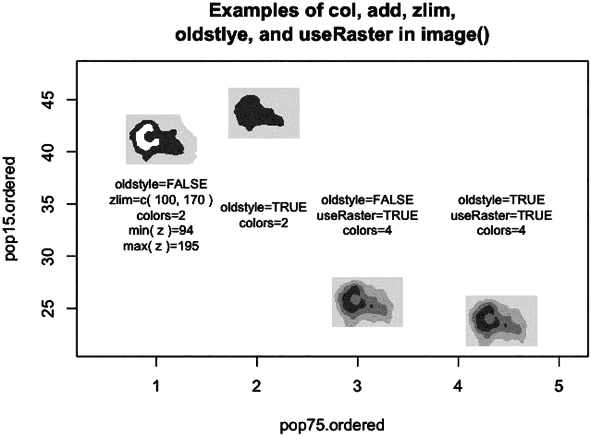

图 4-14

在 image()中使用 zlim、col、add、oldstyle 和 useRaster 的示例

请注意，在第一个图像中，z 的高值和低值被绘制为白色(这是我的机器上透明的默认设置)，因为 zlim 比 z 的范围窄。在前两个图像中，仅使用了两种颜色。在第三和第四幅图像中，使用了四种颜色。此外，对于较大的 z 值，旧样式的图像比当前样式的图像绘制得稍窄。

#### 4.2.4.2 函数的作用是

rasterImage()函数绘制 raster 类的文件以创建图像。该函数接受七个参数以及 par()中的许多参数。rasterImage 的第一个参数是 Image，对于一个可以强制为 raster 类的对象；第二、第三、第四和第五个参数是 xleft、ybottom、xright 和 ytop，表示图像的位置；第六个参数是 angle，表示旋转图像的角度；第七个参数是 interpolate，用于决定是否对图像进行线性插值。

参数 image 接受任何可以强制分类为 raster 的对象。栅格类是一类包含颜色值字符串的对象，可以是矢量、矩阵或数组。函数 rasterImage()试图通过使用 as.raster()将 Image 的值转换为类 raster 的对象(它使用 rgb()进行转换)。有关转换为栅格类的详细信息，请转到 as.raster()的帮助页面。

对象必须是逻辑、数字、字符或 raw 类的向量，或者是矩阵或数组类的向量，并且是逻辑、数字、字符或 raw 模式的向量。如果 image 是一个向量，image()将在元素的颜色级别绘制水平线，以填充图像的尺寸。图像没有默认值。

参数 xleft 和 xright 是图像位置在 x 轴上的左右坐标。参数 ybottom 和 ytop 是图像位置在 y 轴上的上下坐标。所有四个参数都可以采用任意长度的数字向量，并且元素循环——重复绘制图像。这些值必须在图的 x 和 y 界限内。xleft、xright、ybottom 和 ytop 没有默认值。

参数 angle 告诉 image()围绕图像的左下角旋转图像。旋转角度是参数指定的角度，以度为单位。旋转是逆时针的，并平行于 x 轴开始。默认值为 0–或平行于 x 轴。

参数 interpolate 是任意长度的逻辑向量(或者可以强制为逻辑向量)。如果绘制了图像的多个副本，插值循环的值。插值的默认值为 TRUE。

根据 rasterImage()的帮助页面，并非所有设备都会打印光栅图像。此外，根据设备的不同，如果调整绘图的大小，图像可能不会缩放。

在清单 [4-16](#PC16) 中，给出了使用 rasterImage()的示例代码。

```py
plot(
  pop75.ordered, pop15.ordered,
  main="Examples of image, the location arguments,\nangle, and interpolate in rasterImage()",
  type="n"
)

text(
  c( 0.75, 4.3, 1.4, 2.95, 4.35, 2.9 ),
  c( 46.5,  26,  24,    24,     30,  45 ),
  labels=c(
    "VECTORS",
    "MATRICES",
    "interpolate=FALSE\nangle=0",
    "interpolate=FALSE\nangle=0",
    "interpolate=TRUE\nangle=60",
    "interpolate=TRUE\nangle=0"
  ),
  cex=0.8
)

rasterImage(
  grey(
    1-( t( volcano )[ 61:1,]/max( volcano ) )
  ) ,
  xleft=-0.6 +
    pop75.ordered[ 20:22 ],
  ybottom=-0.6*10.94*61/87 +
    pop15.ordered[ 20:22 ],
  xright=0.6 +
    pop75.ordered[ 20:22 ],
  ytop=0.6*10.94*61/87 +
    pop15.ordered[ 20:22 ],
  interpolate=c( 0, 0, 1, 1 )
)

rasterImage(
  matrix(
    grey(
      1-( t( volcano )[ 61:1,]/max( volcano ) )
    ),
    nrow=61
  ) ,
  xleft=-0.6 +
    pop75.ordered[ c( 30, 45 ) ],
  ybottom=-0.6*10.94*61/87 +
    pop15.ordered[ c( 30, 45 ) ],
  xright=0.6 +
    pop75.ordered[ c( 30, 45 ) ],
  ytop=0.6*10.94*61/87 +
    pop15.ordered[ c( 30, 45 ) ],
  angle =c( 0, 60),
  interpolate=c( 0, 1, 1, 1 )
)

Listing 4-16Code for the examples of using image, the location arguments, angle, and interpolate in rasterImage()

```

请注意，volcano 是转置的，因此列变成了行，行变成了列。此外，rasterImage()通过将顶行放在顶部位置开始绘图，依此类推，因此转置矩阵的行被反转。

函数 grey()创建一个向量，因此在第二次调用 rasterImage()时，调用 matrix()来重新创建一个字符颜色代码的矩阵。

在图 [4-15](#Fig15) 中，运行清单 [4-16](#PC16) 中的代码。

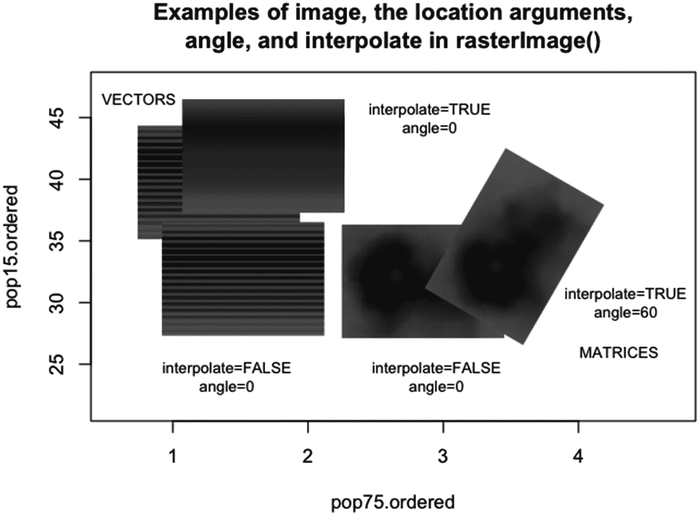

图 4-15

在 rasterImage()中设置图像、位置参数、角度和插值的示例

注意，对于三个向量图，使用插值的图像比没有使用插值的图像平滑得多。对于矩阵的两个图，没有强烈的差异。此外，请注意 grey()参数的元素都在 0 和 1 之间，包括 0 和 1，对于 volcano 的大值来说是小的，对于 volcano 的小值来说是大的。从 volcano 中减去一个小于 94 的常数可以创建一个更亮的图。

## 4.3 使用线条的函数

在本节中，我们将介绍基于行的辅助函数。这些函数是 lines()、abline()、curve()、segments()、arrows()、rect()、polygon()、polypath()和 contour()。

### 4 . 3 . 1 lines()和 abline()函数

lines()函数通常用于绘制线图。在 lines()的帮助页面中，指定的参数是 x、y 和 type。par()的大多数未指定的参数也可以设置。

参数 x 和 y 是 plot.default()的标准参数。如果两者都给定，那么两者的长度必须相同。x 没有默认值。y 的默认值为 NULL。

参数类型给出了要绘制的线条的类型。有关类型的描述，请参见第 3.3.1 节。lines()中 type 的默认值是“l”，也就是说，由 x 和 y 给定的点通过线连接起来，连接的顺序是这些点在向量 x 和 y 中出现的顺序。

函数的作用是:在图上画一条直线。该函数接受 par()的七个指定参数和一些未指定参数。其中六个参数以不同的形式向 abline()提供了相同的信息。第七个参数用于对数刻度。

前两个参数是 a 和 b，代表直线的截距和系数。参数是单元素数值向量。

第三和第四个参数是 h 和 v，用于在 h 给出的 y 值处绘制水平线，在 v 给出的 x 值处绘制垂直线。这些参数是任意长度的数值向量。

第五个参数 coef 是一个包含截距和斜率的两元素数值向量。(这个向量也可以分配给 a，结果与分配给 coef 的结果相同。)

第六个参数是 reg。任何可以作为 coef()函数的参数的对象都可以赋给 reg。例如，lm( pop15.ordered ~ pop75.ordered)可以用作 reg 的值。如果 reg 的值只包含一个元素(没有截距的回归)，则截距设置为零，斜率设置为该元素的值。如果 reg 的值包含两个以上的元素(具有多个回归元的回归)，则使用截距和第一个回归系数。

默认情况下，参数 a、b、h、v、coef 和 reg 为空。该函数检测第一个参数的类，并可以判断该参数是 a 还是 coef、a 不带 b 还是 reg，并根据该判断创建行。参数 h 和 v 必须按名称指定，或者按顺序放在正确的位置。

参数 untf 接受一个只有一个元素的逻辑向量。当坐标轴上至少有一个刻度是对数刻度时，使用该参数。回归线必须适合未转换的数据，但是如果 ab 线绘制在具有对数刻度的图上，则可以通过将 untf 设置为 TRUE 来绘制考虑转换的线。默认值为 FALSE。

在清单 [4-17](#PC17) 中，给出了 line()和 abline()的示例代码。

```py
# the regression

reg.log = glm(
  dpi.ordered ~ pop75.ordered
)

coef( reg.log )
  (Intercept) pop75.ordered
    -278.5465      604.1452

# the plots
plot(
  pop75.ordered, dpi.ordered,
  type="n",
  main="Example of lines() and\na, b, h, and v in abline()"
)

lines(
  pop75.ordered, dpi.ordered,
  type="b",
  col=grey( 0.65 ),
  cex=0.4
)

abline(
  -279,
  604,
  h=c( 1000, 2000, 3000 ),
  v=c( 1, 2, 3, 4 )
)

plot(
  pop75.ordered, dpi.ordered,
  log="y",
  type="n",
  main="Example of untf in abline()"
)

lines(
  pop75.ordered, dpi.ordered,
  type="b",
  col=grey( 0.65 ),
  cex=0.4
)

abline(
  reg.log,
  h=c( 1000, 2000, 3000 ),
  v=c( 1, 2, 3, 4 ),
  untf=TRUE
)

Listing 4-17Code

for an example of lines() and a, b, h, v, and untf in abline()

```

在图 [4-16](#Fig16) 中，运行清单 [4-17](#PC17) 中的代码。

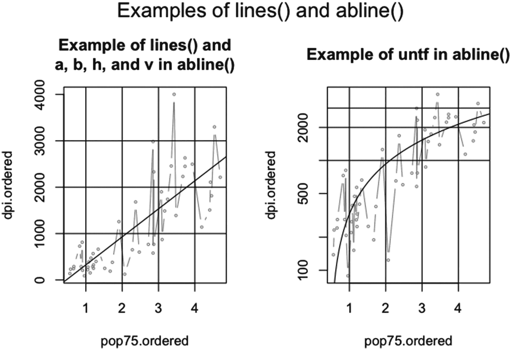

图 4-16

线()和 a、b、h、v 以及 abline()中的 untf 的示例

注意，两个图都是相同数据和相同直线的图。不同之处在于，第二个图在 y 轴上具有对数刻度。

### 曲线( )函数

curve()函数根据输入变量绘制类函数或数学表达式的对象，例如 sin()或 x + 3。函数曲线()可以是独立函数，也可以是辅助函数。在这一章中，只讨论了函数的辅助形式。

函数 curve()接受 11 个指定的参数加上 par()的许多未指定的参数。第一个参数是 expr，表示要绘制的表达式。第二个参数来自，表示要输入的变量的第一个值。第三个参数是 to，用于输入变量的最后一个值。第四个参数是 n，表示计算表达式的点数。输入变量的值在从到之间均匀分布。

第五个参数是 add，表示该图是独立的还是辅助的。第六个参数是 type，表示线的类型。第七个参数是 xname，表示要输入的变量的名称。第八个到第十个参数是 plot()中的标准 xlab、ylab 和 log，仅在独立绘图时使用。第 11 个参数是 xlim，表示要输入的变量的范围。

expr 参数是要绘制的函数或数学表达式。该参数需要一个函数名或数学表达式，它是用作输入的变量的函数，默认情况下称为 x。命名函数或数学表达式的结果长度必须等于输入变量的长度。命名函数可以由用户创建。expr 没有默认值。

接下来的三个参数是 from、to 和 n——它们都采用数字向量。在所有三种情况下，只使用第一个元素。对于 n，如果 n 的长度大于 1，则会给出警告。对于“从”和“到”，情况并非如此。“从”和“到”的默认值为空。n 的默认值是 101。

add 参数接受一个长度为 1 的逻辑向量，它的值可以是 TRUE、FALSE 或 n a。(add 的任何其他值，包括多元向量，将默认为 FALSE。)本章仅涵盖辅助地块的真值。默认值为 FALSE。

类型参数是 plot()的标准参数(参见第 3.3.1 节)。“曲线类型”()的默认值是“l”——对于线形图。

xname 参数采用单元素字符向量。xname 的默认值是“x”。

xlim 参数采用两个元素的数值向量。这两个值给出了输入变量取值的范围。如果 add 等于 TRUE，xlim 的值不一定等于 x 轴的极限。默认情况下，xlim 等于 NULL。

如果指定了 from 和 to，xlim 默认为 c( from，to)。如果 from 和/或 to 为空，则 from 和/或 to 默认为 xlim 的相应元素-如果 xlim 不为空。如果 from、to 和 xlim 都为空，并且 add 等于 TRUE，则输入变量的限制取自 x 轴的限制。

在清单 [4-18](#PC18) 中，给出了曲线()的一些例子的代码。

```py
plot(
  pop75.ordered, pop15.ordered,
  main="Examples of using expr,\nfrom, to, n, xname, xlim, add, & lty in curve()"
)

curve(
  49.86 - 6.44*x,
  add=TRUE
)

curve(
  49.86 - 6.44*ex + 5*sin( ex/2.5*pi ),
  xname="ex",
  add=TRUE,
  lty="dotted"
)

curve(
  35*x/x,
  from=1.5,
  to=3.5, n=2,
  add=TRUE,
  lty="longdash"
)

curve(
  49.86 - 6.44*x + 5*cos( x/2.5*pi ),
  xlim=c( 1, 4 ),
  add=TRUE,
  lty="dashed"
)

Listing 4-18Code for the examples of using expr, from, to, n, xname, xlim, add, and lty in curve()

```

在图 [4-17](#Fig17) 中，代码运行。

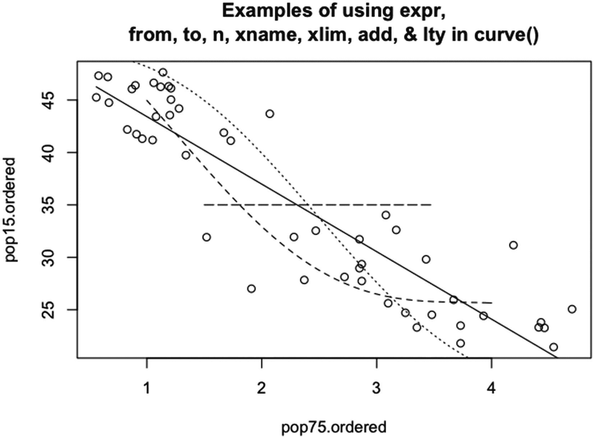

图 4-17

在 curve()中使用 expr，from，to，n，xlim，xname 与 add 的示例

在第一次(实线)和第二次(虚线)调用图 [4-17](#Fig17) 中的曲线()时，数据中 x 的全范围用于绘制曲线。在第三个调用中(长虚线)，from 和 to 参数用于将 x 的限制设置为 1.5 和 3.5。在第四个调用(虚线)中，xlim 用于将限制设置为 1 和 4。第三个调用展示了绘制水平线的一种方法。

### 4.3.3 线段( )和箭头( )函数

segments()函数绘制线段，arrows()函数绘制带箭头的线段。两者对于注释地块都很有用。给出了应用两种函数的示例。

#### 4.3.3.1 segments()函数

segments()函数绘制线段。该函数接受 par()的七个指定参数和一些未指定参数。前四个参数是 x0、y0、x1 和 y1，分别代表线段的 x 和 y 端点。最后三个指定的参数是 par()中的标准 col、lty 和 lwd(参见第 3.4.1、3.3.2 和 3.4.4 节)。

x0、y0、x1 和 y1 参数采用数值向量。这些向量不一定是相同的长度，并且循环填充到具有最长长度的向量的长度。x0 和 y0 参数没有默认值；x1 和 y1 的默认值分别为 x0 和 y0。

col、lty 和 lwd 参数是向量，长度不一定相同，并且都循环到 x0、y0、x1 和 y1 的最长向量的长度。col、lty 和 lwd 的默认值是 par()中参数的值。

#### 4.3.3.2 箭头( )函数

arrows()函数与线段相同，只是在线段的一端或两端绘制了一个箭头。该函数还有一些参数来设置箭头的样式。该函数接受 par()的 10 个指定参数和一些未指定参数。

前四个参数是 x0、y0、x1 和 y1，它们的行为与 segments()相同。第五个参数是长度，表示箭臂的长度。第六个参数是角度，表示箭臂和箭杆之间的角度。第七个参数是代码，表示要绘制的位置和数量。第八个、第九个和第十个参数是 col、lty 和 lwd，它们的行为与 segments()中的行为相同。

长度和角度参数采用任意长度的数值向量；但是，两者都只使用了第一个元素。参数长度以英寸为单位，参数角度以度为单位。长度的默认值为 0.25，角度的默认值为 30。

code 参数接受一个任意长度的整数向量，但是只使用了第一个元素。向量元素的值可以是 1、2 和 3。如果 code 等于 1，则在箭头开始的末端绘制箭头；如果为 2，则在箭头结束的一端；如果 3，在两端。默认值为 2。

#### 4.3.3.3 使用线段( )和箭头( )的例子

在清单 [4-19](#PC19) 中，给出了使用 x0、y0、x1、y1、from、to、n、xname、add 和 xlim 段()和 x0、y0、x1、y1 长度、角度和箭头代码()的示例代码。

```py
plot(
  pop75.ordered, pop15.ordered,
  type="n",
  main="Example of segments() and arrows()"
)

text(
  pop75.ordered, pop15.ordered
)

text(
  c( 0.9, 1, 2.65, 4, 4.4 ),
  c( 31, 23, 47.3, 46, 36 ),
  paste( "segment", c(1:2, 4:6 ) )
)

segments(
  x0=pop75.ordered[ c( 1, 21, 24, 14, 25, 45 ) ],
  y0=pop15.ordered[ c( 1, 21, 24, 14, 25, 45 ) ] +
    rep( c( -2, 2 ), each=3 ),
  x1=pop75.ordered[ c( 21, 24, 42, 25, 45, 50 ) ],
  y1=pop15.ordered[ c( 21, 24, 42, 25, 45, 50)  ] +
    rep( c( -2, 2 ), each=3 )
)

arrows(
  x0=c(  0.9,   4 ),
  y0=c( 33, 45 ),
  x1=c( 1.05, 3.2 ),
  y1=c( 36, 39 ),
  length=0.2,
  angle=20,
  code=2
)

arrows(
  x0=c( 2.15, 2 ),
  y0=c( 23.5, 46 ),
  x1=c( 1.4, 2.3 ),
  y1=c( 23, 47 ),
  length=0.1,
  angle=10,
  code=1
)

arrows(
  4.6,
  35,
  4.6,
  28.6,
  code=3
)

Listing 4-19Code for the example of using x0, y0, x1, and y1 in segments() and x0, y0, x1, y1, length, angle, and code in arrows()

```

在图 [4-18](#Fig18) 中，运行清单 [4-19](#PC19) 中的代码。

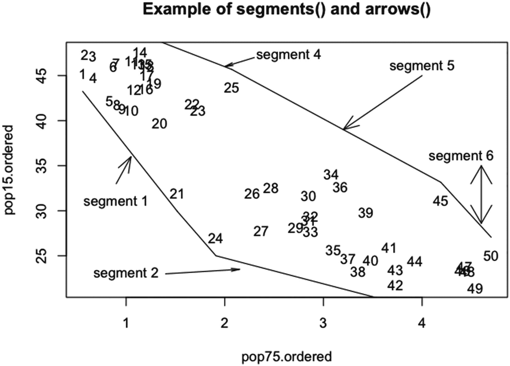

图 4-18

在线段()中使用 x0、y0、x1 和 y1，在箭头()中使用 x0、y0、x1、y1、长度、角度和代码的示例

请注意，区段 3 不在图中，因此不包括该区段。此外，当只提供位置坐标时，对 text()的调用使用 x 和 y 变量的索引值作为标签。

### 4.3.4 绘制自封闭线的函数:rect()、polygon()和 polypath()

自我封闭的线条有时很有用。本节介绍 rect()、polypath()和 polygon()函数。rect()函数绘制矩形，polygon()和 polypath()函数绘制多边形。给出了一个应用这三个函数的例子。

#### 4.3.4.1 rect()函数

rect()函数根据矩形的四个角点绘制矩形。该函数接受 par()的 10 个指定参数和一些未指定参数。前四个参数是 xleft、ybottom、xright 和 ytop——表示矩形四个角的位置。第五个和第六个参数是密度和角度——用于用有角度的线填充矩形。这里，密度是每英寸的线条数，角度是线条与水平线的角度。

第七个参数是 col——表示倾斜线条的颜色或纯色填充颜色，具体取决于 density 的值。第八个参数是 border——如果绘制了边框，则表示边框的颜色，否则表示不包含边框。第九个和第十个参数是 plot()中的标准 lty 和 lwd。

前四个参数采用任意长度的数字向量。这些元素将循环输出，其长度等于最长向量的长度。如果向量的长度没有被最长向量的长度整除，则会给出警告，但矩形仍会打印。为最长向量中的每个元素绘制一个矩形。但是，如果向量中的值为 n a，则不会绘制与该元素关联的矩形。NA 值像任何其他值一样循环。位置参数没有默认值。

密度和角度参数采用任意长度的数值向量。元素循环到最长位置向量的长度。如果密度元素为正，则该数字给出矩形内每英寸的行数。绘制线条，在绘制的线条后面，矩形是透明的。

如果密度为 0，则不绘制线条，矩形不填充颜色，并且矩形是透明的。如果为 NULL，结果取决于 col 的值。对于设置为颜色的 col，颜色填充矩形；否则，结果与将“密度”设定为 0 相同。如果密度为负或 NA，则矩形用颜色填充。密度的默认值为空。

angle 参数给出线条绘制时与水平线的角度，以度为单位。如果角度等于 NULL，则不绘制任何线，矩形是透明的。角度的默认值是 45 度。

col 参数是 plot()的标准参数(参见第 3.4.1 节了解可使用的值的种类)。在 rect()中，col 接受一个任意长度的向量，它循环到位置参数的最长向量的长度。

如果 col 采用除 NA 或 NULL 之外的有效值，并且密度等于负数、NA 或 NULL，则矩形用 col 值给出的颜色填充。如果 col 采用除安娜或 NULL 之外的有效值，并且密度采用正数，则 col 给出矩形中线条的颜色。如果 col 等于 NA 或 NULL，则矩形不填充颜色；但是，如果 density 是正数(颜色由 par()中的 fg 值设置),则会绘制线条。col 的默认值为 NA。

R 中的颜色可以具有从不透明到完全透明的透明度级别(参见第 3.4.1 节)。在 rect()中，如果 color 不等于 NA 或 NULL，则矩形的填充颜色具有由 col 的值给定的透明度。对于不透明的颜色和重叠的矩形，最后绘制的矩形的颜色会覆盖任何以前的颜色或线条。

border 参数采用任意长度的数字、字符或逻辑向量。向量循环到最长位置向量的长度。参数设置矩形边框的颜色。数字和字符向量采用与 col 相同类型的值。逻辑向量的值可以是真或假。

如果绘制线条，NULL 或 TRUE 值会告诉 rect()使用线条的颜色作为边框。否则 border 的值就是 par()中 fg 的值。NA 或 FALSE 值会从绘图中省略边框。border 的默认值为 NULL。

lty 和 lwd 参数是 par()中的标准参数(参见第 3.3.2 和 3.4.4 节)。).在 rect()中，lty 和 lwd 影响直线和边界。lty 的默认值是 par(“lty”)，lwd 的默认值是 par(“LWD”)。

#### 多边形 4.3.4.2()函数

polygon()函数创建多边形，与 polypath()函数略有不同，后者也绘制多边形。这两个函数都自动将 x 和 y 的最后一个值闭合到 x 和 y 的第一个值，函数 polygon()接受八个指定的参数和 par()的一些未指定的参数(在参数顺序中的第八位)。

前两个参数 x 和 y(或者 x 本身，y 设置为空)给出了多边形的顶点。第三个到第七个参数是 density、angle、border、col 和 lty，它们的行为与 rect()函数基本相同。第八个指定的参数是 fillOddEven。有关该参数作用的说明，请参见 polygon()的帮助页。在我的设备上，这个参数似乎没有任何作用。

如果包含 y，参数 x 和 y 是数字向量，长度必须相同。向量 y 可以省略——在这种情况下，x 可以是一个两列矩阵，在行中包含顶点的 x 和 y 值。或者，x 是向量，其值相对于一条线在垂直方向上绘制，其中该线在 x 轴上从 1 开始，在 y 轴上从向量的第一个值开始，在 x 等于向量的长度，y 等于向量的最后一个值时结束。

如果将 NAs 放置在向量(或 vector)的给定元素处或矩阵的给定行中，polygon()会在 NAs 处结束多边形，并使用 NAs 之后的数字开始新的多边形。

有关密度、角度、边界、列和 lty 的描述，请参见本小节第一部分中 rect()的描述。但是，参数的行为方式有一点不同。在多边形中，对于设置为空的列，如果密度等于 0，则多边形是透明的，而如果密度等于空，则多边形是不透明的。对于 rect()，两者都是透明的。这些函数的默认值是相同的。

显然，如果 density 等于 NA、NULL、负数或 0，fillOddEven 参数可以设置为任何 R 对象。如果 density 是正数，fillOddEven 必须是一个可以强制为逻辑模式的向量。如果 fillOddEven 长于一个元素并且 density 大于零，则给出警告，而不是错误。fillOddEven 的默认值为 FALSE。

#### 4.3.4.3 多路径( )函数

polypath()函数采用与 polygon()相同的指定参数，只是不包括密度和角度，也不特别包括 lwd。该函数只填充颜色，不填充线条，因此密度和角度不适用。此外，还包含了一个参数 rule，而不是 fillOddEven。

border、col 和 lty 参数都采用与 polygon()相同的值，但是对于多元向量，只使用第一个元素。如果 border 等于 NA，则不绘制边界。如果 border 等于 NULL，则边框采用 par()中 fg 给定的颜色。否则，边框等于分配给参数的颜色。

在 col 等于 NA 或 NULL 的情况下，在多边形中不绘制颜色，并且多边形是透明的。如果 col 等于 NA 或 NULL，并且 border 不是 NA，则用 border 给定的颜色画出多边形的轮廓。在所有其他情况下，如果 col 等于一种颜色，则用 col 给定的颜色填充多边形。

单独绘制多个多边形时，对于等于 NA 或 NULL 的 col，多边形是透明的。纯色不透明(指定的颜色可以透明)。当从对 polypath()的同一个调用中绘制多个多边形时，rule 参数确定多边形重叠时多边形的行为。

当嵌线等于“缠绕”时，绘制多边形的方向(顺时针或逆时针)会影响重叠多边形的行为。对于嵌套或重叠的多边形，如果绘制的前两个多边形都是顺时针方向或逆时针方向，则所有多边形都用相同的颜色填充。如果一个是顺时针方向，另一个不是，那么，在它们重叠的地方，交叉点被标为白色。对于嵌套地块，随着多边形变小，颜色和白色交替出现。

如果有三个以上的重叠地块，规则会变得更加复杂。多边形看起来有三个多边形的交集，如果一个是逆时针方向，一个是顺时针方向，则两个多边形的交集是白色的，如果两个多边形的方向相同，则两个多边形的交集是彩色的。

对于我看到的例子，如果规则等于“偶数”,所有的图都以同样的方式绘制。第一个图标有颜色，第二个图标有颜色，其中第二个图不与第一个图重叠。当第二个图与第一个图重叠时，第二个图为白色。如果第三个图与前两个图都不重叠，则第三个图是彩色的。在所有三个地块相交的地方，该地块标有颜色。如果只有两个点相交，如果下面的图是彩色的，则第三个点绘制为白色，如果下面的图是白色的，则第三个点绘制为彩色。

#### 4.3.4.4 矩形( )、多边形( )和多边形( )的例子

在清单 [4-20](#PC20) 中，给出了运行 rect()、polygon()和 polypath()的示例代码。

```py
plot(
  pop75.ordered, pop15.ordered,
  type="n",
  xlab="",
  ylab="",
  main="Examples of rect(), polygon(), & polypath()"
)
text(
  c( 1.05, 2.42, 4 ),
  25,
  c( "rect()", "polygon()", "polypath()" )
)

rect(
  c(  0.85, 0.55, 1.05, 0.75 ),
  31,
  c( 1.35, 1.55 ),
  c( 42, 45 ),
  density=c( NA, 3 ),
  col=grey(
    c( 0.9, 0.7, 0.5, 0.3 )
  ),
  border=grey(
    c( 0.7, 0.3 )
  )
)

polygon(
  c( 2.8, 3.5, 2.1,  NA, 2.8, 3.3,   2.2, NA, 2.4,   3.2, 2.4 ) - 0.38,
  c( 42,  31,  31,  NA,  40,  32, 31.5, NA,  32, 32.5, 38 ),
  density=c( 3, 4, NA ),
  col=grey(
    c( 0.7, 0.45, 0.55 )
  ),
  fillOddEven=0,
  border=NULL
)

polypath(
  c( 2.8, 3.5, 2.1,  NA,  2.2,  3.3, 2.8,  NA, 2.4,   3.2, 2.4 ) + 1.2,
  c(  42,  31,  31,  NA, 31.5, 32,  40,  NA,  32, 32.5,  38 ),
  col="grey60",
  rule="winding",
  border=TRUE,
  lwd=2,
  lty="dashed"
)

Listing 4-20Code for

the examples of rect(), polygon(), and polypath()

```

在图 [4-19](#Fig19) 中，运行清单 [4-20](#PC20) 中的代码。

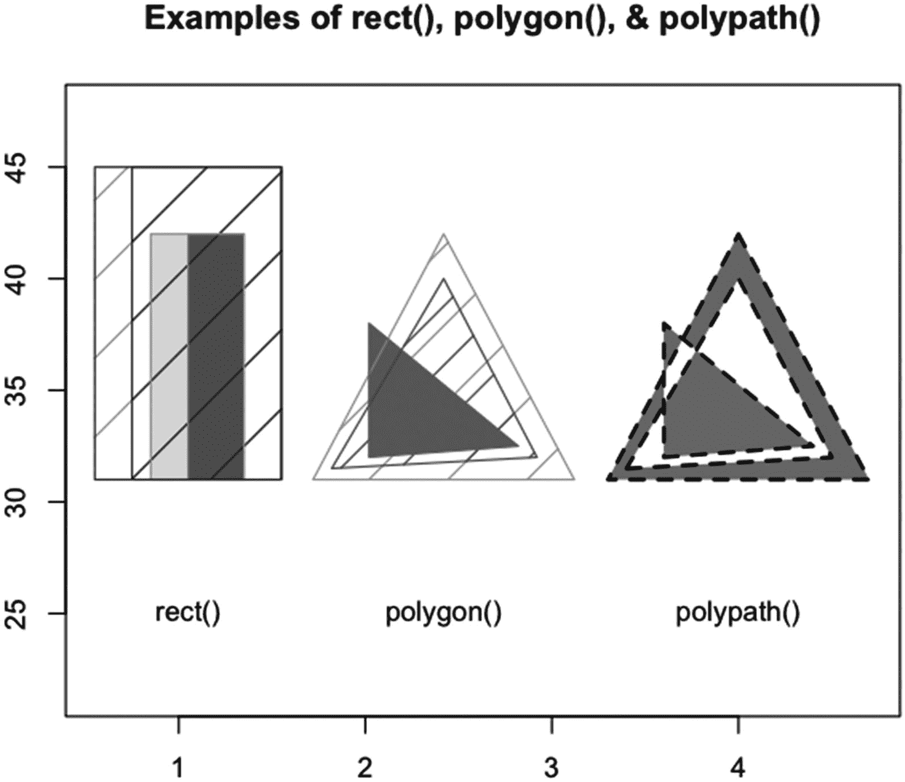

图 4-19

使用 rect()、polygon()和 polypath()的示例

请注意，对于 rect()的示例，首先绘制浅灰色矩形，其次是带有浅灰色线条的矩形，第三是深灰色矩形，最后是带有深灰色线条的矩形。带有浅灰色线条的矩形从等于 0.55 的 x 延伸到等于 1.55 的 x，但是带有深灰色线条的矩形绘制在从等于 0.75 的 x 到等于 1.55 的浅灰色线条上。

类似地，浅灰色矩形从等于 0.85 的 x 延伸到等于 1.35 的 x，但是深灰色矩形绘制在从 1.05 到 1.35 的 x 的浅灰色矩形上。此外，在浅色和深灰色矩形上可以看到深灰色线，因为带有深灰色线的矩形是最后绘制的。

对于多边形()的示例，绘制了三个三角形。首先绘制外部三角形，其次是中间三角形，最后是内部三角形。通过使用 NAs 分离每组绘图指令，在对 polygon 的一次调用中绘制了所有三个三角形。请注意，尽管这些线被第三个三角形覆盖，但在第三个三角形上边界是可见的。在对 polygon 的另一个调用中绘制第三个三角形可以解决这个问题。

对于 polypath()示例，绘制的三个三角形与 polygon()示例相同。第一个三角形按顺时针方向绘制，第二个和第三个三角形按逆时针方向绘制。使用了规则“缠绕”,因此——由于第一个和第二个三角形的绘制方向不同——第二个三角形是白色的，第一个和第三个是深灰色的。但是，当第三个三角形与第一个三角形相交时——因为两个三角形绘制的方向不同——第三个三角形在第一个三角形的灰色上绘制白色。请注意，对于 polypath()示例，线型是“虚线”,线宽是 2。

### 4.3.5 等高线( )函数

contour()函数绘制等高线图。该函数可以作为独立函数或辅助函数运行。在本章中，我们仅将该函数作为辅助函数。本例中的数据集是数据集包中的火山数据集。有关数据集的描述，请参见 4.2.4.2 部分，或者参见火山的帮助页面

contour()函数接受 19 个指定的参数以及来自 par()的许多未指定的参数。前九个参数是 x，代表 x 轴上放置 z 行的位置；y，表示 y 轴上放置 z 列的位置；z，用于计算轮廓的值的矩阵；nlevels，表示要使用的轮廓级别数，仅在未设置级别时使用；级别，用于轮廓的级别(优先于 the levels 标签，用于等高线上的标签；xlim 和 ylim，plot()的标准参数，仅用于独立选项；和 zlim，供 z 的上下限使用。

参数 x 可以是向量，也可以是两个或三个元素的列表——都是数字模式。如果 x 是一个向量，向量的长度就是 z 中的行数。向量必须按升序排列。此外，如果 x 是一个向量，y 必须作为一个单独的向量提供。如果 x 是一个列表，该列表可以包含 x 和 y 或 x、y 和 z 作为两个或三个元素。x 的默认值是 seq( 0，1，length . out = nrow(z))–它提供 0 到 1 之间(包括 0 和 1)等间距值的正确数目。

参数 y 采用长度等于 z 中列数的递增数字向量。y 的默认值为 seq( 0，1，length.out=ncol(z))。

自变量 z 是一个数值矩阵。行中的值用于计算垂直方向(x 轴上方)的等高线。列中的值用于计算水平方向(y 轴右侧)的等高线。每个值都有一个 x 坐标和一个 y 坐标。第一行与第一个 x 值相关联，该行(给出 contour()使用的垂直方向的值)从图的底部到顶部。z 没有默认值。

第四个和第五个参数是 nlevels 和 levels。分配了其中一个，但不是两个都分配。参数 nlevels 给出了要查找的等高线级别数。参数 levels 给出了创建等值线的值。一元整数向量用于 nlevels，任意长的数字向量用于 levels。nlevels 的默认值是 10。级别的默认值是 pretty( zlim，nlevels)。(函数 pretty()在一组界限内寻找合适的区间，其中设定了一定数量的区间。有关更多信息，请参见 pretty()的帮助页面。)

第六个参数是标签。该参数采用任意长度的字符向量(或可以强制为字符的向量)。元素循环到一定的级别数。labels 的默认值为 NULL，也就是说，R 创建标签。

第七、第八和第九个参数是 xlim、ylim 和 zlim。仅当 contour 作为独立函数运行时，参数 xlim 和 ylim 才会影响绘图。自变量 zlim 给出了 z 的下限和上限，在此范围内形成等值线。该参数采用任意长度的数字向量。使用向量中的最小值和最大值。xlim、ylim 和 zlim 的默认值为 range( x，有限=真)、range( y，有限=真)和 range(z，有限=真)。(函数 range()查找数值对象的范围。有限参数告诉 range()忽略非有限值。)

最后十个参数是 labcex，代表标签中的字符大小；drawlabels，告诉等高线是否绘制标签；方法，用于放置标签的方法；vfont，可选地，使用 Hershey 字体；来自 plot()和 par()的标准轴、frame.plot、col、lty 和 lwd 和 add，用于将 contour()作为辅助图或独立图运行。

labcex 参数给出了标签的字符大小。根据轮廓的帮助页面，尺寸是绝对的，而不是相对于 par()中 cex 的值。该参数采用任意长度的数字向量，但只使用了第一个元素。默认值为 0.6。

drawlabels 参数采用任意长度的逻辑向量(或可以强制为逻辑的向量)，但只使用第一个元素。默认值为 TRUE，即绘制等高线标签。

方法参数采用任意长度的字符向量，但只使用第一个值。第一个元素的可能字符值是“简单”、“边缘”和“最平”。任何其他值都会产生错误。

在 contour()的帮助页面中，“简单”的值表示标签绘制在图的边缘并与等高线重叠。“边缘”的值表示标注绘制在地块的边缘，并嵌入在等高线中。值“最平坦”表示标注绘制在等值线最平坦的部分，并嵌入到等值线中。方法的默认值是“最平”。

vfont 参数指定 Hershey 字体系列和字体粗细。该参数是一个两元素的字符向量。要查看可用的字体，请在 R 提示符下运行 Hershey 演示。要查看使用 Hershey 字体的示例，请参见清单 [4-20](#PC20) 。vfont 没有默认值。

axes 和 frame.plot 参数仅在创建独立绘图时使用，并且是 plot()的标准参数。col、lty 和 lwd 参数是 par()中的标准参数。col 的默认值是 par()中 fg 的值。lty 的默认值是 par()中 lty 的值。lwd 的默认值是 lwd 在 par()中的值。

add 参数接受任意长度的逻辑向量(或者可以强制为逻辑向量),但是，如果长度超过一个元素，则只使用第一个元素并给出警告。

在清单[中，4-21](#PC21) 是使用 contour()的示例代码。该示例绘制了数据集火山的等值线。默认情况下，在 R 中加载包数据集，因此对于大多数用户来说，可以像访问工作区中的任何对象一样访问数据。

```py
plot(
  pop75.ordered, pop15.ordered,
  type="n",
  xlab="x",
  ylab="y",
  xlim=c( 0, 5.5 ),
  ylim=c( 18, 52 ),
  main="Example of x, y, z, levels, labels, labcex,\nmethod, vfont, col, lty, lwd, and add in contour()",
  sub="The volcano Dataset"
)

contour(
  x=0.5 + 4.5*seq( 0, 1, len=87 ),

   y= 20 +  30*seq( 0, 1, len=61 ),

  z=volcano,

  levels=c( 1:6*20+60 ),
  labels=paste( 1:6*20+60 ),
  labcex=0.8,
  method="flattest",
  vfont=c("serif", "bold"),
  col="grey10",
  lty="dotdash",
  lwd=2,
  add=TRUE
)

Listing 4-21Code for an example of contour() using x, y, z, levels, labels, labcex, method, vfont, col, lty, lwd, and add

```

在图 [4-20](#Fig20) 中，运行清单 [4-21](#PC21) 中的代码。

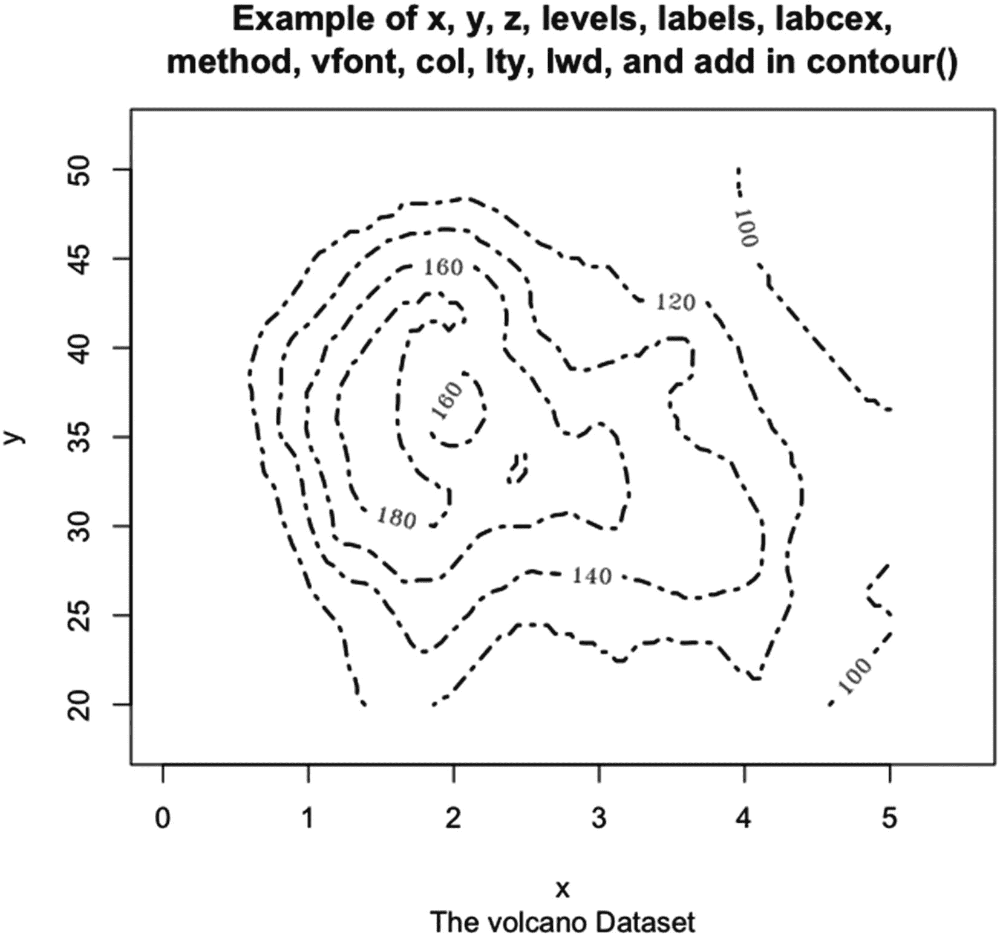

图 4-20

使用 x，y，z，级别，标签，labcex，方法，vfont，col，lty，lwd 和 add in contour()的示例

请注意，我们选择了六个特定的级别——80、100、120、140、160 和 180。火山数据集的最小值为 94，因此从不使用 80 的等值线。此外，还使用了 Hershey 字体 serif bold，并将标签大小设置为 0.8。使用线宽 2 和点划线类型。轮廓和标签的颜色选择为深灰色。

## 4.4 提供关于某个图的信息或与该图进行交互的函数

本节介绍图例()、多行文字()、标识()和定位器()函数。legend()和 mtext()函数向地块添加图例和边距文本。identify()和 locator()函数使用计算机的指针与绘图交互。

### 4.4.1 图例( )和多行文字( )函数

当在绘图中使用不同的绘图字符、不同颜色或样式的线条或不同颜色或样式的阴影区时，通常使用图例。legend()函数在绘图上放置一个图例。有时一个来源，信用，或其他信息应该被包括在一个绘图，在页边空白处。函数的作用是:将文本放在空白处。

#### 4.4.1.1 传奇( )函数

legend()函数有 39 个参数。前 11 个参数是 x，代表图例的 x 位置；y，表示图例的 y 位置，如果需要的话；图例，用于图例中使用的文本字符串；fill，说明是否应该在图例的关键字中使用填充框，并指定填充框中使用的颜色；col，用于线条和/或绘图字符的颜色，如果在键中使用线条和/或绘图字符；border，如果在关键字中使用了填充框，则为填充框的边框颜色；lty 和 lwd，用于线条的样式和宽度(如果在关键字中使用线条);pch，用于标绘字符，如果标绘字符在键中使用；以及角度和密度，用于填充框中线条的角度和密度(如果在关键字中使用了具有填充线条样式的填充框)。

x 参数可以采用一个元素的字符串、数值向量或两个元素的数值向量。可能的字符串有" topleft "、" top "、" topright "、" left "、" center "、" right "、" bottomleft "、" bottom "和" bottom right "--尽管字符串可以缩短为唯一标识符，例如，" topl "表示" topleft "。字符串指示图例的位置。

如果 x 是一个单元素数值向量，并且 y 等于 NULL，则默认情况下 legend()绘制图例时，左上角在 x 轴上为 1，在 y 轴上为 x 值。如果 x 是两个元素的数值向量，并且 y 等于 NULL，legend()将绘制 x 轴上 1 和 2 之间以及 y 轴上 x 的两个值之间的图例。

如果 x 和 y 是单元素数值向量，默认情况下，图例的左上角位于 x 轴上，y 轴上。然后，该函数会找到好的图例尺寸。

如果 x 和 y 是二元数值向量，则这四个值定义了图例框的四个角。如果框对于图例来说太小，图例将绘制在框外。

x 参数没有默认值，y 的默认值为 NULL。

图例参数给出了图例的值。根据 legend()的帮助页，如果向量不是字符向量，legend()会尝试使用 as.graphicsAnnot()将向量转换为模式字符。向量的长度是任意的，长度给出了图例值的数量。图例没有默认值。

fill 参数接受一个任意长度的颜色值向量(参见第 3.4.1 节了解可以使用的值的类型)。如果将 fill 设置为一个值，则在图例文本的左侧绘制方框，并用由 fill 或给定颜色的填充线设置的颜色填充。这取决于是否设定了密度。如果 fill 的元素设置为 0，则相应的框是透明的。颜色循环到图例的长度。col 的默认值为 NULL。

col 参数给出了图例中使用的线条或绘图字符的颜色(代替填充框或在填充框旁边)。像 fill 一样，col 是一个颜色值的向量，长度是任意的。参数元素循环到图例的长度。值为 0 时绘制白色。col 的默认值是 par()中 col 的值。

border 参数给出填充框周围边框的颜色。该参数采用一个颜色值向量，长度和周期都是任意的。值为 0 时绘制白色。边框的默认值是“黑色”。

lty、lwd 和 pch 参数是 plot()的标准参数(参见第 3.3.2 节和第 3.4.4 节)，尽管如果 pch 的元素是字符串，则字符串中的字符数可以大于 1。(注意，图例和图中使用的颜色、符号或线条之间没有内在联系。)lty、lwd 和 pch 没有默认值。

密度和角度参数用于 rect()和 polygon()(参见第 4.3.4 节。)参数采用任意长度的数值向量，并循环到 legend 的长度。密度参数以每英寸行数为单位，角度以度为单位。密度的默认值为空，角度的默认值为 45 度。

第 12 到第 16 个参数给出了图例框和边框的值。参数是 bty，代表边框的框类型；bg，为图例框的背景色；box.lty，为边框的线型；box.lwd，为边框的线宽；和 box.col，表示边框的颜色。

bty 参数采用任意长度的向量。除了“n”之外，任何值都给出一个四边的方框，对于“n”不绘制方框，也不能分配背景颜色。bty 的默认值是“o”。

bg 参数设置背景颜色，并接受任意长度的颜色值向量。仅使用第一个值。bg 的默认值是 bg 在 par()中的值。

box.lty、box.lwd 和 box.col 参数分别采用 par()中 lty、lwd 和 col 使用的类型值的向量(请参见 3.3.2 和 3.4.4 节)。仅使用向量的第一个值。默认值是 par()中 lty、lwd 和 fg 的值。

第 17 到 20 个参数影响字符和绘图字符。参数为 pt.bg，用于 pch 设置为 20、21、22、23、24 和/或 25 时的背景颜色(参见第 3.3.2 节。);cex，为图例中文字的大小；pt.cex，为键中绘图字符的大小；和 pt.lwd，用于形成绘图字符的线的宽度。

pt.bg 参数采用任意长度的颜色值向量，并循环到图例的长度。pt.bg 的默认值是 NA–这意味着背景是透明的。

cex 参数接受任意长度的数值向量。如果长度不是图例长度的等分，则会给出警告，但会打印图例。如果 cex 变化，图例符号不对齐。cex 的默认值是 1。

pt.cex 参数采用任意长度的数值向量。pt.cex 的值是绘图字符的大小。即使 pt.cex 变化，如果 cex 是单个值，图例的键也是对齐的。pt.cex 的默认值是 cex。pt.cex 和 cex 都是相对于 par()中 cex 的大小。

pt.lwd 参数采用任意长度的数值向量。这些值循环到图例的长度。pt.lwd 的默认值是 lwd 在 par()中的值。

第 21 个和第 22 个参数 xjust 和 yjust 提供了关于图例如何相对于图例的给定 x 和 y 坐标对齐的信息。如果位置由数值指定，而不是由两元素向量指定，则 xjust 和 yjust 的值仅影响图例的位置。

如果 xjust 的值大于 0.5，则将图例的中心向左移动，如果小于 0.5，则将图例的中心向右移动。值 0.5 表示图例在水平方向上以该点为中心。值 xjust 等于 0 表示图例的中心位于 x 位置右侧(0–0.5 =-0.5)图例宽度的一半处。值-1.5(-1.5–0.5 =-2)表示图例的中心在 x 位置右侧两个图例宽度处。xjust 的默认值为 0，即图例的左侧位于 x 的值处。

对于 yjust，大于 0.5 的值将图例下移，小于 0.5 的值将图例上移。0.5 再次使图例居中，这次是在 y 位置。值 1 表示图例的中心在 y 位置下半个图例高度处(1–0.5 = 0.5)，依此类推。yjust 的默认值为 1，即图例顶部的位置是 y 的值。

第 23 到 28 个参数在图例框中定位文本和键，并设置文本格式。参数是 x.intersp，表示图例项和图例值之间的间距；y.intersp，表示图例中各行之间的间距；adj，用于在水平和垂直方向对齐图例文本；text.width 以 x 轴为单位的图例框文本部分的宽度，它影响框的右边框。text.col，用于图例字符串的颜色；和 text.font，用于图例字符串的字体粗细。

x.intersp 参数采用长度小于或等于 legend 长度的数值向量。争论循环往复。如果 x.intersp 的长度没有均匀地除以图例的长度，则会给出警告，但图例会出图。如果 x.intersp 比 legend 长，则会出现错误。

当 x.intersp 等于 0 且 adj[1]等于默认值时，绘图字符中心和图例文本之间的间距略大于零。对于填充框和线条，填充框右侧或线条右端与图例文本之间没有空格。x.intersp 值等于 1 会将图例文本放在填充框、线条或绘图字符右侧大约两个字符宽度的位置。值 2 给出大约四个字符宽度的空间。负值将图例文本向左移动。x.intersp 的默认值等于 1。

y.intersp 参数采用一个数值向量，其长度应为一个元素或图例的长度。长于图例长度的参数会产生错误，而那些短于图例长度且长于一个元素的参数会表现得很奇怪。

如果 y.intersp 只采用一个值，而 adj 等于默认值，则值 1 会在图例文本行之间留出大约半行高度的空间。值 2 给出大约两个线高度。值 0 覆盖这些行。负值会反转行的顺序。

如果给定 y.intersp 的一系列递增或递减值，则行距行为会发生变化。例如，如果 y.intersp 等于 0:3/3，则前两行之间的间距大约为零，第二行和第三行之间的间距大约为一行，第三行和第四行之间的间距大约为两行。此外，在框的上边框和第一行之间有一点零以上的空间，在第四行和框的下边框之间有大约一行的空间。y.intersp 的默认值是 1。

adj 参数将图例文本相对于图例行上的键放置。该参数采用一个或两个元素的数值向量。可以指定其他长度向量，甚至矩阵；但是只使用向量或矩阵的前两个值。

该函数使用 adj 的值来调整图例文本的位置。调整基于两个数字，第一个数字用于水平位置，第二个数字用于垂直位置。如果 adj 取单个元素的向量，那么第二个值设置为 0.5，adj 的单个元素的值成为第一个值。

如果 adj 的第一个值等于 0，则图例文本的左端放置在填充框和/或绘图字符中心右侧大约一个半字符宽度处。对于行，文本的左端大约是行右端右侧的一个半字符宽度。

值 0.5 将图例文本的左端放置在填充框和/或打印字符中心左侧约三分之一字符串宽度的位置。对于行，文本的左端距行的右端约为字符串宽度的三分之一。

值为 1 会将图例文字的右端放置在填充框或绘图字符中心右侧大约一个半字符宽度的位置。对于线条，图例文本的右端大约是线条右端右侧的一个半字符宽度。可以使用大于 1 小于 0 的值。

如果第二个值大于 0.5，则向下移动文本；如果小于 0.5，则向上移动文本。值 0.5 使文本(相对于填充框、绘图符号或线条)在垂直方向居中。

如果第二个值等于 1，则文本(大写字母)的顶部将在填充框、绘图字符和/或线条的中心绘图。如果第二个值等于 0，则文本底部在填充框、绘图字符和/或线条的中心绘图。大于 1 且小于 0 的值可用于 adj 的第二个值。

在接下来的三段中，我们假设 x.intersp 和 y.intersp 等于默认值。adj 的默认值是 c( 0，0.5)。

text.width 参数采用长度最多为图例长度的数值向量。值必须是非负数。如果 x 和 y 的值是二元向量，则忽略该参数，在这种情况下，图例框的宽度由 x 和 y 的值设置。

宽度以 x 轴单位测量，但从图例文本中第一个字符的右侧开始测量，而不是图例框的左侧。宽度影响图例框的宽度，但对图例没有影响，图例将在必要时打印在框外。

如果给定了多个值，legend()会为每个值绘制一个图例，但图例是不透明的，因此图例会相互重叠。也就是说，结果中值的顺序很重要。默认值为 NULL，表示 R 选择图例宽度。

text.col 和 text.font 参数采用任意长度的向量，其值的类型与 plot()中的 col 和 font 相同。这些值循环到图例的长度。text.col 的缺省值是 par()中 col 的缺省值，text.font 的缺省值是 NULL——这表示我的设备上的普通重量。

第 29 到 39 个参数给出了影响图例的一般参数，包括设置和格式化标题。参数为 merge，用于放置填充框和/或绘制字符(如果还绘制了线条);跟踪，用于调试图例代码；plot，用于是否绘制图例或返回大小；ncol，代表图例中的列数；horiz，用于是否绘制水平图例；标题，绘制一个图例标题；插入，当图例框的位置由字符串指定时，将图例从绘图边界插入；xpd，用于是否在绘图边界外扩展绘图；title.col，用于标题的颜色；title.adj，用于向左或向右调整标题；和 seg.len，用于字符宽度中的关键线长度。

merge 参数采用任意长度的逻辑向量(或者可以强制为逻辑向量)。但是，如果长度大于 1，则会给出警告，并且只使用第一个值。

如果 merge 等于 TRUE，并且 lwd 和/或 lty 设置为值，并且绘制字符被绘制，则绘制字符绘制在线的中间。如果 merge 等于 FALSE，则绘制字符将绘制在线的右端。

如果同时绘制线条和填充框，并且 merge 等于 TRUE，则填充框绘制在线的左端下方。如果 merge 等于 FALSE，填充框将绘制在线的左侧，有一点重叠。

如果打印线条、填充框和打印字符这三者，并且 merge 设置为 TRUE，则填充框打印在线的左侧，而打印字符打印在线的中心。如果为 FALSE，填充框将绘制在线的左侧，而绘制字符将绘制在线的右侧。

否则，合并没有效果。注意，绘图字符和线条总是相同的颜色。merge 的默认值为 TRUE。

trace 参数采用任意长度的逻辑向量(或者可以强制为逻辑向量)。如果跟踪的长度大于 1，则会给出警告，并且只使用第一个元素。然而，传说绘图。如果 trace 设置为 TRUE，将在 R 控制台上打印一些诊断信息。如果为 FALSE，则不会在 R 控制台上打印任何内容。

plot 参数采用任意长度的逻辑向量(或者可以强制为逻辑向量)。但是，如果长度大于 1，则会给出警告，并且只使用第一个元素。

如果 plot 等于 TRUE，则绘制图例。如果为 FALSE，则不绘制图例。在这两种情况下，将函数调用设置为等于一个对象会向该对象分配一个列表，其中包含以 x 和 y 轴为单位的图例框和图例线的位置。plot 的默认值为 TRUE。

ncol 参数必须是一个值大于或等于 1 的单元素数值向量。该参数给出了图例中的列数。图例会向外扩展，以便根据需要为任意多的列腾出空间。例如，如果有四个标签并且请求了三列，则前两列各包含两个图例项，第三列不包含任何图例项。

如果该值不是一个整数，右边框会随着数字增加到下一个整数而向右移动，但是某些标签可能会在数字增加到下一个整数时才绘制。ncol 的默认值为 1。

horiz 参数采用任意长度的逻辑向量(或者可以强制为逻辑向量)。如果长度大于 1，则会给出警告，并且只使用第一个元素。然而，传说绘图。

TRUE 值表示水平图例。FALSE 值表示垂直图例。horiz 的默认值为 FALSE。

title 参数采用一个包含图例标题或 NULL 值的单元素字符向量。默认值为 NULL。

inset 参数采用任意长度的数字向量，在图例的位置由字符串指定时使用。自变量以比例为单位进行度量，其中比例是垂直于给定轴的轴的比例。

如果位置在轴的中间，那么只使用一个元素，即使给出了更多的元素。根据插入值和垂直轴的长度，图例将从给定的轴上移开。

如果字符串指定了角位置，则在插入长度大于 1 时，使用插入的前两个元素。第一个元素给出了与纵轴的距离占横轴的比例。第二个元素给出了从水平轴到垂直轴的距离。

如果只指定了一个元素，则离轴的距离基于该比例；并且，除非图是正方形的，否则这将在两个轴上给出不同大小的插入。插入的默认值为 0。

xpd 参数是 plot()中的标准 xpd。该参数采用一个单元素逻辑向量，可以采用值 TRUE、NA、NULL 和 FALSE。如果 xpd 等于 TRUE，图例可以出图到出图区域边界。如果 xpd 等于 NA，图例可以绘制到器件边界。如果 xpd 等于 NULL 或 FALSE，legend()将在绘图边界停止绘图。xpd 参数没有默认值，这表明 xpd 是在 plot()调用中设置的值。

参数 title.col 和 title.adj 分别给出了标题的颜色和从左到右的位置。title.col 参数采用任意长度的颜色值向量(参见第 3.4.1 节)。title.col 的默认值是 text.col。

title.adj 参数采用任意长度的数字向量。如果 title.adj 等于 0，则标题绘制在左边界的右侧。如果等于 1，标题将绘制在右边框的左侧。如果等于 0.5，标题将在中心打印。负值和大于 1 的值也是可以接受的。

如果 title.adj 的长度大于 1，则标题在 adj 的每个值处绘图，并且 title.col 中的颜色循环到 title.adj 的长度。然而，与 title.adj 的值相关联的位置对于多元素向量是不同的。尽管如此，随着 title.adj 值的增加，标题的位置会向右移动。title.adj 的默认值为 0.5。

当键包含一行时，seg.len 的值给出该行的长度，并以两个字符宽度单位来度量。参数 seg.len 采用任意长度的数值向量。

如果 seg.len 大于或等于图例的长度，并且 n 是图例的长度，则 legend()为大于或等于 n 的 seg.len 的每个元素绘制一个新的图例。对于 seg.len 的多元素向量，col、lty 和 lwd 的值循环到 seg.len 的长度。如果 seg.len 小于 n，则 seg.len 的元素循环到图例的末尾。seg.len 的默认值是 2。

在清单 [4-22](#PC22) 中，给出了使用 legend()的一些示例代码。

```py
par( cex=0.75 )
plot(
  pop75.ordered, pop15.ordered,
  type="n",
  main="Some Examples of Using legend()"
)

legend(
  "topleft",
  legend=paste("color", 1:3 ),
  fill=grey(
    c( 0.2, 0.5, 0.8 )
  ),
  border=0,
  density=c( 20, NA, NA ),
  bg="grey95",
  box.lwd=3,
  box.lty="dashed",
  box.col="grey20",
  text.col="grey20",
  text.font=3,
  horiz=TRUE,
  title=" Example of fill",
  title.col="grey5",
  title.adj=0,
  inset=c( 0.01, 0.014 )
)

legend(
  "topright",
  legend=paste("pch", 21:23 ),
  pch=21:23,
  pt.bg="grey80",
  cex = 1.2,
  pt.cex = 1.2,
  pt.lwd = 2,
  bg="grey99",
  box.lwd=2,
  box.col="grey40",
  text.col="grey20",
  text.font=3,
  title="Example of pch",
  title.col="grey5",
  title.adj=0.5,
  inset=c( 0.01, 0.014 )
)

legend(
  0.5,
  40,
  legend=paste("lty", 1:3 ),
  col=grey(
    c( 0.2, 0.5, 0.7 )
  ),
  lty=1:3,
  lwd=1:3,
  bg="grey97",
  box.lwd=2,
  box.col="grey60",
  cex=0.95,
  text.col=grey(
    c( 0.2, 0.5, 0.7 )
  ),
  text.font=1,
  ncol=2,
  title="Example of lty, lwd & col",
  title.col="grey5",
  title.adj=1,
  seg.len=2.5
)

legend(
  c( 1, 3.5 ),
  c( 26, 33 ),
  legend=paste("example", 1:3 ),
  fill=grey(
    c( 0.7, 0.5, 0.2 )
  ),
  col=grey(
    c( 0.2, 0.5, 0.7 )
  ),
  lty=1:3,
  lwd=2,
  pch=21:23,
  bg="grey96",
  box.lwd=2,
  box.col="grey60",
  pt.bg=grey(
    c( 0.7, 0.5, 0.2 )
  ),
  pt.cex=1.2,
  text.col=grey(
    c( 0.2, 0.5, 0.7 )
  ),
  text.font=1,
  merge=FALSE,
  title="Example of Boxes, pch's, & Lines",
  title.col="grey5",
  seg.len=2.5
)

legend(
  "bottomr",
  legend=paste( "default", 1:3 ),
  fill=paste0(
    "grey",
    c(75, 60, 45 )
  )
)
par( cex=1 )

Listing 4-22Code for five examples of using legend()

```

在图 [4-21](#Fig21) 中，运行清单 [4-22](#PC22) 中的代码。

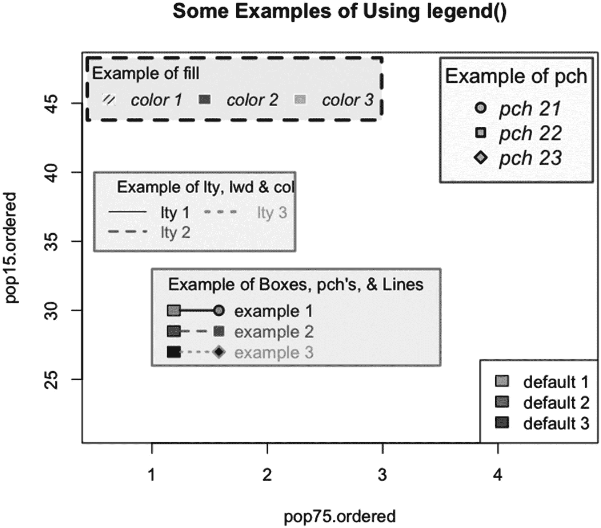

图 4-21

使用 legend()的五个例子

在图 [4-21](#Fig21) 的第一个图例中，第一个填充框使用填充线而不是纯色，但是第二个和第三个使用纯色。图例是水平的，标题在左边。在右侧和上方的图例中，使用了标绘字符并填充了颜色。标题在中间。

在左边的第二个框中，线条用于表示键。所有的线条宽度、线条类型和线条颜色都不同。标题在右边，用了两栏。在左边的第三个框中，填充框、绘图字符和线条同时使用。颜色、线型、填充框轮廓和符号背景都各不相同。

在示例的右侧，显示了使用默认样式参数的图例。请注意，示例中没有使用参数 angle、bty、pt.lwd、xjust、yjust、x.intersp、y.intersp、adj、text.width、trace 和 plot。

#### 4.4.1.2 的 mtext()函数

函数的作用是:将文本放置在图的边缘。该函数接受 10 个参数以及 par()中的许多参数。

mtext()的参数是文本，用于打印文本；side，用于绘制文本的一侧；line，表示从绘制文本的绘图中引出的线；outer，用于确定文本是放在图的外边缘还是图的边缘(在本章中，我们只讨论 outer 等于 FALSE，有关 outer 等于 TRUE，请参见 6.2.1.1 部分)；at，表示放置文本的位置；adj，用于平行于轴的方向(左/右或下/上)的文本调整；padj，用于在垂直于轴的方向上调整文本；cex，为文本的字符大小；col，表示文本的颜色；和字体，表示文本的字体粗细。

文本参数采用任意长度的字符向量。文本没有默认值。

边参数采用任意长度的数字向量。如果边的元素不在 1 和 4 之间(包括 1 和 4)，则不会为该元素打印文本。如果 side 的元素不是整数，则该元素被向上舍入到下一个整数。底部有 1 个边，左侧有 2 个边，顶部有 3 个边，右侧有 4 个边。side 的默认值为 3。

line 参数采用任意长度的数值向量。负值是允许的，并绘制到图中。从图中绘制出正值。0 号线刚好在地块外，在边界处。如果文本包含多行，则文本中的最后一行位于 line 的值处。line 的默认值为 0。

外部参数采用任意长度的逻辑向量(或者可以强制为逻辑向量)。outer 的默认值为 FALSE，即文本在绘图页边空白中绘图。

at 参数采用一个任意长度的数字向量，根据 side 的值，以 x 轴或 y 轴为单位进行度量。默认情况下，对于给定的边，参数给出文本开始的位置。at 的默认值为 NA，也就是说，mtext()使用 adj 的值来放置文字。

adj 参数接受任意长度的数字向量。如果未指定 at，值 0 表示文本根据 side 的值在页边距的左侧或底部打印。如果 adj 等于 1，则根据 side 的值，文本在页边距的右侧或顶部打印。如果提供了 at，adj 给出文本相对于 at 给出的位置的位置。adj 参数是连续的，可以接受负值和大于 1 的值。adj 的默认值是 NA–即使用 par()中 las 的值。

padj 参数采用与 adj 相同的值。对于等于 0 的 padj，文本的底部在线的中间，看起来垂直于轴。如果 padj 等于 1，则从垂直方向看，文本的顶部在线的中间。padj 的默认值是 NA–即使用 par()中 las 的值。

cex、col 和 font 参数是 plot()的标准参数。(参见第 3.4.3、3.4.1 和 3.4.2 节。)

mtext()的十个参数都不一定长度相同。全部循环到最长参数的长度。

在清单 [4-23](#PC23) 中，给出了使用多行文字()的示例代码。

```py
plot(
  pop75.ordered, pop15.ordered,
  main="Example of Using mtext()"
)

mtext(
  "Source:\nLifeCycleSavings dataset\nin the R datasets package",
  side=1,
  line=4,
  cex=0.8,
  col="grey50",
  font=2,
  adj=1
)

Listing 4-23Code for the example of using mtext()

```

在图 [4-22](#Fig22) 中，运行清单 [4-23](#PC23) 中的代码。

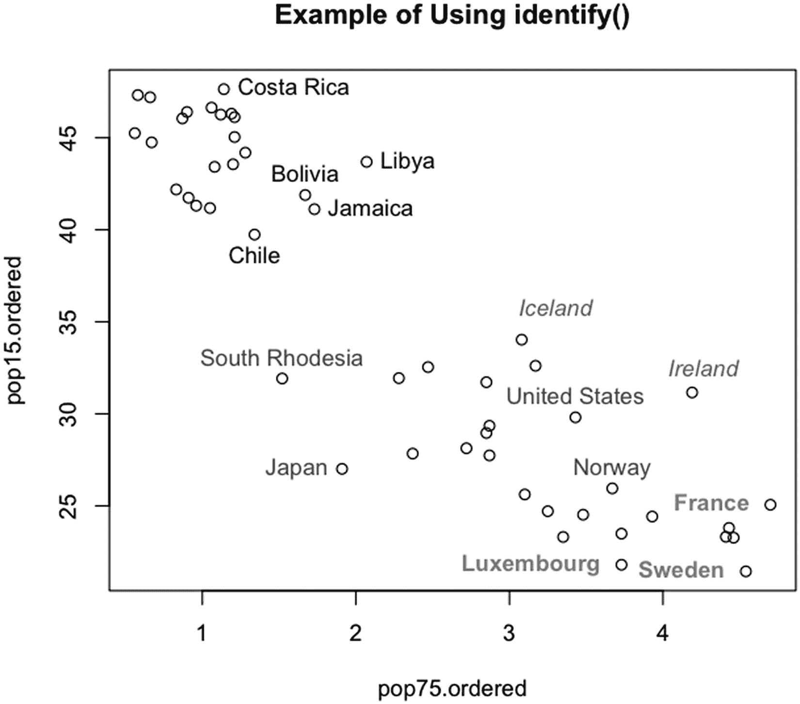

图 4-23

清单结果 [4-24](#PC24) ，运行 identify()的例子

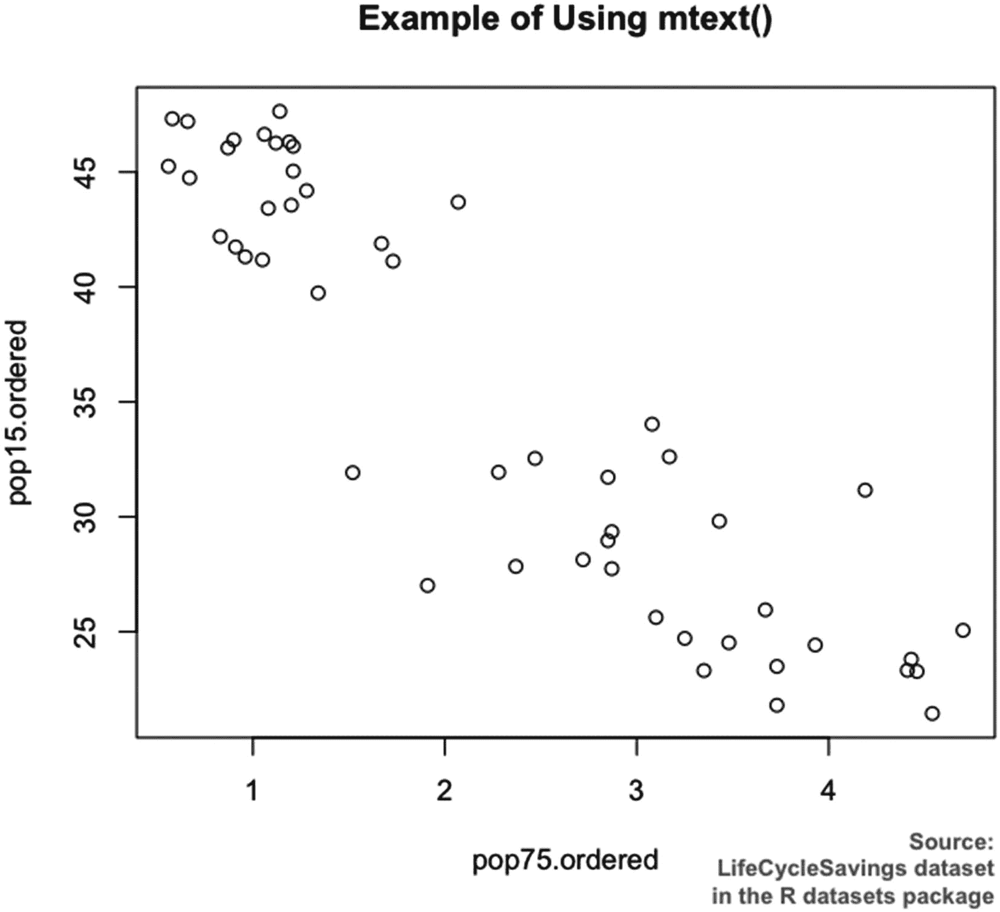

图 4-22

使用多行文字()的示例

来源引用以灰色阴影和粗体绘制。字符大小小于轴标签文本的大小。页边距文本的底线位于第 4 行。下边距默认有五行(包括第 0 行)。

### 4.4.2 交互函数:标识( )和定位器( )

identify()和 locator()函数使在绘图中放置图例、线条和标签等内容的任务变得更加容易。identify()函数可以使用计算机指针标记和识别散点图(以及其他类型的图)中的点。locator()函数允许用户通过使用指针将文本或图例放在绘图中的某个位置。函数 locator()也允许自由绘制线条和点。

这些函数在运行时会等待用户点击指针指定的次数。要在 Quartz 中给定次数之前退出任一函数，请按 Esc 键。对于 X11 或 Windows，使用第一个按钮以外的任何按钮单击鼠标。根据 identify()和 locator()的帮助页面，只有装有 X11、Quartz 或 Windows 的电脑才能使用这些函数。

#### 4.4.2.1 的 identify()函数

identify()函数接受 10 个指定的参数，加上 par()中的一些参数。十个指定的参数是 x 和 y，表示散点图上的点的位置；标签，用于指定给点的标签；pos，用于是否返回标签相对于该点的位置；n 代表要标记或识别的最大点数；plot，用于绘制标签还是仅返回索引值，以及可能的位置值和选择顺序；atpen，告诉 identify()将标签绘制在所单击指针的右上方；offset，从 atpen 等于 FALSE 的点开始增加或减少标签的偏移量；公差，表示围绕一个点的圆的半径，在圆内单击将选择该点；和 order，表示是否返回选择点的顺序。

该函数总是返回所选点索引的数值向量。有时函数会将向量作为包含一个或两个以上向量的列表的第一个元素返回——这取决于 pos 和 order 的值。

x 和 y 参数可以通过以下方式输入:x 作为数值向量，y 等于 NULL；x 作为两列数值矩阵，y 等于 NULL；或者 x 和 y 作为两个等长的数值向量。x 没有默认值，y 的默认值为 NULL。

labels 参数采用一个字符向量(或可以强制为字符的向量)，其长度通常等于散点图中的点数。如果不等于点数，则给出警告。默认值是 seq_along( x)。

pos 参数接受一个长度为 1 的逻辑向量(否则会给出警告)。如果设置为 TRUE，identify()将返回分配给所选点的标签的位置值向量(在 text()中使用的位置–参见第 4.2.2 节)。pos 的默认值为 FALSE。

n 参数给出了调用 identify()时可以选择的最大点数。该参数采用一个长度为 1 的数字向量(否则会给出警告)。通过限制 n，当选择了 n 个点而没有任何其他干预时，该函数将控制返回到控制台。n 的默认值是长度(x)。

plot 参数采用一个长度应为 1 的逻辑向量(或者可以强制为逻辑向量)。如果向量大于 1，则不会给出警告，但只使用第一个值。如果设置为 TRUE，则在控制返回到控制台时绘制标签。如果设置为 FALSE，则不会在图上绘制任何标签。在这两种情况下，都会返回选定点的信息，例如索引值。plot 的默认值为 TRUE。

atpen 参数采用一个长度为 1 的逻辑向量(或可以强制为逻辑向量的向量)——更长的向量不会给出警告，而是只使用第一个值。通常，identify()根据指针所单击点的周围位置，将标签绘制到点的左侧、右侧、顶部或底部。atpen 参数告诉 identify()在单击指针时将标签的左下角放在指针的位置。atpen 的默认值为 FALSE。

当 atpen 等于 FALSE 时，offset 参数以字符宽度给出标签到该点的距离。如果 atpen 为 TRUE，那么 offset 没有任何作用。偏移的默认值为 0.5。

容差参数采用长度应为 1 的数值向量。如果更长，则不会给出警告，而是只使用第一个值。该参数给出了围绕点的圆的半径(以英寸为单位),在圆内单击该半径会告诉 identify()识别并(可能)标记该点。如果指针被单击的位置附近没有足够的点，则会发出警告，但函数会继续执行-如果存在具有重叠圆的点，情况也是如此。公差的默认值为 0.25。

order 参数接受一个长度为 1 的逻辑向量(或者可以强制为逻辑向量)。如果长度大于 1，则不会给出警告，但只使用第一个元素。如果 order 设置为 TRUE，identify()返回点在选择顺序中的位置。order 的默认值为 FALSE。

在清单 [4-24](#PC24) 中，给出了运行 identify()的代码和输出。

```py
> plot(
pop75.ordered, pop15.ordered,
main="Example of Using identify()"
)

> identify(
pop75.ordered, pop15.ordered, labels=row.names(LifeCycleSavings)[ord],
tol=0.5,
col="grey10"
)
[1] 14 20 22 23 25

> identify(
pop75.ordered, pop15.ordered, labels=row.names(LifeCycleSavings)[ord],
tol=0.5,
pos=TRUE,
order=TRUE,
col="grey40"
)
$ind
[1] 21 24 39 41

$pos
[1] 3 2 3 3

$order
[1] 1 2 4 3

> identify(
pop75.ordered, pop15.ordered, labels=row.names(LifeCycleSavings)[ord],
tol=0.5,
atpen=TRUE,
col="grey50",
font=3
)
[1] 34 45

> identify(
pop75.ordered, pop15.ordered, labels=row.names(LifeCycleSavings)[ord],
tol=0.5,
offset=0.75,
font=2,
col="grey60"
)
[1] 42 49 50

Listing 4-24An example of using identify() multiple times

```

在图[中，4-23](#Fig23) 是清单 [4-24](#PC24) 中运行的代码的结果图。

该图左上角的五个国家在第一次调用中被标记为 identify()。在第二次调用 identify 时绘制了图形下部未用斜体或粗体显示的四个国家，其中 pos 和 order 设置为 TRUE。这两个斜体国家在第三次调用 identify()时被标记，并在 atpen 设置为 TRUE 时被定位。三个加粗的国家名称是从第四次调用 identify()开始绘制的，偏移量设置为 0.75。

#### 4.4.2.2 定位器( )函数

locator()函数有两种用法。函数可用于将 x 和 y 值输入到另一个函数中，然后该函数将信息添加到图中，或者定位器()可用于将自由曲线和/或点放入图中。

locator()函数接受 par()的两个指定参数和许多未指定参数。两个参数是 n 和 type，n 表示要使用的点数，type 表示要绘制的对象的类型。

n 参数应该是一个值大于或等于 1 的单元素数值向量。如果不是整数，该数字将向下舍入为整数。n 的默认值是 512。

参数类型是 plot()中的标准参数类型–参见第 3.3.1 节。type 的默认值为“n”，即不绘制任何内容，当 locator()仅用于设置位置时非常有用。

在清单 [4-25](#PC25) 中，给出了一个使用 locator()将图例放置到第 4.2.1 节中最初绘制的图中的示例。

```py
> tri1 = quantile( dpi.ordered, 0.33)
> tri2 = quantile( dpi.ordered, 0.67)

> plot(
pop75.ordered, dpi.ordered,
log="xy",
main="Example of locator()",
font.main=1,
type="n"
)

> points(
pop75.ordered, dpi.ordered,
pch=ifelse(dpi.ordered<=tri2,
ifelse( dpi.ordered<=tri1, "L", "M" ),
"H" ),
cex=0.7,
font=2
)

> legend(
locator( 1, "n" ),
legend=c(
"First Tercile of Income",
"Second Tercile of Income",
"Third Tercile of Income"),
pch=c( "L", "M", "H" ),
pt.lwd=2,
pt.cex=0.7,
cex=0.7,
bg="grey98"
)

Listing 4-25An example of using locator() to place a legend

```

在图 [4-24](#Fig24) 中，显示了列出 [4-25](#PC25) 的结果。

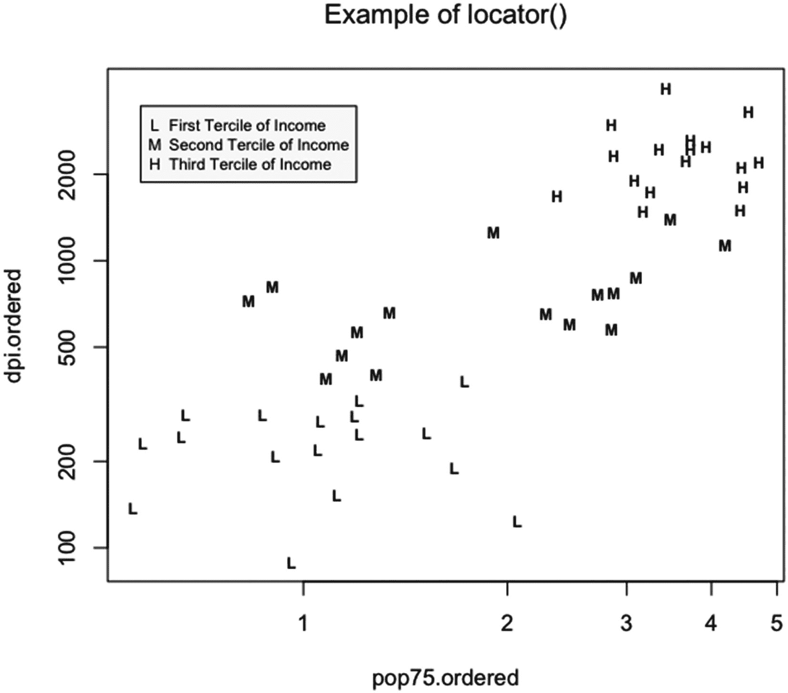

图 4-24

清单 [4-25](#PC25) 的结果，一个使用 locator()的例子

在清单 [4-25](#PC25) 中，n 等于 1，所以图例左上角的位置由指针设置。参数 n 可能已被设置为 2，因此左上角和右下角都已被指针赋值。在图例()中使用 locator()时，没有其他数字是有效的。